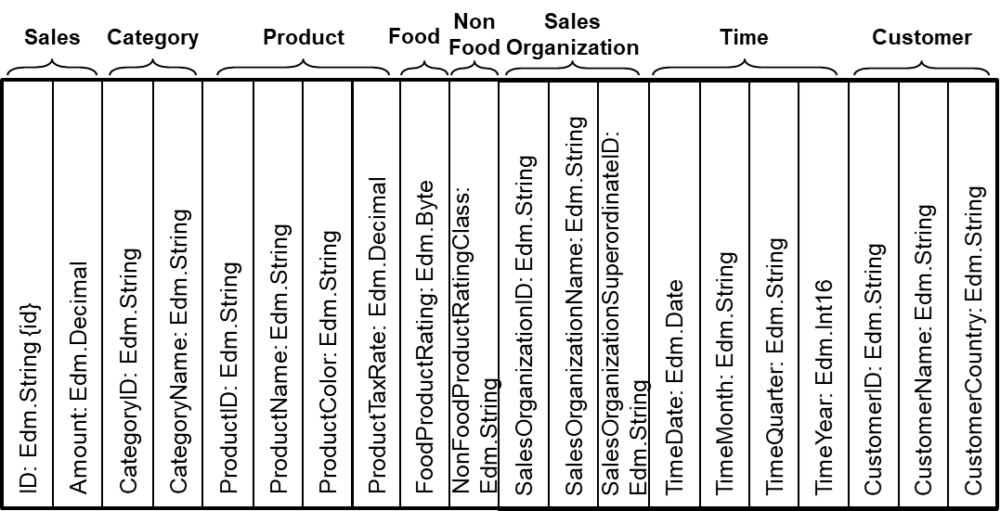

## Committee Specification Draft 04

## 28 October 2022

**This stage:**  
https://docs.oasis-open.org/odata/odata-data-aggregation-ext/v4.0/csd04/odata-data-aggregation-ext-v4.0-csd04.md (Authoritative)  
https://docs.oasis-open.org/odata/odata-data-aggregation-ext/v4.0/csd04/odata-data-aggregation-ext-v4.0-csd04.html  
https://docs.oasis-open.org/odata/odata-data-aggregation-ext/v4.0/csd04/odata-data-aggregation-ext-v4.0-csd04.pdf

**Previous stage:**  
https://docs.oasis-open.org/odata/odata-data-aggregation-ext/v4.0/cs02/odata-data-aggregation-ext-v4.0-cs02.docx (Authoritative)  
https://docs.oasis-open.org/odata/odata-data-aggregation-ext/v4.0/cs02/odata-data-aggregation-ext-v4.0-cs02.html  
https://docs.oasis-open.org/odata/odata-data-aggregation-ext/v4.0/cs02/odata-data-aggregation-ext-v4.0-cs02.pdf

**Latest stage:**  
https://docs.oasis-open.org/odata/odata-data-aggregation-ext/v4.0/odata-data-aggregation-ext-v4.0.md (Authoritative)  
https://docs.oasis-open.org/odata/odata-data-aggregation-ext/v4.0/odata-data-aggregation-ext-v4.0.html  
https://docs.oasis-open.org/odata/odata-data-aggregation-ext/v4.0/odata-data-aggregation-ext-v4.0.pdf

**Technical Committee:**  
[OASIS Open Data Protocol (OData) TC](https://www.oasis-open.org/committees/odata/)

**Chairs:**  
Ralf Handl (ralf.handl@sap.com), [SAP SE](https://www.sap.com)  
Michael Pizzo (mikep@microsoft.com), [Microsoft](https://www.microsoft.com)

**Editors:**  
Ralf Handl (ralf.handl@sap.com), [SAP SE](https://www.sap.com)  
Hubert Heijkers (hubert.heijkers@nl.ibm.com), [IBM](https://www.ibm.com)  
Michael Pizzo (mikep@microsoft.com), [Microsoft](https://www.microsoft.com)  
Gerald Krause (gerald.krause@sap.com), [SAP SE](https://www.sap.com)  
Heiko Theißen (heiko.theissen@sap.com), [SAP SE](https://www.sap.com)  
Martin Zurmuehl (martin.zurmuehl@sap.com), [SAP SE](https://www.sap.com)

<a name="AdditionalArtifacts">**Additional artifacts:**</a>  
This document is one component of a Work Product that also includes:
- OData Aggregation ABNF Construction Rules Version 4.0: https://docs.oasis-open.org/odata/odata-data-aggregation-ext/v4.0/csd04/abnf/odata-aggregation-abnf.txt
- OData Aggregation ABNF Test Cases: https://docs.oasis-open.org/odata/odata-data-aggregation-ext/v4.0/csd04/abnf/odata-aggregation-testcases.xml
- OData Core Vocabulary: https://docs.oasis-open.org/odata/odata-data-aggregation-ext/v4.0/csd04/vocabularies/Org.OData.Core.V1.xml
- OData Aggregation Vocabulary: https://docs.oasis-open.org/odata/odata-data-aggregation-ext/v4.0/csd04/vocabularies/Org.OData.Aggregation.V1.xml

<a name="RelatedWork">**Related work:**</a>  
This document is related to:
- OData Version 4.01. Edited by Michael Pizzo, Ralf Handl, and Martin Zurmuehl. A multi-part Work Product which includes:
  - OData Version 4.01. Part 1: Protocol. Latest stage: https://docs.oasis-open.org/odata/odata/v4.01/odata-v4.01-part1-protocol.html.
  - OData Version 4.01. Part 2: URL Conventions. Latest stage: https://docs.oasis-open.org/odata/odata/v4.01/odata-v4.01-part2-url-conventions.html.
  - ABNF components: OData ABNF Construction Rules Version 4.01 and OData ABNF Test Cases. https://docs.oasis-open.org/odata/odata/v4.01/os/abnf/.
- OData Vocabularies Version 4.0. Edited by Michael Pizzo, Ralf Handl, and Ram Jeyaraman. Latest stage: http://docs.oasis-open.org/odata/odata-vocabularies/v4.0/odata-vocabularies-v4.0.html.
- OData Common Schema Definition Language (CSDL) JSON Representation Version 4.01. Edited by Michael Pizzo, Ralf Handl, and Martin Zurmuehl. Latest stage: https://docs.oasis-open.org/odata/odata-csdl-json/v4.01/odata-csdl-json-v4.01.html.
- OData Common Schema Definition Language (CSDL) XML Representation Version 4.01. Edited by Michael Pizzo, Ralf Handl, and Martin Zurmuehl. Latest stage: https://docs.oasis-open.org/odata/odata-csdl-xml/v4.01/odata-csdl-xml-v4.01.html.
- OData JSON Format Version 4.01. Edited by Michael Pizzo, Ralf Handl, and Mark Biamonte. Latest stage: https://docs.oasis-open.org/odata/odata-json-format/v4.01/odata-json-format-v4.01.html.

**Abstract:**  
This specification adds basic grouping and aggregation functionality (such as sum, min, and max) to the Open Data Protocol (OData) without changing any of the base principles of OData.

**Status:**  
This document was last revised or approved by the OASIS Open Data Protocol (OData) TC on the above date. The level of approval is also listed above. Check the "Latest stage" location noted above for possible later revisions of this document. Any other numbered Versions and other technical work produced by the Technical Committee (TC) are listed at https://www.oasis-open.org/committees/tc_home.php?wg_abbrev=odata#technical.

TC members should send comments on this document to the TC's email list. Others should send comments to the TC's public comment list, after subscribing to it by following the instructions at the "[Send A Comment](https://www.oasis-open.org/committees/comments/index.php?wg_abbrev=odata)" button on the TC's web page at https://www.oasis-open.org/committees/odata/.

This specification is provided under the [RF on RAND Terms](https://www.oasis-open.org/policies-guidelines/ipr/#RF-on-RAND-Mode) Mode of the [OASIS IPR Policy](https://www.oasis-open.org/policies-guidelines/ipr/), the mode chosen when the Technical Committee was established. For information on whether any patents have been disclosed that may be essential to implementing this specification, and any offers of patent licensing terms, please refer to the Intellectual Property Rights section of the TC's web page (https://www.oasis-open.org/committees/odata/ipr.php).

Note that any machine-readable content ([Computer Language Definitions](https://www.oasis-open.org/policies-guidelines/tc-process-2017-05-26/#wpComponentsCompLang)) declared Normative for this Work Product is provided in separate plain text files. In the event of a discrepancy between any such plain text file and display content in the Work Product's prose narrative document(s), the content in the separate plain text file prevails.

**Key words:**  
The key words "MUST", "MUST NOT", "REQUIRED", "SHALL", "SHALL NOT", "SHOULD", "SHOULD NOT", "RECOMMENDED", "NOT RECOMMENDED", "MAY", and "OPTIONAL" in this document are to be interpreted as described in BCP 14 [RFC2119](#RFC2119) and [RFC8174](#RFC8174) when, and only when, they appear in all capitals, as shown here.

**Citation format:**  
When referencing this document, the following citation format should be used:

**[OData-Data-Agg-v4.0]**  
OData Extension for Data Aggregation Version 4.0. Edited by Ralf Handl, Hubert Heijkers, Gerald Krause, Michael Pizzo, Heiko Theißen, and Martin Zurmuehl. 20 May 2022. OASIS Committee Specification Draft 04. https://docs.oasis-open.org/odata/odata-data-aggregation-ext/v4.0/csd04/odata-data-aggregation-ext-v4.0-csd04.html. Latest stage: https://docs.oasis-open.org/odata/odata-data-aggregation-ext/v4.0/odata-data-aggregation-ext-v4.0.html.

**Notices:**  
Copyright © OASIS Open 2022. All Rights Reserved.

Distributed under the terms of the OASIS IPR Policy, [https://www.oasis-open.org/policies-guidelines/ipr/]. For complete copyright information please see the full Notices section in an Appendix below.

# <a name="Introduction">1</a> Introduction

This specification adds aggregation functionality to the Open Data Protocol (OData) without changing any of the base principles of OData. It defines semantics and a representation for aggregation of data, especially:
- Semantics and operations for querying aggregated data,
- Results format for queries containing aggregated data,
- Vocabulary terms to annotate what can be aggregated, and how.

## <a name="Glossary">1.1</a> Glossary

### <a name="DefinitionsofTerms">1.1.1</a> Definitions of Terms

This specification defines the following terms:
- <a name="AggregatableExpression">_Aggregatable Expression_</a> – an [expression](#Expression) resulting in a value of an [aggregatable primitive type](#AggregatablePrimitiveType)
- <a name="AggregatablePrimtiveType">_Aggregatable Primitive Type_</a> – a primitive type other than `Edm.Stream` or subtypes of `Edm.Geography` or `Edm.Geometry`
- <a name="DataAggregationPath">_Data Aggregation Path_</a> – a path that consists of one or more segments separated by a forward slash. Segments are names of declared or dynamic structural or navigation properties, or type-cast segments consisting of the (optionally qualified) name of a structured type that is derived from the type identified by the preceding path segment to reach properties declared by the derived type.
- <a name="Expression">_Expression_</a> – derived from the `commonExpr` rule (see [OData-ABNF](#ODataABNF)). Certain expressions are evaluated relative to a "current instance", while other expressions introduced in this document are evaluated to a "current collection", see [example 43](#collexpr).
- <a name="SingleValuedPropertyPath">_Single-Valued Property Path_</a> – property path ending in a single-valued primitive, complex, or navigation property

### <a name="AcronymsandAbbreviations">1.1.2</a> Acronyms and Abbreviations

- $A,I,U$ – collections of instances
- $H$ – hierarchical collection
- $u,w$ – instances in a collection
- $x,y$ – instances in a hierarchical collection, called nodes
- $p,q,v$ – paths
- $S,T$ – transformation sequences
- $\Gamma(A,v)$ – the collection that results from evaluating a [data aggregation path](#DataAggregationPath) $v$ relative to a collection $A$, defined [below](#EvaluationofDataAggregationPaths)
- $γ(u,v)$ – the collection that results from evaluating a [data aggregation path](#DataAggregationPath) $v$ relative to an instance $u$, defined [below](#EvaluationofDataAggregationPaths)
- $\Pi_G(s)$ – a transformation of a collection that injects grouping properties into every instance of the collection, defined [below](#SimpleGrouping)

### <a name="DocumentConventions">1.1.3</a> Document Conventions

Keywords defined by this specification use `this monospaced font`.

$$\hbox{\tt Normative source code uses this paragraph style.}$$

Some sections of this specification are illustrated with non-normative examples.

::: example
Example 1: text describing an example uses this paragraph style
```
Non-normative examples use this paragraph style.
```
:::

All examples in this document are non-normative and informative only. Examples labeled with ⚠ contain advanced concepts or make use of keywords that are defined only later in the text, they can be skipped at first reading.

All other text is normative unless otherwise labeled.

# <a name="Overview">2</a> Overview

Open Data (OData) services expose a data model that describes the schema of the service in terms of the Entity Data Model (EDM, see [OData-CSDL](#ODataCDSL)) and then allows for querying data in terms of this model. The responses returned by an OData service are based on that data model and retain the relationships between the entities in the model.

Extending the OData query features with simple aggregation capabilities avoids cluttering OData services with an exponential number of explicitly modeled "aggregation level entities" or else restricting the consumer to a small subset of predefined aggregations.

Adding the notion of aggregation to OData without changing any of the base principles in OData has two aspects:
1. Means for the consumer to query aggregated data on top of any given data model (for sufficiently capable data providers)
2. Means for the provider to annotate what data can be aggregated, and in which way, allowing consumers to avoid asking questions that the provider cannot answer.

Implementing any of these two aspects is valuable in itself independent of the other, and implementing both provides additional value for consumers. The provided aggregation annotations help a consumer understand more of the data structure looking at the service's exposed data model. The query extensions allow the consumers to explicitly express the desired aggregation behavior for a particular query. They also allow consumers to formulate queries that utilize the aggregation annotations.

## <a name="ExampleDataModel">2.1</a> Example Data Model

::: example
Example 2: The following diagram depicts a simple model that is used throughout this document.

<svg class="st20" viewBox="0 200 600 350" style="width:100%">
  <style type="text/css">
  <![CDATA[
    .st1 {fill:#f2f2f2;stroke:none;stroke-linecap:round;stroke-linejoin:round;stroke-width:0.75}
    .st2 {fill:#ffffff;stroke:none;stroke-linecap:round;stroke-linejoin:round;stroke-width:0.7}
    .st3 {fill:#000000;font-family:Arial;font-size:0.666664em}
    .st4 {font-size:1em}
    .st5 {stroke:#000000;stroke-linecap:round;stroke-linejoin:round;stroke-width:0.75}
    .st6 {fill:none;visibility:hidden}
    .st7 {stroke:#000000;stroke-linecap:round;stroke-linejoin:round;stroke-width:1.4}
    .st8 {fill:#000000;font-family:Arial;font-size:0.833336em}
    .st9 {fill:#000000;font-family:Arial;font-size:0.833336em;font-style:italic}
    .st10 {fill:none}
    .st11 {marker-start:url(#mrkr1-125);stroke:#000000;stroke-linecap:round;stroke-linejoin:round;stroke-width:0.75;visibility:hidden}
    .st12 {fill:#000000;fill-opacity:1;stroke:#000000;stroke-opacity:1;stroke-width:0.22935779816514}
    .st13 {fill:#000000;font-family:Arial;font-size:0.75em}
    .st14 {fill:#000000;fill-opacity:1;stroke:#000000;stroke-opacity:1;stroke-width:0.22222222222222}
    .st15 {stroke:#000000;stroke-linecap:round;stroke-linejoin:round;stroke-width:0.72}
    .st16 {marker-end:url(#mrkr1-200);stroke:#000000;stroke-linecap:round;stroke-linejoin:round;stroke-width:0.72}
    .st17 {fill:none;stroke:none;stroke-linecap:round;stroke-linejoin:round;stroke-width:0.75}
    .st18 {fill:#000000;font-family:Calibri;font-size:0.833336em}
    .st19 {marker-end:url(#mrkr14-311);stroke:#000000;stroke-linecap:round;stroke-linejoin:round;stroke-width:0.75}
    .st20 {fill:none;fill-rule:evenodd;font-size:12px;overflow:visible;stroke-linecap:square;stroke-miterlimit:3}
  ]]>
  </style>
  <defs id="Markers">
    <g id="lend1">
      <path d="M 1 -1 L 0 0 L 1 1 "
        style="stroke-linecap:round;stroke-linejoin:round;fill:none" />
    </g>
    <marker id="mrkr1-125" class="st12" orient="auto"
      markerUnits="strokeWidth" overflow="visible">
      <use xlink:href="#lend1" transform="scale(4.36) " />
    </marker>
    <g id="lend2">
      <path d="M 1 1 L 0 0 L 1 -1 L 1 1 " style="stroke:none" />
    </g>
    <marker id="mrkr2-137" class="st14" refX="-4.5" orient="auto"
      markerUnits="strokeWidth" overflow="visible">
      <use xlink:href="#lend2" transform="scale(-4.5,-4.5) " />
    </marker>
    <marker id="mrkr1-200" class="st14" orient="auto"
      markerUnits="strokeWidth" overflow="visible">
      <use xlink:href="#lend1" transform="scale(-4.5,-4.5) " />
    </marker>
    <g id="lend14">
      <path d="M 3 -1 L 0 0 L 3 1 L 3 -1 "
        style="stroke-linecap:round;stroke-linejoin:round;fill:none" />
    </g>
    <marker id="mrkr14-311" class="st12" refX="-13.08"
      orient="auto" markerUnits="strokeWidth" overflow="visible">
      <use xlink:href="#lend14" transform="scale(-4.36,-4.36) " />
    </marker>
  </defs>
  <g id="group1000-1" transform="translate(208.346,-446.457)">
    <g id="shape1001-2" transform="translate(0,-28.3465)">
      <rect x="0" y="819.213" width="110.551" height="22.6772"
        class="st1" />
    </g>
    <g id="shape1002-4">
      <rect x="0" y="813.543" width="110.551" height="28.3465"
        class="st2" />
      <text x="4" y="825.32" class="st3">
        ID: Edm.String {id}
        <tspan x="4" dy="1.2em" class="st4">Amount: Edm.Decimal</tspan>
      </text>
    </g>
    <g id="shape1003-8">
    </g>
    <g id="shape1004-10" transform="translate(-4.79616E-14,-28.3465)">
      <path d="M0 841.89 L110.55 841.89" class="st5" />
    </g>
    <g id="shape1005-13">
    </g>
    <g id="shape1006-15">
      <rect x="0" y="790.866" width="110.551" height="51.0236"
        class="st6" />
      <rect x="0" y="790.866" width="110.551" height="51.0236"
        class="st7" />
    </g>
    <g id="shape1000-18">
      <text x="45.27" y="805.2" class="st8">Sale</text>
    </g>
  </g>
  <g id="group1007-20" transform="translate(208.346,-566.929)">
    <g id="shape1008-21" transform="translate(0,-48.7559)">
      <rect x="0" y="819.213" width="110.551" height="22.6772"
        class="st1" />
    </g>
    <g id="shape1009-23">
      <desc>Date: Edm.Date {id} Month: Edm.String Quarter: Edm.String
        Yea...</desc>
      <rect x="0" y="793.134" width="110.551" height="48.7559"
        class="st2" />
      <text x="4" y="805.51" class="st3">
        Date: Edm.Date {id}
        <tspan x="4" dy="1.2em" class="st4">Month: Edm.String </tspan>
        <tspan x="4" dy="1.2em" class="st4">Quarter: Edm.String </tspan>
        <tspan x="4" dy="1.2em" class="st4">Year: Edm.Int16</tspan>
      </text>
    </g>
    <g id="shape1010-29">
    </g>
    <g id="shape1011-31" transform="translate(-4.79616E-14,-48.7559)">
      <path d="M0 841.89 L110.55 841.89" class="st5" />
    </g>
    <g id="shape1012-34">
    </g>
    <g id="shape1013-36">
      <rect x="0" y="770.457" width="110.551" height="71.4331"
        class="st6" />
      <rect x="0" y="770.457" width="110.551" height="71.4331"
        class="st7" />
    </g>
    <g id="shape1007-39">
      <text x="44.16" y="784.8" class="st8">Time</text>
    </g>
  </g>
  <g id="group1014-41" transform="translate(26.7784,-442.205)">
    <g id="shape1015-42" transform="translate(0,-36.8504)">
      <rect x="0" y="819.213" width="110.551" height="22.6772"
        class="st1" />
    </g>
    <g id="shape1016-44">
      <rect x="0" y="805.039" width="110.551" height="36.8504"
        class="st2" />
      <text x="4" y="816.26" class="st3">
        ID: Edm.String {id}
        <tspan x="4" dy="1.2em" class="st4">Name: Edm.String </tspan>
        <tspan x="4" dy="1.2em" class="st4">Country: Edm.String</tspan>
      </text>
    </g>
    <g id="shape1017-49">
    </g>
    <g id="shape1018-51" transform="translate(-4.79616E-14,-36.8504)">
      <path d="M0 841.89 L110.55 841.89" class="st5" />
    </g>
    <g id="shape1019-54">
    </g>
    <g id="shape1020-56">
      <rect x="0" y="782.362" width="110.551" height="59.5276"
        class="st6" />
      <rect x="0" y="782.362" width="110.551" height="59.5276"
        class="st7" />
    </g>
    <g id="shape1014-59">
      <text x="33.6" y="796.7" class="st8">Customer</text>
    </g>
  </g>
  <g id="group1028-61" transform="translate(384.094,-577.134)">
    <g id="shape1029-62" transform="translate(0,-28.3465)">
      <rect x="0" y="819.213" width="110.551" height="22.6772"
        class="st1" />
    </g>
    <g id="shape1030-64">
      <rect x="0" y="813.543" width="110.551" height="28.3465"
        class="st2" />
      <text x="4" y="825.32" class="st3">
        ID: Edm.String {id}
        <tspan x="4" dy="1.2em" class="st4">Name: Edm.String</tspan>
      </text>
    </g>
    <g id="shape1031-68">
    </g>
    <g id="shape1032-70" transform="translate(-4.79616E-14,-28.3465)">
      <path d="M0 841.89 L110.55 841.89" class="st5" />
    </g>
    <g id="shape1033-73">
    </g>
    <g id="shape1034-75">
      <rect x="0" y="790.866" width="110.551" height="51.0236"
        class="st6" />
      <rect x="0" y="790.866" width="110.551" height="51.0236"
        class="st7" />
    </g>
    <g id="shape1028-78">
      <text x="34.99" y="805.2" class="st8">Category</text>
    </g>
  </g>
  <g id="group1035-80" transform="translate(384.094,-436.252)">
    <g id="shape1036-81" transform="translate(0,-48.7559)">
      <rect x="0" y="819.213" width="110.551" height="22.6772"
        class="st1" />
    </g>
    <g id="shape1037-83">
      <desc>ID: Edm.String {id} Name: Edm.String Color: Edm.String
        TaxRat...</desc>
      <rect x="0" y="793.134" width="110.551" height="48.7559"
        class="st2" />
      <text x="4" y="805.51" class="st3">
        ID: Edm.String {id}
        <tspan x="4" dy="1.2em" class="st4">Name: Edm.String </tspan>
        <tspan x="4" dy="1.2em" class="st4">Color: Edm.String </tspan>
        <tspan x="4" dy="1.2em" class="st4">TaxRate: Edm.Decimal</tspan>
      </text>
    </g>
    <g id="shape1038-89">
    </g>
    <g id="shape1039-91" transform="translate(-4.79616E-14,-48.7559)">
      <path d="M0 841.89 L110.55 841.89" class="st5" />
    </g>
    <g id="shape1040-94">
    </g>
    <g id="shape1041-96">
      <rect x="0" y="770.457" width="110.551" height="71.4331"
        class="st6" />
      <rect x="0" y="770.457" width="110.551" height="71.4331"
        class="st7" />
    </g>
    <g id="shape1035-99">
      <text x="38.04" y="784.8" class="st9">Product</text>
    </g>
  </g>
  <g id="group1042-101" transform="translate(208.346,-324)">
    <g id="shape1043-102" transform="translate(0,-28.3465)">
      <rect x="0" y="819.213" width="110.551" height="22.6772"
        class="st1" />
    </g>
    <g id="shape1044-104">
      <rect x="0" y="813.543" width="110.551" height="28.3465"
        class="st2" />
      <text x="4" y="825.32" class="st3">
        ID: Edm.String {id}
        <tspan x="4" dy="1.2em" class="st4">Name: Edm.String</tspan>
      </text>
    </g>
    <g id="shape1045-108">
    </g>
    <g id="shape1046-110" transform="translate(-4.79616E-14,-28.3465)">
      <path d="M0 841.89 L110.55 841.89" class="st5" />
    </g>
    <g id="shape1047-113">
    </g>
    <g id="shape1048-115">
      <rect x="0" y="790.866" width="110.551" height="51.0236"
        class="st6" />
      <rect x="0" y="790.866" width="110.551" height="51.0236"
        class="st7" />
    </g>
    <g id="shape1042-118">
      <text x="14.42" y="805.2" class="st8">SalesOrganization</text>
    </g>
  </g>
  <g id="group1054-120" transform="translate(208.346,-464.882)">
    <g id="shape1055-121" transform="translate(-70.1169,-22.1102)">
      <rect x="0" y="830.551" width="15.5095" height="11.3386"
        class="st10" />
      <rect x="0" y="830.551" width="15.5095" height="11.3386"
        class="st11" />
      <text x="5.25" y="838.92" class="st13">1</text>
    </g>
    <g id="shape1056-127" transform="translate(-15.5072,7.65354)">
      <rect x="0" y="830.551" width="14.0065" height="11.3386"
        class="st10" />
      <rect x="0" y="830.551" width="14.0065" height="11.3386"
        class="st11" />
      <text x="5.25" y="838.92" class="st13">*</text>
    </g>
    <g id="shape1057-132" transform="translate(0,1673.86) rotate(180)">
    </g>
    <g id="shape1058-134" transform="translate(-47.847,-1.27717)">
    </g>
    <g id="shape1054-138">
      <path d="M0 834.8 L-71.02 834.8" class="st15" />
    </g>
  </g>
  <g id="group1064-141" transform="translate(318.898,-464.882)">
    <g id="shape1065-142" transform="translate(48.9382,-22.1102)">
      <rect x="0" y="830.551" width="15.5095" height="11.3386"
        class="st10" />
      <rect x="0" y="830.551" width="15.5095" height="11.3386"
        class="st11" />
      <text x="5.25" y="838.92" class="st13">1</text>
    </g>
    <g id="shape1066-147" transform="translate(0.0833553,8.50393)">
      <rect x="0" y="830.551" width="14.0065" height="11.3386"
        class="st10" />
      <rect x="0" y="830.551" width="14.0065" height="11.3386"
        class="st11" />
      <text x="5.25" y="838.92" class="st13">*</text>
    </g>
    <g id="shape1067-152" transform="translate(0,-4.25197)">
    </g>
    <g id="shape1068-154" transform="translate(20.2598,-1.27717)">
    </g>
    <g id="shape1064-157">
      <path d="M0 834.8 L65.2 834.8" class="st15" />
    </g>
  </g>
  <g id="group1069-160" transform="translate(432.283,-577.134)">
    <g id="shape1070-161" transform="translate(5.75265,55.559)">
      <rect x="0" y="830.551" width="14.0065" height="11.3386"
        class="st10" />
      <rect x="0" y="830.551" width="14.0065" height="11.3386"
        class="st11" />
      <text x="5.25" y="838.92" class="st13">*</text>
    </g>
    <g id="shape1071-166" transform="translate(-10.5894,14.1732)">
      <rect x="0" y="830.551" width="15.5095" height="11.3386"
        class="st10" />
      <rect x="0" y="830.551" width="15.5095" height="11.3386"
        class="st11" />
      <text x="5.25" y="838.92" class="st13">1</text>
    </g>
    <g id="shape1072-171"
      transform="translate(846.142,841.89) rotate(90)">
    </g>
    <g id="shape1073-173" transform="translate(-5.25197,44.0181)">
    </g>
    <g id="shape1069-176">
      <path d="M7.09 841.89 L7.09 911.34" class="st15" />
    </g>
  </g>
  <g id="group1079-179" transform="translate(263.622,-324)">
    <g id="shape1080-180" transform="translate(67.1811,-12.7559)">
      <rect x="0" y="830.551" width="22.6772" height="11.3386"
        class="st10" />
      <rect x="0" y="830.551" width="22.6772" height="11.3386"
        class="st11" />
      <text x="3.83" y="838.92" class="st13">0..1</text>
    </g>
    <g id="shape1081-185" transform="translate(-14.0899,14.1732)">
      <rect x="0" y="830.551" width="14.0065" height="11.3386"
        class="st10" />
      <rect x="0" y="830.551" width="14.0065" height="11.3386"
        class="st11" />
      <text x="5.25" y="838.92" class="st13">*</text>
    </g>
    <g id="shape1082-190"
      transform="translate(839.055,841.89) rotate(90)">
    </g>
    <g id="shape1083-192" transform="translate(15.2992,-7.4189)">
    </g>
    <g id="shape1079-195">
      <path
        d="M0 841.89 L-0 852.52 A8.50394 8.50394 -180 0 0 8.5 861.02 L57.4 861.02 A8.50394 8.50394 -180 0 0 65.91 852.52
               L65.91 821.69 A5.31496 5.31496 -180 0 0 60.59 816.38 L55.28 816.38"
        class="st16" />
    </g>
  </g>
  <g id="group1084-201" transform="translate(256.535,-446.457)">
    <g id="shape1085-202" transform="translate(-6.90433,69.4488)">
      <rect x="0" y="830.551" width="15.5095" height="11.3386"
        class="st10" />
      <rect x="0" y="830.551" width="15.5095" height="11.3386"
        class="st11" />
      <text x="5.25" y="838.92" class="st13">1</text>
    </g>
    <g id="shape1086-207" transform="translate(5.75264,14.4567)">
      <rect x="0" y="830.551" width="14.0065" height="11.3386"
        class="st10" />
      <rect x="0" y="830.551" width="14.0065" height="11.3386"
        class="st11" />
      <text x="5.25" y="838.92" class="st13">*</text>
    </g>
    <g id="shape1087-212"
      transform="translate(846.142,841.89) rotate(90)">
    </g>
    <g id="shape1088-214" transform="translate(-5.25197,45.0929)">
    </g>
    <g id="shape1084-217">
      <path d="M7.09 841.89 L7.09 913.32" class="st16" />
    </g>
  </g>
  <g id="group1094-222" transform="translate(256.535,-497.48)">
    <g id="shape1095-223" transform="translate(-9.17205,-52.441)">
      <rect x="0" y="830.551" width="15.5095" height="11.3386"
        class="st10" />
      <rect x="0" y="830.551" width="15.5095" height="11.3386"
        class="st11" />
      <text x="5.25" y="838.92" class="st13">1</text>
    </g>
    <g id="shape1096-228" transform="translate(7.16997,0.708661)">
      <rect x="0" y="830.551" width="14.0065" height="11.3386"
        class="st10" />
      <rect x="0" y="830.551" width="14.0065" height="11.3386"
        class="st11" />
      <text x="5.25" y="838.92" class="st13">*</text>
    </g>
    <g id="shape1097-233"
      transform="translate(-831.969,841.89) rotate(-90)">
    </g>
    <g id="shape1098-235" transform="translate(-5.25197,-31.2181)">
    </g>
    <g id="shape1094-238">
      <path d="M7.09 841.89 L7.09 772.44" class="st16" />
    </g>
  </g>
  <g id="shape1099-243" transform="translate(173.622,-446.457)">
    <rect x="0" y="827.717" width="35.4331" height="14.1732"
      class="st17" />
    <text x="7.43" y="837.8" class="st18">Sales</text>
  </g>
  <g id="shape1100-246" transform="translate(317.126,-446.457)">
    <rect x="0" y="827.717" width="35.4331" height="14.1732"
      class="st17" />
    <text x="7.43" y="837.8" class="st18">Sales</text>
  </g>
  <g id="shape1101-249" transform="translate(138.114,-474.803)">
    <rect x="0" y="827.717" width="49.7571" height="14.1732"
      class="st17" />
    <text x="5.09" y="837.8" class="st18">Customer</text>
  </g>
  <g id="shape1102-252" transform="translate(336.539,-474.803)">
    <rect x="0" y="827.717" width="49.7571" height="14.1732"
      class="st17" />
    <text x="8.87" y="837.8" class="st18">Product</text>
  </g>
  <g id="shape1103-255" transform="translate(436.385,-510.236)">
    <rect x="0" y="827.717" width="49.7571" height="14.1732"
      class="st17" />
    <text x="6.92" y="837.8" class="st18">Products</text>
  </g>
  <g id="shape1104-258" transform="translate(389.613,-552.756)">
    <rect x="0" y="827.717" width="49.7571" height="14.1732"
      class="st17" />
    <text x="6.66" y="837.8" class="st18">Category</text>
  </g>
  <g id="shape1105-261" transform="translate(233.707,-538.583)">
    <rect x="0" y="827.717" width="49.7571" height="14.1732"
      class="st17" />
    <text x="4" y="837.8" class="st18">Time</text>
  </g>
  <g id="shape1106-264" transform="translate(183.366,-388.878)">
    <rect x="0" y="827.717" width="92.126" height="14.1732"
      class="st17" />
    <text x="4" y="837.8" class="st18">SalesOrganization</text>
  </g>
  <g id="shape1108-267" transform="translate(330.236,-324)">
    <rect x="0" y="827.717" width="69.7039" height="14.1732"
      class="st17" />
    <text x="4" y="837.8" class="st18">Superordinate</text>
  </g>
  <g id="group1110-270" transform="translate(432.283,-368.504)">
    <g id="shape1111-271" transform="translate(0,-20.4094)">
      <rect x="0" y="819.213" width="110.551" height="22.6772"
        class="st1" />
    </g>
    <g id="shape1112-273">
      <rect x="0" y="821.48" width="110.551" height="20.4094"
        class="st2" />
      <text x="4" y="834.09" class="st3">Rating: Edm.Byte</text>
    </g>
    <g id="shape1113-276">
    </g>
    <g id="shape1114-278" transform="translate(-4.79616E-14,-20.4094)">
      <path d="M0 841.89 L110.55 841.89" class="st5" />
    </g>
    <g id="shape1115-281">
    </g>
    <g id="shape1116-283">
      <rect x="0" y="798.803" width="110.551" height="43.0866"
        class="st6" />
      <rect x="0" y="798.803" width="110.551" height="43.0866"
        class="st7" />
    </g>
    <g id="shape1110-286">
      <text x="26.65" y="813.14" class="st8">FoodProduct</text>
    </g>
  </g>
  <g id="group1117-288" transform="translate(432.283,-308.153)">
    <g id="shape1118-289" transform="translate(0,-20.4094)">
      <rect x="0" y="819.213" width="110.551" height="22.6772"
        class="st1" />
    </g>
    <g id="shape1119-291">
      <rect x="0" y="821.48" width="110.551" height="20.4094"
        class="st2" />
      <text x="4" y="834.09" class="st3">RatingClass: Edm.String</text>
    </g>
    <g id="shape1120-294">
    </g>
    <g id="shape1121-296" transform="translate(-4.79616E-14,-20.4094)">
      <path d="M0 841.89 L110.55 841.89" class="st5" />
    </g>
    <g id="shape1122-299">
    </g>
    <g id="shape1123-301">
      <rect x="0" y="798.803" width="110.551" height="43.0866"
        class="st6" />
      <rect x="0" y="798.803" width="110.551" height="43.0866"
        class="st7" />
    </g>
    <g id="shape1117-304">
      <text x="17.48" y="813.14" class="st8">NonFoodProduct</text>
    </g>
  </g>
  <g id="shape1124-306" transform="translate(432.283,-390.047)">
    <path d="M0 841.89 L-20.55 841.89 L-20.55 805.5" class="st19" />
  </g>
  <g id="shape1125-312" transform="translate(432.283,-329.697)">
    <path d="M0 841.89 L-20.55 841.89 L-20.55 745.14" class="st19" />
  </g>
</svg>

The Amount property in the Sale entity type is an [aggregatable property](#AggregationCapabilities), and the properties of the related entity types are groupable. These can be arranged in four hierarchies:
- Product hierarchy based on [groupable](#AggregationCapabilities) properties of the Category and Product entity types
- Customer [hierarchy](#LeveledHierarchy) based on Country and Customer
- Time [hierarchy](#LeveledHierarchy) based on Year, Month and Date
- SalesOrganization [hierarchy](#RecursiveHierarchy) based on the recursive association to itself

In the context of Online Analytical Processing (OLAP), this model might be described in terms of a Sales "cube" with an Amount "measure" and three "dimensions". This document will avoid such terms, as they are heavily overloaded.
:::

Query extensions and descriptive annotations can both be applied to normalized as well as partly or fully denormalized schemas.

::: example
Example 3: The following diagram depicts a denormalized schema for the simple model.


:::

## <a name="ExampleData">2.2</a> Example Data

::: example
Example 4: The following entity sets and sample data will be used to further illustrate the capabilities introduced by this extension.

:::: {.example-data style=width:600px;height:700px}
<svg viewBox="0 0 600 700">
  <defs>
    <marker id="begin" viewBox="0 0 10 10" refX="0" refY="5" orient="auto" markerWidth="5" markerHeight="5">
      <path d="M10,0 L0,5 L10,10 z" />
    </marker>
    <marker id="end" viewBox="0 0 10 10" refX="10" refY="5" orient="auto" markerWidth="5" markerHeight="5">
      <path d="M0,0 L10,5 L0,10 z" />
    </marker>
  </defs>
  <path d="M310,150 l45,50" marker-start="url(#begin)" marker-end="url(#end)" />
  <path d="M50,485 l0,-35" marker-start="url(#begin)" marker-end="url(#end)" />
  <path d="M160,485 l30,-185" marker-end="url(#end)" />
  <path d="M215,485 l45,-335" marker-start="url(#begin)" marker-end="url(#end)" />
  <path d="M300,485 l55,-165" marker-start="url(#begin)" marker-end="url(#end)" />
  <path d="M525,300 l-40,-20" marker-end="url(#end)" />
</svg>

::::: {.nav style=left:250px}
Products

ID|Category|Name|Color|TaxRate
--|--------|----|-----|------:
P1|PG1|Sugar|White|0.06
P2|PG1|Coffee|Brown|0.06
P3|PG2|Paper|White|0.14
P4|PG2|Pencil|Black|0.14
:::::

::::: {style=left:510px}
Food

|Rating|
|------|
|5|
|&nbsp;|
|n/a|
|n/a|
:::::

::::: {style=left:570px}
Non-Food

|RatingClass|
|------|
|n/a|
|n/a|
|average|
|&nbsp;|
:::::

::::: {style=top:150px}
Time

Date|Month|Quarter|Year
----|-----|-------|----
2022-01-01|2022-01|2022-1|2022
2022-04-01|2022-04|2022-2|2022
2022-04-10|2022-04|2022-2|2022
...|||
:::::

::::: {style=top:150px;left:360px}
Categories

ID|Name
--|----
PG1|Food
PG2|Non-Food
:::::

::::: {.nav style=top:260px;left:360px}
Sales Organizations

ID|Superordinate|Name
--|-------------|----
Sales||Corporate Sales
US|Sales|US
US West|US|US West
US East|US|US East
EMEA|Sales|EMEA
EMEA Central|EMEA|EMEA Central
:::::

::::: {style=top:300px}
Customers

ID|Name|Country
--|----|-------
C1|Joe|USA
C2|Sue|USA
C3|Sue|Netherlands
C4|Luc|France
:::::

::::: {.nav .nav-2 style=top:450px}
Sales

ID|Customer|Time|Product|Sales Organization|Amount
--|--------|----|-------|------------------|-----:
1|C1|2022-01-03|P3|US West|1
2|C1|2022-04-10|P1|US West|2
3|C1|2022-08-07|P2|US West|4
4|C2|2022-01-03|P2|US East|8
5|C2|2022-11-09|P3|US East|4
6|C3|2022-04-01|P1|EMEA Central|2
7|C3|2022-08-06|P3|EMEA Central|1
8|C3|2022-11-22|P1|EMEA Central|2
:::::

::::: {.legend style=top:470px;left:500px}
Legend

|Property|
|------|
|Key|
|Navigation Property|
:::::
::::
:::

## <a name="ExampleUseCases">2.3</a> Example Use Cases

::: example
Example 5: In the example model, one prominent use case is the relation of customers to products. The first question that is likely to be asked is: "Which customers bought which products?"

This leads to the second more quantitative question: "Who bought how much of what?"

The answer to the second question typically is visualized as a cross-table:

|           |   |    |     |      |        |     |
|-----------|---|---:|----:|-----:|-------:|----:|
|           |   |Food|     |      |Non-Food|     |
|           |   |    |Sugar|Coffee|        |Paper|
|USA        |   |  14|    2|    12|       5|    5|
|           |Joe|   6|    2|     4|       1|    1|
|           |Sue|   8|     |     8|       4|    4|
|Netherlands|   |   2|    2|      |       3|    3|
|           |Sue|   2|    2|      |       3|    3|

The data in this cross-table can be written down in a shape that more closely resembles the structure of the data model, leaving cells empty that have been aggregated away:

Customer/Country|Customer/Name|Product/Category/Name|Product/Name|Amount
----------------|-------------|---------------------|------------|-----:
USA|Joe|Non-Food|Paper|1
USA|Joe|Food|Sugar|2
USA|Joe|Food|Coffee|4
USA|Sue|Food|Coffee|8
USA|Sue|Non-Food|Paper|4
Netherlands|Sue|Food|Sugar|2
Netherlands|Sue|Non-Food|Paper|3
USA||Food|Sugar|2
USA||Food|Coffee|12
USA||Non-Food|Paper|5
Netherlands||Food|Sugar|2
Netherlands||Non-Food|Paper|1
USA|Joe|Food||6
USA|Joe|Non-Food||1
USA|Sue|Food||8
USA|Sue|Non-Food||4
Netherlands|Sue|Food||2
Netherlands|Sue|Non-Food||3
USA||Food||14
USA||Non-Food||5
Netherlands||Food||2
Netherlands||Non-Food||3

Note that this result contains seven fully qualified aggregate values, followed by fifteen rollup rows with subtotal values.
:::
# <a name="SystemQueryOptionapply">3</a> System Query Option `$apply`

A _set transformation_ (_transformation_ for short) is an operation on an input set that produces an output set. A _transformation sequence_ is a sequence of set transformations, separated by forward slashes to express that they are consecutively applied. A transformation sequence is invoked using the system query option `$apply` or they appear as a parameter of certain set transformations defined below. The input set of the first set transformation is the collection addressed by the resource path. The output set of each set transformation is the input set for the next set transformation. The output set of the last set transformation in the transformation sequence invoked by the system query option `$apply` is the result of `$apply`. This is consistent with the use of service-defined bindable and composable functions in path segments.

The system query option `$apply` MUST NOT be used if the resource path addresses a single instance.

The system query option `$apply` is evaluated first, then the other system query options are evaluated, if applicable, on the result of `$apply`, see [OData-Protocol, section 11.2.1](#ODataProtocol). Stability across requests for system query options `$top` and `$skip` [OData-Protocol, sections 11.2.6.3 and 11.2.6.4](#ODataProtocol) is defined in [section 3.3.8](#StableTotalOrderBeforeskipandtop).

Each set transformation:
- carries over the input type to the output set such that it fits into the data model of the service.
- can mark certain navigation properties and stream properties for _expansion by default_, that is, they are expanded in the result of `$apply` in the absence of an `$expand` query option.
- may produce an output set with a different number of instances than the input set.
- does not necessarily guarantee that all properties of the instances in the output set have a well-defined value.

Instances of an output set can contain structural and navigation properties, which can be declared or dynamic, as well as instance annotations.

The allowed set transformations are defined in this section as well as in the section on [Hierarchical Transformations](#HierarchicalTransformations).

Service-defined bound functions that take a collection of instances of a structured type as their binding parameter and return a collection of instances of a structured type MAY be used as set transformations within `$apply`. Further transformations can follow the bound function. The parameter syntax for bound function segments is identical to the parameter syntax for bound functions in resource path segments or `$filter` expressions. See [section 7.6](#ModelFunctionsasSetTransformations) for an example.

If a data service that supports `$apply` does not support it on the collection identified by the request resource path, it MUST fail with `501 Not Implemented` and a meaningful human-readable error message.

On resource paths ending in `/$count` the system query option `$apply` is evaluated on the set identified by the resource path without the `/$count` segment, the result is the plain-text number of items in the result of `$apply`. This is similar to the combination of `/$count` and `$filter`.

During serialization of the result of `$apply`, declared properties and dynamic properties are represented as defined by the response format. Other properties have been aggregated away and are not represented in the response.

The entities returned in the request examples in the following sections that involve aggregation are transient. For brevity, the examples replace with ellipses (…) the type control information required to disambiguate represented dynamic property values of type `Edm.Decimal`.

## <a name="FundamentalsofInputandOutputSets">3.1</a> Fundamentals of Input and Output Sets

(The definitions of italicized terms made in this section are used throughout this text, always with a hyperlink to this section.)

### <a name="TypeStructureandContextURL">3.1.1</a> Type, Structure and Context URL

All input sets and output sets in one transformation sequence are collections of the _input type_, that is the entity type or complex type of the first input set, or in other words, of the resource to which the transformation sequence is applied. The input type is determined by the entity model element identified within the metadata document by the context URL of that resource [OData-Protocol, section 10](#ODataProtocol). Individual instances in an input or output set can have a subtype of the input type. (See [example 68](#subinputtype).) The transformation sequence given as the `$apply` system query option is applied to the resource addressed by the resource path. The transformations defined below can have nested transformation sequences as parameters, these are then applied to resources that can differ from the current input set.

The _structure_ of an instance that occurs in an input or output set is defined by the names of the structural and navigation properties that the instance contains. Instances of an input type can have different structures, subject to the following rules:
- Declared properties of the input type or a nested or related type thereof or of a subtype of one of these MUST have their declared type and meaning when they occur in an input or output set.
- Single- or collection-valued primitive properties addressed by a property path starting at a non-transient entity MUST keep their values from the addressed resource path collection throughout the transformation sequence. Likewise, single- or collection-valued navigation property paths starting at a non-transient entity MUST keep addressing the same non-transient entities as in the addressed resource path collection.
- Instances in an output set need not have all declared or dynamic properties that occurred in the input set.
- Instances in an output set can have dynamic properties that did not occur in the input set. The name for such a dynamic property is called an alias, it is a SimpleIdentifier (see [OData-CSDL, section 17.2](#ODataCSDL)). Aliases MUST differ from names of declared properties in the input type, from names of properties in the first input set, and from names of properties in the current input set. Aliases in one collection MUST also differ from each other.

Here is an overview of the structural changes made by different transformations:
- During [aggregation](#BasicAggregation) or [nest](#Transformationnest), many instances are replaced by one instance, properties that represent the aggregation level are retained, and others are replaced by dynamic properties holding the aggregate value of the many instances or a transformed copy of them.
- During [compute](#Transformationcompute), dynamic properties are added to each instance.
- During [addnested](#Transformationaddnested), dynamic properties are added to each occurrence of a related collection.
- During [join](#Transformationsjoinandouterjoin), one instance with a collection of related instances is replaced by many copies, each of which is related via a dynamic property to one of the related instances.
- During [concatenation](#Transformationconcat), the same instances are transformed multiple times and the output sets with their potentially different structures are concatenated.

An output set thus consists of instances with different structures, this is the same situation as with a collection of an open type [OData-CSDL, sections 6.3 and 9.3](#ODataCSDL) and it is handled in the same way.

If the first input set is a collection of entities from a given entity set, then so are all input sets and output sets in the transformation sequence. The `{select-list}` in the context URL [OData-Protocol, section 10](#ODataProtocol) MUST describe only properties that are present or annotated as absent (for example, if `Core.Permissions` is `None` [OData-Protocol, section 11.2.2](#ODataProtocol)) in all instances of the collection, after applying any `$select` and `$expand` system query options. The `{select-list}` SHOULD describe as many such properties as possible, even if the request involves a concatenation that leads to a non-homogeneous structure. If the server cannot determine any such properties, the `{select-list}` MUST consist of just the instance annotation `AnyStructure` defined in the `Core` vocabulary [ODataVocCore](#ODataVocCore). (See [example 69](#anystructure).)

### <a name="SamenessandPrecedence">3.1.2</a> Sameness and Precedence

Input sets and output sets are not sets of instances in the mathematical sense but collections, because the same instance can occur multiple times in them. In other words: A collection contains values (which can be instances or primitive values), possibly with repetitions. The occurrences in the collection form a set in the mathematical sense. The _cardinality_ of a collection is the total number of occurrences in it. When this text describes a transformation algorithmically and stipulates that certain steps are carried out _for each_ instance in a collection, this means that the steps are carried out multiple times for the same instance if it occurs multiple times in the collection.

A collection addressed by the resource path is returned by the service either as an ordered collection [OData-Protocol, section 11.4.10](#ODataProtocol) or as an unordered collection. The same applies to collections that are nested in or related to the addressed resource as well as to collections that are the result of evaluating an expression starting with `$root`, which occur, for example, as the first parameter of a [hierarchical transformation](#HierarchicalTransformations).

But when such a collection is transformed by the `$apply` system query option, halfway cases between ordered and unordered can arise. For example, the [`groupby`](#Transformationgroupby) transformation retains any order within a group but not between groups.

::: example
⚠ Example 6: Request the top 10 sales per customer. The processing of the request can be parallelized per customer and the responses per customer can be interleaved in the overall response. This means that for any given customer, their top 10 sales appear in the desired order, though not consecutively.
```
GET /service/Sales?$apply=groupby((Customer),orderby(Amount desc)/top(10))
```
:::

For every transformation defined in the following sections, it will be specified how it orders its output set, based on the order of its input set. The order of the last output set can be further influenced by a `$orderby` system query option before it is observed in the response payload.

An order of a collection is more precisely defined as follows: Given two different occurrences $u_1$ and $u_2$ in a collection, which may be of the same value or of different values, $u_1$ precedes $u_2$ or $u_2$ precedes $u_1$, but not both. It can be neither, in which case the relative order of $u_1$ and $u_2$ does not matter. If $u_1$ precedes $u_2$ and $u_2$ precedes $u_3$, then $u_1$ also precedes $u_3$, and $u_1$ never precedes $u_1$. (This is a partial order in the mathematical sense defined on the set of occurrences.)

When transformations are defined in the following sections, the algorithmic description sometimes contains an _order-preserving loop_ over a collection. Such a loop processes the occurrences in an order chosen by the service in such a way that $u_1$ is processed before $u_2$ whenever $u_1$ precedes $u_2$. Likewise, in an order-preserving sequence $u_1,…,u_n$ we have $i<j$ whenever $u_i$ precedes $u_j$.

The transformation [`orderby`](#Transformationorderby) defined below carries out a _stable-sort_ by a list of expressions. This is a sorting operation on an ordered collection that sorts it into another ordered collection. In the sorted collection, $u_1$ precedes $u_2$ if and only if either
- $u_1$ precedes $u_2$ according to the rules of [OData-Protocol, section 11.2.6.2](#ODataProtocol) or
- these rules do not determine a precedence in either direction between $u_1$ and $u_2$ but $u_1$ preceded $u_2$ in the collection before the sort.

A stable-sort does not necessarily produce a total order, the sorted collection may still contain two occurrences whose relative order does not matter.

The output set of a [basic aggregation](#BasicAggregation) transformation can contain instances of an entity type without entity-id. After a [`concat`](#Transformationconcat) transformation, different occurrences of the same entity can differ in individual non-declared properties. To account for such cases, the definition of sameness given in [OData-URL, section 5.1.1.1.1](#ODataURL) is refined here. Instances are _the same_ if
- both are instances of complex types and both are null or both have the same structure and same values with null considered different from absent or
- both are instances of entity types without entity-id (transient entities, see [OData-Protocol, section 4.3](#ODataProtocol)) and both are null or both have the same structure and same values with null considered different from absent (informally speaking, they are compared like complex instances) or
- (1) both are instances of the same entity type with the same entity-id (non-transient entities, see [OData-Protocol, section 4.1](#ODataProtocol)) and (2) the structural and navigation properties contained in both have the same values (for non-primitive properties the sameness of values is decided by a recursive invocation of this definition).
  - If this is fulfilled, the instances are called _complementary representations of the same non-transient entity_. If this case is encountered at some recursion level while the sameness of non-transient entities $u_1$ and $u_2$ is established, a merged representation of the entity $u_1=u_2$ exists that contains all properties of $u_1$ and $u_2$. But if the instances both occur in the last output set, services MUST represent each with its own structure in the response payload.
  - If the first condition is fulfilled but not the second, the instances are not the same and are called _contradictory representations of the same non-transient entity_. ([Example 97](#contradict) describes a use case for this.)

Collections are _the same_ if there is a one-to-one correspondence $f$ between them such that
- corresponding occurrences are of the same value and
- an occurrence $u_1$ precedes another occurrence $u_2$ if and only if the occurrence $f(u_1)$ precedes the occurrence $f(u_2)$, where the occurrences $u_1$ and $u_2$ may be of the same value or of different values. (A one-to-one correspondence with this second property is called _order-preserving_.)

### <a name="EvaluationofDataAggregationPaths">3.1.3</a> Evaluation of Data Aggregation Paths

This document specifies when a [data aggregation path](#DataAggregationPath) that occurs in a request is evaluated by the service. If such an evaluation fails, the service MUST reject the request.

For a data aggregation path to be an expression in the sense of [OData-CSDL, section 14.4.1.1](#ODataCSDL), it may have at most one collection-valued segment, and it can then be evaluated relative to an instance. For the transformations defined in this document, such a path can also be evaluated relative to a collection $A$, even if it has multiple collection-valued segments itself.

To this end, the following notation is used in the subsequent sections: If $A$ is a collection and $v$ a data aggregation path, optionally followed by a type-cast segment, the result of such a path evaluation is denoted by $\Gamma(A,v)$ and defined as the unordered concatenation, possibly containing repetitions, of the collections $γ(u,v)$ for each $u$ in $A$ that is not null. The function $γ(u,v)$ takes a non-null value and a path as arguments and is recursively defined as follows:
1. If $v$ is an empty path, let $B$ be a collection with $u$ as its single member and continue with step 9.
2. Let $v_1$ be the first segment of $v$ and $v_2$ the remainder, if any, such that $v$ equals the concatenated path $v_1/v_2$.
3. If $v_1$ is a type-cast segment and $u$ is of its type or a subtype thereof, let $w=u$ and continue with step 8.
4. If $v_1$ is a type-cast segment and $u$ is not of its type or a subtype thereof, let $B$ be an empty collection and continue with step 9. (This rule follows [OData-URL, section 4.11](#ODataURL) rather than [OData-CSDL, section 14.4.1.1](#ODataCSDL).)
5. Otherwise, $v_1$ is a non-type-cast segment. If $u$ does not contain a structural or navigation property $v_1$, let $B$ be an empty collection and continue with step 9.
6. If $v_1$ is single-valued, let $w$ be the value of the structural or navigation property $v_1$ in $u$. If $w$ is null, let $B$ be an empty collection and continue with step 9; otherwise continue with step 8.
7. Otherwise, $v_1$ is collection-valued. Let $C$ be the collection addressed by the structural or navigation property $v_1$ in $u$, and let $B=\Gamma(C,v_2)$. Then continue with step 9.
8. Let $B=γ(w,v_2)$.
9. Return $B$.

This notation is extended to the case of an empty path $e$ by setting $\Gamma(A,e)=A$. Note every $u$ in $\Gamma(A,v)$ occurs also in $A$ or nested into $A$, therefore an algorithmic step like "Add a dynamic property to each $u$ in $\Gamma(A,v)$" effectively changes $A$.
## <a name="BasicAggregation">3.2</a> Basic Aggregation

### <a name="Transformationaggregate">3.2.1</a> Transformation `aggregate`

#### <a name="AggregationAlgorithm">3.2.1.1</a> Aggregation Algorithm

The `aggregate` transformation takes a comma-separated list of one or more `aggregate expressions` as parameters and returns an output set with a single instance of the [input type](#TypeStructureandContextURL) without entity-id containing one property per aggregate expression, representing the aggregated value of the input set.

An aggregate expression MUST have one of the types listed below. To compute the value of the property for a given aggregate expression, the `aggregate` transformation first determines a collection $U$ of instances or primitive values, based on the input set of the `aggregate` transformation, and a path $p$ that occurs in the aggregate expression. Let $p_1$ denote a data aggregation path with single- or collection-valued segments and $p_2$ a type-cast segment. Depending on the type of aggregate expression, $p=p_1$ or $p=p_2$ or $p=p_1/p_2$. Each type of aggregate expression defines a function $f(U)$ which the aggregate transformation evaluates to obtain the property value.

The property is a dynamic property, except for a special case in type 4. In types 1 and 2, the aggregate expression MUST end with the keyword `with` and an aggregation method $g$. The aggregation method also determines the type of the dynamic property. In types 1, 2 and 3 the aggregate expression MUST, and in type 4 it MAY, be followed by the keyword `as` and an [alias](#Keywordalias), which is then the name of the dynamic property. More aggregate expressions can be constructed with the [`from`](#Keywordfrom) keyword, see later section.

_Types of aggregate expressions:_
1. A path $p=p_1$ or $p=p_1/p_2$ where the last segment of $p_1$ has a complex or entity or [aggregatable primitive type](#AggregatablePrimitiveType) whose values can be aggregated using the specified [aggregation method](#AggregationMethods) $g$, or $p=p_2$ if the input set can be aggregated using the [custom aggregation method](#CustomAggregationMethods) $g$.  
Let $f(U)=g(U)$.
2. An [aggregatable expression](#AggregatableExpression) $W$ built from arithmetic operations [OData-URL, section 5.1.1.2](#ODataURL), unbound primitive function calls, numeric or duration values, and [data aggregation paths](#DataAggregationPath) with single-valued segments whose last segment must be primitive unless it occurs as a function parameter.  
Let $f(U)=g(V)$ where $V$ is the collection consisting of $W$ evaluated relative to each member of $U$ with null values removed from $V$. In this type, $p$ is absent.
3. A path $p/{\tt \$count}$ (see [section 3.2.1.4](#AggregateExpressioncount)) with optional prefix $p/{}$ where $p=p_1$ or $p=p_2$ or $p=p_1/p_2$.  
Let $f(U)$ be the [cardinality](#SamenessandPrecedence) of $U$.
4. A path $p/c$ consisting of an optional prefix $p/{}$ with $p=p_1$ or $p=p_1/p_2$ where the last segment of $p_1$ has a structured type or $p=p_2$, and a [custom aggregate](#CustomAggregates) $c$ defined on the collection addressed by $p$.  
Let $f(U)=c(U)$, if computation of the custom aggregate fails, the service MUST reject the request. In the absence of an alias, the name of the property MUST be the name of the custom aggregate, this is a dynamic property unless there is a declared property with that name, which is allowed by the `CustomAggregate` annotation. The custom aggregate also determines the type of the dynamic property.

_Determination of $U$:_

Let $I$ be the input set. If $p$ is absent, let $U=I$ with null values removed.

Otherwise, let $q$ be the portion of $p$ up to and including the last navigation property, if any, and any type-cast segment that immediately follows, and let $r$ be the remainder, if any, of $p$ that contains no navigation properties, such that $p$ equals the concatenated path $q⁄r$. The aggregate transformation considers each entity reached via the path $q$ exactly once. To this end, using the [$\Gamma$ notation](#EvaluationofDataAggregationPaths):
- If $q$ is non-empty, let $E=\Gamma(I,q)$ and remove duplicates from that entity collection: If [multiple representations of the same non-transient entity](#SamenessandPrecedence) are reached, the service MUST merge them into one occurrence in $E$ if they are complementary and MUST reject the request if they are contradictory. (See [example 119](#aggrconflict).) If [multiple occurrences of the same transient entity](#SamenessandPrecedence) are reached, the service MUST keep only one occurrence in $E$.
- If $q$ is empty, let $E=I$.

Then, if $r$ is empty, let $U=E$, otherwise let $U=\Gamma(E,r)$, this consists of instances or primitive values, possibly with repetitions.

#### <a name="Keywordas">3.2.1.2</a> Keyword `as`

Aggregate expressions can define an [alias](#TypeStructureandContextURL) which follows the `as` keyword.

::: example
Example 7:
```
GET /service/Sales?$apply=aggregate(Amount with sum as Total,
                                    Amount with max as MxA)
```
results in
```
{
  "@odata.context": "$metadata#Sales(Total, MxA)",
  "value": [
    { "Total@odata.type": "Decimal", "Total": 24,
      "MxA@odata.type": "Decimal", "MxA": 8 }
  ]
}
```
:::

::: example
Example <a name="aggrmul">8</a>:
```
GET /service/Sales?$apply=aggregate(Amount mul Product/TaxRate
                                    with sum as Tax)
```
results in
```
{   "@odata.context": "$metadata#Sales(Tax)",
  "value": [
    { "Tax@odata.type": "Decimal", "Tax": 2.08 }
  ]
}
```
:::

An alias affects the structure of the output set: each alias corresponds to a dynamic property in a `$select` option.

#### <a name="AggregationMethods">3.2.1.3</a> Aggregation Methods

Values can be aggregated using the standard aggregation methods [`sum`](#StandardAggregationMethodsum), [`min`](#StandardAggregationMethodmin), [`max`](#StandardAggregationMethodmax), [`average`](#StandardAggregationMethodaverage), and [`countdistinct`](#StandardAggregationMethodcountdistinct), or with [custom aggregation methods](#CustomAggregationMethods) defined by the service. Only types 1 and 2 of the [aggregation algorithm](#AggregationAlgorithm) involve aggregation methods, and the algorithm ensures that no null values occur among the values to be aggregated.

##### <a name="StandardAggregationMethodsum">3.2.1.3.1</a> Standard Aggregation Method `sum`

The standard aggregation method `sum` can be applied to numeric values to return the sum of the values, or null if there are no values to be aggregated. The provider MUST choose a single type for the property across all instances of that type in the result that is capable of representing the aggregated values. This may require a larger integer type, `Edm.Decimal` with sufficient `Precision` and `Scale`, or `Edm.Double`.

::: example
Example 9:
```
GET /service/Sales?$apply=aggregate(Amount with sum as Total)
```
results in
```
{
  "@odata.context": "$metadata#Sales(Total)",
  "value": [
    { "Total@odata.type": "Decimal", "Total": 24 }
  ]
}
```
:::

##### <a name="StandardAggregationMethodmin">3.2.1.3.2</a> Standard Aggregation Method `min`

The standard aggregation method `min` can be applied to values with a totally ordered domain to return the smallest of the values, or null if there are no values to be aggregated.

The result property will have the same type as the input property.

::: example
Example 10:
```
GET /service/Sales?$apply=aggregate(Amount with min as MinAmount)
```
results in
```
{
  "@odata.context": "$metadata#Sales(MinAmount)",
  "value": [
    { "MinAmount@odata.type": "Decimal", "MinAmount": 1 }
  ]
}
```
:::

##### <a name="StandardAggregationMethodmax">3.2.1.3.3</a> Standard Aggregation Method `max`

The standard aggregation method `max` can be applied to values with a totally ordered domain to return the largest of the values, or null if there are no values to be aggregated.

The result property will have the same type as the input property

::: example
Example 11:
```
GET /service/Sales?$apply=aggregate(Amount with max as MaxAmount)
```
results in
```
{
  "@odata.context": "$metadata#Sales(MaxAmount)",
  "value": [
    { "MaxAmount@odata.type": "Decimal", "MaxAmount": 8 }
  ]
}
```
:::

##### <a name="StandardAggregationMethodaverage">3.2.1.3.4</a> Standard Aggregation Method `average`

The standard aggregation method `average` can be applied to numeric values to return the sum of the non-null values divided by the count of the values, or null if there are no values to be aggregated.

The provider MUST choose a single type for the property across all instances of that type in the result that is capable of representing the aggregated values; either `Edm.Double` or `Edm.Decimal` with sufficient `Precision` and `Scale`.

::: example
Example 12:
```
GET /service/Sales?$apply=aggregate(Amount with average as AverageAmount)
```
results in
```
{
  "@odata.context": "$metadata#Sales(AverageAmount)",
  "value": [
    { "AverageAmount@odata.type": "Decimal", "AverageAmount": 3.0 }
  ]
}
```
:::

##### <a name="StandardAggregationMethodcountdistinct">3.2.1.3.5</a> Standard Aggregation Method `countdistinct`

The aggregation method `countdistinct` can be applied to arbitrary collections to count the distinct values. Instance comparison uses the definition of equality in [OData-URL, section 5.1.1.1.1](#ODataURL).

The result property MUST have type `Edm.Decimal` with `Scale` 0 and sufficient `Precision`.

::: example
Example 13:
```
GET /service/Sales?$apply=aggregate(Product with countdistinct
                                    as DistinctProducts)
```
results in
```
{
  "@odata.context": "$metadata#Sales(DistinctProducts)",
  "value": [
    { "DistinctProducts@odata.type": "Decimal", "DistinctProducts": 3 }
  ]
}
```
:::

The number of instances in the input set can be counted with the [aggregate expression `$count`](#AggregateExpressioncount).

##### <a name="CustomAggregationMethods">3.2.1.3.6</a> Custom Aggregation Methods

Services can define custom aggregation methods if the functionality offered by the standard aggregation methods is not sufficient for the intended consumers.

Custom aggregation methods MUST use a namespace-qualified name (see [OData-ABNF](#ODataABNF)), i.e. contain at least one dot. Dot-less names are reserved for future versions of this specification.

::: example
⚠ Example 14: custom aggregation method that concatenates distinct string values separated by commas
```
GET /service/Sales?$apply=groupby((Customer/Country),
                   aggregate(Amount with sum as Total,
                             Product/Name with Custom.concat as ProductNames))
```
results in
```
{
  "@odata.context": "$metadata#Sales(Customer(Country),Total,ProductNames)",
  "value": [
    { "Customer": { "Country": "Netherlands" },
      "Total@odata.type": "Decimal", "Total":  5,
      "ProductNames": "Paper,Sugar" },
    { "Customer": { "Country": "USA" },
      "Total@odata.type": "Decimal", "Total": 19,
      "ProductNames": "Coffee,Paper,Sugar" }
  ]
}
```
:::

#### <a name="AggregateExpressioncount">3.2.1.4</a> Aggregate Expression `$count`

The aggregate expression `$count` is defined as type 3 in the [aggregation algorithm](#AggregationAlgorithm). It MUST always specify an [alias](#TypeStructureandContextURL) and MUST NOT specify an [aggregation method](#AggregationMethods).

The result property MUST have type `Edm.Decimal` with `Scale` 0 and sufficient `Precision`.

::: example
Example 15:
```
GET /service/Sales?$apply=aggregate($count as SalesCount)
```
results in
```
{
  "@odata.context": "$metadata#Sales(SalesCount)",
  "value": [
    { "SalesCount@odata.type": "Decimal", "SalesCount": 8 }
  ]
}
```
:::

#### <a name="Keywordfrom">3.2.1.5</a> Keyword `from`

The `from` keyword offers a shortcut for a sequence of [`groupby`](Transformationgroupby) and [`aggregate`](#Transformationaggregate) transformations with the pattern ${\tt groupby}(…,{\tt aggregate}(…{\tt\ as\ }A_1))/{\tt aggregate}(A_1{\tt\ with\ }…)$.

In the following $p_1,…,p_n$ are [data aggregation paths](#DataAggregationPath) that are allowed in `groupby` for [simple grouping](#SimpleGrouping).

1. If $A$ is an aggregate expression and $g$ is an aggregation method, then
   $$A{\tt\ from\ }p_1,…,p_n{\tt\ with\ }g$$
   is an aggregate expression which evaluates to the value of property $D$ in the single instance in the output set of the following transformation sequence:
   $${\tt groupby}((p_1,…,p_n),{\tt aggregate}(A{\tt\ as\ }A_1))/{\tt aggregate}(A_1{\tt\ with\ }g{\tt\ as\ }D).$$
2. If $A=p/c{\tt\ from\ }…$ is an aggregate expression that starts with a custom aggregate $c$, optionally prefixed with a path $p$ as in type 4 in the [aggregation algorithm](#AggregationAlgorithm), and that optionally continues with `from` and `with` clauses, then
   $$A{\tt\ from\ }p_1,…,p_n$$
   is an aggregate expression which evaluates to the value of property $c$ in the single instance in the output set of the following transformation sequence:
   $${\tt groupby}((p_1,…,p_n),{\tt aggregate}(A{\tt\ as\ }A_1))/{\tt aggregate}(p/c).$$

Aggregate expressions constructed by these rules MUST be followed in the `aggregate` transformation by the keyword `as` and an [alias](#TypeStructureandContextURL). These rules can be applied repeatedly and lead to multiple `from` clauses in one aggregate expression.

::: example
⚠ Example <a name="from">16</a>: illustrates rule 1 where $A={\tt Amount\ with\ sum}$, $p_1={\tt Time}$, $g={\tt average}$
```
GET /service/Sales?$apply=aggregate(Amount with sum from Time with average
                                    as DailyAverage)
```
is equivalent to (but avoids the intermediate dynamic property `Total`)
```
GET /service/Sales?$apply=groupby((Time),aggregate(Amount with sum as Total))
                  /aggregate(Total with average as DailyAverage)
```
and results in the average sales volume per day
```
{
  "@odata.context": "$metadata#Sales(DailyAverage)",
  "value": [
    { "DailyAverage@odata.type": "Decimal", "DailyAverage": 3.428571428571429 }
  ]
}
```
:::

::: example
⚠ Example 17: illustrates rule 1 where $A={\tt Forecast}$, $p_1={\tt Time}$, $g={\tt average}$
```
GET /service/Sales?$apply=aggregate(Forecast from Time with average
                                    as DailyAverage)
```
is equivalent to
```
GET /service/Sales?$apply=groupby((Time),aggregate(Forecast))
                  /aggregate(Forecast with average as DailyAverage)
```
:::

### <a name="Transformationconcat">3.2.2</a> Transformation `concat`

The `concat` transformation takes two or more parameters, each of which is a sequence of set transformations.

It applies each transformation sequence to the input set and concatenates the intermediate output sets in the order of the parameters into the output set, preserving the ordering of the individual output sets as well as the structure of each instance in these sets, potentially leading to a non-homogeneously structured output set. If different intermediate output sets contain dynamic properties with the same alias, clients SHOULD ensure they have the same type and meaning in each intermediate output set.

::: example
⚠ Example 18:
```
GET /service/Sales?$apply=concat(topcount(2,Amount),
                          aggregate(Amount))
```
results in
```
{
  "@odata.context": "$metadata#Sales(Amount)",
  "value": [
    { "ID": 4, "Amount": 8 },
    { "ID": 3, "Amount": 4 },
    { "Amount": 24 }
  ]
}
```
Note that two Sales entities with the second highest amount 4 exist in the input set; the entity with `ID` 3 is included in the result, because the service chose to use the `ID` property for imposing a stable ordering.
:::

The output set of `concat` has a mixed form consisting of the structures imposed by the two transformation sequences.

### <a name="Transformationgroupby">3.2.3</a> Transformation groupby
 
The `groupby` transformation takes one or two parameters where the second is a list of set transformations, separated by forward slashes to express that they are consecutively applied. If the second parameter is not specified, it defaults to a single transformation whose output set consists of a single instance of the [input type](#TypeStructureandContextURL) without properties and without entity-id.

#### <a name="SimpleGrouping">3.2.3.1</a> Simple Grouping

In its simplest form the first parameter of `groupby` specifies the _grouping properties_, a comma-separated parenthesized list $G$ of one or more [data aggregation paths](#DataAggregationPath) with single-valued segments. The same path SHOULD NOT appear more than once; redundant property paths MAY be considered valid, but MUST NOT alter the meaning of the request. Navigation properties and stream properties specified in grouping properties are expanded by default (see [example 66](#groupbynav)).

The algorithmic description of this transformation makes use of the following definitions: Let $u[q]$ denote the value of a structural or navigation property $q$ in an instance $u$. A path $p_1$ is called a _prefix_ of a path $p$ if there is a non-empty path $p_2$ such that $p$ equals the concatenated path $p_1/p_2$. Let $e$ denote the empty path.

The output set of the groupby transformation is constructed in five steps.
1. [For each](#SamenessandPrecedence) instance $u$ in the input set, a projection is computed that contains only the grouping properties. This projection is $s_G(u,e)$ and the function $s_G(u,p)$ takes an instance and a path relative to the input set as arguments and is computed recursively as follows:
   - Let $w$ be an instance of the type of $u$ without properties and without entity-id.
   - For each structural or navigation property $q$ of $u$:
     - If $u$ has a subtype of the type addressed by $p$ and $q$ is only declared on that subtype, let $p'=p/p''/q$ where $p''$ is a type-cast to the subtype, otherwise let $p'=p/q$.
     - If $p'$ occurs in $G$, let $w[q]=u[q]$.
     - Otherwise, if $p'$ is a prefix of a path in $G$, let $w[q]=s_G(u[q],p')$.
   - Return $w$.
2. The input set is split into subsets where two instances are in the same subset if their projections are [the same](#SamenessandPrecedence). If [representations of the same non-transient entity](#SamenessandPrecedence) are encountered during the comparison of two projections, the service MUST assign them to one subset with the merged representation if they are complementary and MUST reject the request if they are contradictory.
3. The set transformations from the second parameter are applied to each subset, resulting in a new set of potentially different structure and cardinality. Associated with each resulting set is the common projection of the instances in the subset from which the resulting set was computed.
4. Each set resulting from the previous step is transformed to contain the associated common projection $s$. This transformation is denoted by $\Pi_G(s)$ and is defined below.
5. The output set is the concatenation of the transformed sets from the previous step. Precedence between occurrences from the same transformed set remains the same, and no precedence is defined between occurrences from different transformed sets.

_Definition of $\Pi_G(s)$:_

_Prerequisites:_ $G$ is a list of data aggregation paths and $s$ is an instance of the [input type](#TypeStructureandContextURL).

The output set of the transformation $\Pi_G(s)$ is in one-to-one correspondence with its input set via the [order-preserving](#SamenessandPrecedence) mapping $u↦a_G(u,s,e)$. The function $a_G(u,s,p)$ takes two instances and a path relative to the input set as arguments and is computed recursively as follows:
1. If necessary, cast $u$ to a subtype so that its type contains all structural and navigation properties of $s$.
2. For each structural or navigation property $q$ of $s$:
   - If $s$ has a subtype of the type addressed by $p$ and $q$ is only declared on that subtype, let $p'=p/p''/q$ where $p''$ is a type-cast to the subtype, otherwise let $p'=p/q$.
   - If $q$ is a primitive structural property or $p'$ occurs in G, let $u[q]=s[q]$. (In the case where $p'$ occurs in $G$ we also call $q$ a "final segment from $G$".)
   - Otherwise, if $q$ is single-valued, let $u[q]=a_G(u[q],s[q],p')$.
   - Otherwise, if $q$ is collection-valued and $s[q]$ consists of one instance $w$, let $u[q]$ be the collection consisting of $a_G(ε,w,p')$ where $ε$ is a new instance of the type of $w$ without properties and without entity-id. (This case cannot occur during simple grouping, but may occur when $\Pi_G(s)$ is used again in later sections of this document.)
   - Otherwise, the behavior is undefined. (Such cases never occur when $\Pi_G(s)$ is used in this document.)
3. Return $u$.

::: example
Example 19:
```
GET /service/Sales?$apply=groupby((Customer/Country,Product/Name),
                                  aggregate(Amount with sum as Total))
```
results in
```
{
  "@odata.context": "$metadata#Sales(Customer(Country),Product(Name),Total)",
  "value": [
    { "Customer": { "Country" : "Netherlands" }, "Product": { "Name": "Paper" },
      "Total@odata.type": "Decimal", "Total":  3 },
    { "Customer": { "Country": "Netherlands" },  "Product": { "Name": "Sugar" },
      "Total@odata.type": "Decimal", "Total":  2 },
    { "Customer": { "Country": "USA" },          "Product": { "Name": "Coffee" },
      "Total@odata.type": "Decimal", "Total": 12 },
    { "Customer": { "Country": "USA" },          "Product": { "Name": "Paper" },
      "Total@odata.type": "Decimal", "Total":  5 },
    { "Customer": { "Country": "USA" },          "Product": { "Name": "Sugar" },
      "Total@odata.type": "Decimal", "Total":  2 }
  ]
}
```
:::

If the second parameter is omitted, steps 2 and 3 above produce one instance containing only the grouping properties per distinct value combination.

::: example
⚠ Example 20:
```
GET /service/Sales?$apply=groupby((Product/Name,Amount))
```
results in
```
{
  "@odata.context": "$metadata#Sales(Product(Name),Amount)",
  "value": [
    { "Product": { "Name": "Coffee" }, "Amount": 4 },
    { "Product": { "Name": "Coffee" }, "Amount": 8 },
    { "Product": { "Name": "Paper"  }, "Amount": 1 },
    { "Product": { "Name": "Paper"  }, "Amount": 2 },
    { "Product": { "Name": "Paper"  }, "Amount": 4 },
    { "Product": { "Name": "Sugar"  }, "Amount": 2 }
  ]
}
```
Note that the result has the same structure, but not the same content as
```
GET /service/Sales?$expand=Product($select=Name)&$select=Amount
```
:::

A `groupby` transformation affects the structure of the output set similar to `$select` where each grouping property corresponds to an item in a `$select` clause.

#### <a name="Groupingwithrollup">3.2.3.2</a> Grouping with `rollup`

The `rollup` grouping operator allows applying set transformations to instances of an input set organized in a [leveled hierarchy](#LeveledHierarchy). It can be used instead of a grouping property in the first parameter of `groupby`. It has two overloads, depending on the number of parameters.

If used with two or more parameters, it defines an unnamed leveled hierarchy of grouping properties as a list of [data aggregation paths](#DataAggregationPath) with single-valued segments. The first path in the list is the root level of the hierarchy defining the coarsest granularity, and the other paths define consecutively finer-grained levels of the hierarchy. This unnamed hierarchy is used for grouping instances.

A groupby with `rollup` applied to a leveled hierarchy allows requesting aggregation for all levels of that hierarchy. It splits the input set into groups using all grouping properties (see (1) below), then removes the last property from the hierarchy (see (2)) and repeats this process using the remaining grouping properties until all of the levels have been used up (see terminating rule (3)).

Such a grouping with `rollup` for a leveled hierarchy is processed using the following equivalence relationships, in which $p_1,…,p_k$ are groupable property paths representing a level, $T$ is a transformation sequence, the ellipsis ($…$) stands in for zero or more property paths, $P_1$ stands in for zero or more property paths and $P_2$ for zero or more `rollup` or [`rolluprecursive`](#Groupingwithrolluprecursive) operators or property paths:

- ${\tt groupby}((P_1,{\tt rollup}(p_1,…,p_{k-1},p_k),P_2),T)$ is equivalent to
  $$\matrix{   {\tt concat}(\hfill\\   \quad {\tt groupby}((P_1,p_1,…,p_{k-1},p_k,P_2),T),\hfill&\tt (1)\\   \quad {\tt groupby}((P_1,{\tt rollup}(p_1,…,p_{k-1}),P_2),T)\hfill&\tt(2)\\   ).\hskip25pc\\   }$$
- ${\tt groupby}((P_1,{\tt rollup}(p_1,p_2),P_2),T)$ is equivalent to
  $$\matrix{   {\tt concat}(\hfill&\tt (3)\\   \quad {\tt groupby}((P_1,p_1,p_2,P_2),T),\hfill\\   \quad {\tt groupby}((P_1,p_1,P_2),T)\hfill\\   ).\hskip25pc\\   }$$

::: example
Example 21: rolling up two hierarchies, the first with two levels, the second with three levels:
$$({\tt rollup}(p_{1,1},p_{1,2}),{\tt rollup}(p_{2,1},p_{2,2},p_{2,3}))$$
will result in the six groupings
$$\matrix{ (p_{1,1},p_{1,2},\hfill&p_{2,1},p_{2,2},p_{2,3})\hfill\\ (p_{1,1},p_{1,2},\hfill&p_{2,1},p_{2,2})\hfill\\ (p_{1,1},p_{1,2},\hfill&p_{2,1})\hfill\\ (p_{1,1},\hfill&p_{2,1},p_{2,2},p_{2,3})\hfill\\ (p_{1,1},\hfill&p_{2,1},p_{2,2})\hfill\\ (p_{1,1},\hfill&p_{2,1})\hfill }$$
The leveled hierarchy of the first rollup has 2 levels, the one of the second has 3 levels, and the groupings represent all possible $6=2⋅3$ combinations of levels from both hierarchies.
:::

::: example
Example 22: answering the second question in [section 2.3](#ExampleUseCases)
```
GET /service/Sales?$apply=groupby((rollup(Customer/Country,Customer/Name),
                            rollup(Product/Category/Name,Product/Name)),
                           aggregate(Amount with sum as Total))
```
results in seven entities for the finest grouping level
```
{
  "@odata.context": "$metadata#Sales(Customer(Country),
                                     Product(Category(Name)),Total)",
  "value": [
    { "Customer": { "Country": "USA", "Name": "Joe" },
      "Product":  { "Category": { "Name": "Non-Food" }, "Name": "Paper" },
      "Total@odata.type": "Decimal", "Total": 1 },
    ...
```
plus additional fifteen rollup entities for subtotals: five without customer name
```
    { "Customer": { "Country": "USA" },
      "Product":  { "Category": { "Name": "Food" }, "Name": "Sugar" },
      "Total@odata.type": "Decimal", "Total":  2 },
    ...
```
six without product name
```
    { "Customer": { "Country": "USA", "Name": "Joe" },
      "Product":  { "Category": { "Name": "Food" } },
      "Total@odata.type": "Decimal", "Total":  6 },
    ...
```
and four with neither customer nor product name
```
    { "Customer": { "Country": "USA" },
      "Product":  { "Category": { "Name": "Food" } },
      "Total@odata.type": "Decimal", "Total": 14 },
    ...
  ]
}
```
:::

Note that the absence of one or more properties of the output structure declared by the surrounding OData context allows distinguishing rollup entities from other entities.

If `rollup` is used with one parameter, the parameter references a named leveled hierarchy to be used for grouping instances, and therefore MUST be the value of the `Qualifier` attribute of an annotation with term [`LeveledHierarchy`](#LeveledHierarchy). If the annotation has qualifier $Q$ and as value a collection consisting of $p_1,…,p_n$ with $n≥2$, then ${\tt rollup}(Q)$ is equivalent to ${\tt rollup}(p_1,…,p_n)$.

Another grouping operator [`rolluprecursive`](#Groupingwithrolluprecursive) which similarly works with a [recursive hierarchy](#RecursiveHierarchy) is defined later.
## <a name="TransformationsPreservingtheInputSetStructure">3.3</a> Transformations Preserving the Input Set Structure

These transformations produce an output set that is a subset of their input set. Some of the algorithmic descriptions that follow make use of the following definition: A total order of a collection is called stable across requests if it is the same for all requests that construct the collection by executing the same resource path and transformations, possibly nested, on the same underlying data.

::: example
⚠ Example 23: A stable total order is required for the input set of a [`skip`](#Transformationskip) transformation. The following request constructs that input set by executing the `Sales` resource path and the `groupby` transformation, computing the total sales per customer. Because of the subsequent `skip` transformation, the service must endow this with a stable total order. In other words, the request divides the total sales per customer into pages of $N$ customers and returns page number $i$ in a reproducible manner (as long as the underlying data do not change).
```
GET /service/Sales?$apply=
  groupby((Customer),aggregate(Amount with sum as Total))
  /skip(M)/top(N)
```
where the number in `skip` is $M=(i-1)⋅N$.
:::

### <a name="Topbottomtransformations">3.3.1</a> Top/bottom transformations

These transformations take two parameters. The first parameter MUST be an [expression](#Expression) that is [evaluable on the input set as a collection](#ExpressionsEvaluableonaCollection), without reference to an individual instance (and which therefore cannot be a property path). The second parameter MUST be an expression that is evaluated on each instance of the input set in turn.

The output set is constructed as follows:
1. Let $A$ be a copy of the input set with a total order that need not extend any existing order but is completely chosen by the service. The total order MUST be stable across requests. ($A$'s is the order of the eventual output set of this transformation.)
2. Let $B$ be a copy of $A$ that is [stable-sorted](#SamesnessandPrecedence) in ascending (for transformations starting with `bottom`) or descending (for transformations starting with `top`) order of the value specified in the second parameter. ($B$'s is the order in which contributions to the output set are considered.)
3. Start with an empty output set.
4. Loop over $B$ in its total order.
5. Exit the loop if a condition is met. This condition depends on the transformation being executed and is given in the subsections below.
6. Insert the current item of the loop into the output set in the order of $A$.
7. Continue the loop.

For example, if the input set consists of non-transient entities and the datastore contains an index ordered by the second parameter and then the entity-id, a service may implement this algorithm with $A=B$ ordered like this index.

The order of the output set can be influenced with a subsequent [`orderby`](#Transformationorderby) transformation.

#### <a name="Transformationsbottomcountandtopcount">3.3.1.1</a> Transformations `bottomcount` and `topcount`

The first parameter MUST evaluate to a positive integer $c$. The second parameter MUST evaluate to a primitive type whose values are totally ordered. In step 5, exit the loop if the cardinality of the output set equals $c$.

::: example
Example 24:
```
GET /service/Sales?$apply=bottomcount(2,Amount)
```
results in
```
{
  "@odata.context": "$metadata#Sales"
  "value": [
    { "ID": 1, "Amount": 1 },
    { "ID": 7, "Amount": 1 }
  ]
}
```
:::

::: example
Example 25:
```
GET /service/Sales?$apply=topcount(2,Amount)
```
results in
```
{
  "@odata.context": "$metadata#Sales",
  "value": [
    { "ID": 3, "Amount": 4 },
    { "ID": 4, "Amount": 8 }
  ]
}
```
Note that two `Sales` entities with the second highest amount 4 exist in the input set; the entity with `ID` 3 is included in the result, because the service chose to use the `ID` property for imposing a stable ordering in step 1. Such a logic needs to be in place even with a preceding `orderby` since it cannot be ensured that it creates a stable order of the instances on the expressions of the second parameter.
:::

#### <a name="Transformationsbottompercentandtoppercent">3.3.1.2</a> Transformations `bottompercent` and `toppercent`

The first parameter MUST evaluate to a positive number $p$ less than or equal to 100. The second parameter MUST evaluate to a number. In step 5, exit the loop if the ratio of the sum of the numbers addressed by the second parameter in the output set to their sum in the input set equals or exceeds $p$%.

::: example
Example 26:
```
GET /service/Sales?$apply=bottompercent(50,Amount)
```
results in
```
{
  "@odata.context": "$metadata#Sales",
  "value": [
    { "ID": 1, "Amount": 1 },
    { "ID": 2, "Amount": 2 },
    { "ID": 5, "Amount": 4 },
    { "ID": 6, "Amount": 2 },
    { "ID": 7, "Amount": 1 },
    { "ID": 8, "Amount": 2 }
  ]
}
```
:::

::: example
Example 27:
```
GET /service/Sales?$apply=toppercent(50,Amount)
```
results in
```
{
  "@odata.context": "$metadata#Sales",
  "value": [
    { "ID": 3, "Amount": 4 },
    { "ID": 4, "Amount": 8 }
  ]
}
```
:::

#### <a name="Transformationsbottomsumandtopsum">3.3.1.3</a> Transformations `bottomsum` and `topsum`

The first parameter MUST evaluate to a number $s$. The second parameter MUST be an [aggregatable expression](#AggregatableExpression) that evaluates to a number. In step 5, exit the loop if the sum of the numbers addressed by the second parameter in the output set is greater than or equal to a non-negative $s$ or is less than or equal to a negative $s$.

::: example
Example 28:
```
GET /service/Sales?$apply=bottomsum(7,Amount)
```
results in
```
{
  "@odata.context": "$metadata#Sales",
  "value": [
    { "ID": 1, "Amount": 1 },
    { "ID": 2, "Amount": 2 },
    { "ID": 6, "Amount": 2 },
    { "ID": 7, "Amount": 1 },
    { "ID": 8, "Amount": 2 }
  ]
}
```
:::

::: example
Example 29:
```
GET /service/Sales?$apply=topsum(15,Amount)
```
results in
```
{
  "@odata.context": "$metadata#Sales",
  "value": [
    { "ID": 3, "Amount": 4 },
    { "ID": 4, "Amount": 8 },
    { "ID": 5, "Amount": 4 }
  ]
}
```
:::

### <a name="Transformationfilter">3.3.2</a> Transformation `filter`

The `filter` transformation takes a Boolean expression that could also be passed as a `$filter` system query option. Its output set is the subset of the input set containing all instances (possibly with repetitions) for which this expression, evaluated relative to the instance, yields true. No order is defined on the output set.

::: example
Example 30:
```
GET /service/Sales?$apply=filter(Amount gt 3)
```
results in
```
{
  "@odata.context": "$metadata#Sales",
  "value": [
    { "ID": 3, "Amount": 4 },
    { "ID": 4, "Amount": 8 },
    { "ID": 5, "Amount": 4 }
  ]
}
```
:::

### <a name="Transformationidentity">3.3.3</a> Transformation `identity`

The output set of the `identity` transformation is its input set in unchanged order.

::: example
Example 31: Add a grand total row to the `Sales` result set
```
GET /service/Sales?$apply=concat(identity,aggregate(Amount with sum as Total))
```
:::

### <a name="Transformationorderby">3.3.4</a> Transformation `orderby`

The `orderby` transformation takes a list of expressions that could also be passed as a `$orderby` system query option. Its output set consists of the instances of the input set in the same order `$orderby` would produce for the given expressions, but keeping the relative order from the input set if the given expressions do not distinguish between two instances. The orderby transformation thereby performs a [stable-sort](#SamenessandPrecedence). A service supporting this transformation MUST at least offer sorting by values addressed by property paths, including dynamic properties, with both suffixes `asc` and `desc`.

::: example
Example 32:
```
GET /service/Sales?$apply=groupby((Product/Name),
                           aggregate(Amount with sum as Total))
                   /orderby(Total desc)
```
results in
```
{
  "@odata.context": "$metadata#Sales(Product(Name),Total)",
  "value": [
    { "Product": { "Name": "Coffee" },
      "Total@odata.type": "Decimal", "Total": 12 },
    { "Product": { "Name": "Paper" },
      "Total@odata.type": "Decimal", "Total":  8 },
    { "Product": { "Name": "Sugar" },
      "Total@odata.type": "Decimal", "Total":  4 }
  ]
}
```
:::

### <a name="Transformationsearch">3.3.5</a> Transformation `search`

The `search` transformation takes a search expression that could also be passed as a `$search` system query option. Its output set is the subset of the input set containing all instances (possibly with repetitions) that match this search expression. Closing parentheses in search expressions must be within single or double quotes in order to avoid syntax errors like `search())`. No order is defined on the output set.

::: example
Example 33: assuming that free-text search on `Sales` takes the related product name into account,
```
GET /service/Sales?$apply=search(coffee)
```
results in
```
{
  "@odata.context": "$metadata#Sales",
  "value": [
    { "ID": 3, "Amount": 4 },
    { "ID": 4, "Amount": 8 }
  ]
}
```
:::

### <a name="Transformationskip">3.3.6</a> Transformation `skip`

The `skip` transformation takes a non-negative integer $c$ as argument. Let $A$ be a copy of the input set with a total order that extends any existing order of the input set but is otherwise chosen by the service. The total order MUST be stable across requests.

The transformation excludes from the output set the first $c$ instances of $A$. It keeps all remaining instances in the same order as they occur in $A$.

::: example
Example 34:
```
GET /service/Sales?$apply=orderby(Customer/Name desc)/skip(2)/top(2)
```
results in
```
{
  "@odata.context": "$metadata#Sales"
  "value": [
    { "ID": 6, "Amount": 2 },
    { "ID": 7, "Amount": 1 }
  ]
}
```
:::

### <a name="Transformationtop">3.3.7</a> Transformation `top`

The `top` transformation takes a non-negative integer $c$ as argument. Let $A$ be a copy of the input set with a total order that extends any existing order of the input set but is otherwise chosen by the service. The total order MUST be stable across requests.

If $A$ contains more than $c$ instances, the output set consists of the first $c$ instances of $A$. Otherwise, the output set equals $A$. The instances in the output set are in the same order as they occur in $A$.

Note the transformation `top(0)` produces an empty output set.

::: example
Example 35:
```
GET /service/Sales?$apply=orderby(Customer/Name desc)/top(2)
```
results in
```
{
  "@odata.context": "$metadata#Sales"
  "value": [
    { "ID": 4, "Amount": 8 },
    { "ID": 5, "Amount": 4 }
  ]
}
```
:::

### <a name="StableTotalOrderBeforeskipandtop">3.3.8</a> Stable Total Order Before `$skip` and `$top`

When the system query options `$top` and `$skip` [OData-Protocol, sections 11.2.6.3 and 11.2.6.4](#ODataProtocol) are executed after the system query option `$apply` and after `$filter` and `$orderby`, if applicable, they operate on a collection with a total order that extends any existing order but is otherwise chosen by the service. The total order MUST be stable across requests.
## <a name="TransformationsChangingtheInputSetStructure">3.4</a> Transformations Changing the Input Set Structure

Transformation [`nest`](#Transformationnest) produces a one-instance output set, [join](#Transformationsjoinandouterjoin) transformations respect the order and the others in this section add dynamic properties to the output set but do not change the number of instances or their order.

### <a name="Transformationcompute">3.4.1</a> Transformation `compute`

The `compute` transformation takes a comma-separated list of one or more _compute expressions_ as parameters.

A compute expression is a common expression followed by the `as` keyword, followed by an [alias](#TypeStructureandContextURL).

The output set is constructed by copying the instances of the input set and adding one dynamic property per compute expression to [each](#SamenessandPrecedence) instance of the output set. The name of each added dynamic property is the alias of the corresponding compute expression. The value of each added dynamic property is computed relative to the corresponding instance. Services MAY support expressions that address dynamic properties added by other expressions within the same compute transformation, provided that the service can determine an evaluation sequence. The type of the property is determined by the rules for evaluating `$filter` expressions and numeric promotion defined in [OData-URL](#ODataURL).

The values of properties copied from the input set are not changed, nor is the order of instances changed.

::: example
Example 36:
```
GET /service/Sales?$apply=compute(Amount mul Product/TaxRate as Tax)
```
results in
```
{   "@odata.context": "$metadata#Sales(*,Tax)",
  "value": [
    { "ID": 1, "Amount": 1, "Tax@odata.type": "Decimal", "Tax": 0.14 },
    { "ID": 2, "Amount": 2, "Tax@odata.type": "Decimal", "Tax": 0.12 },
    { "ID": 3, "Amount": 4, "Tax@odata.type": "Decimal", "Tax": 0.24 },
    { "ID": 4, "Amount": 8, "Tax@odata.type": "Decimal", "Tax": 0.48 },
    { "ID": 5, "Amount": 4, "Tax@odata.type": "Decimal", "Tax": 0.56 },
    { "ID": 6, "Amount": 2, "Tax@odata.type": "Decimal", "Tax": 0.12 },
    { "ID": 7, "Amount": 1, "Tax@odata.type": "Decimal", "Tax": 0.14 },
    { "ID": 8, "Amount": 2, "Tax@odata.type": "Decimal", "Tax": 0.28 }
  ]
}
```
:::

### <a name="Transformationsjoinandouterjoin">3.4.2</a> Transformations `join` and `outerjoin`

The `join` and `outerjoin` transformations take as their first parameter $p$ a collection-valued complex property or navigation property, optionally followed by a type-cast segment to address only instances of that derived type or one of its sub-types, followed by the `as` keyword, followed by an [alias](#TypeStructureandContextURL). The optional second parameter specifies a transformation sequence $T$.

[For each](#SamenessandPrecedence) instance $u$ in an [order-preserving loop](#SamenessandPrecedence) over the input set
1. the instance collection $U$ addressed by $p$ is identified.
2. If $T$ is provided, $U$ is replaced with the result of applying $T$ to $U$.
3. In case of an `outerjoin`, if $U$ is empty, a null instance is added to it.
4. [For each](#SamenessandPrecedence) instance $w$ in an [order-preserving loop](#SamenessandPrecedence) over $U$
   - an instance $x$ is appended to the output set of the transformation.
   - The instance $x$ is a clone of $u$ with an additional dynamic property whose name is the given alias and whose value is $w$.
   - The property $x$ is a navigation property if $p$ is a collection-valued navigation property, otherwise it is a complex property.
   - The property $x$ carries as control information the context URL of $u$.

::: example
Example 37: all links between products and sales instances
```
GET /service/Products?$apply=join(Sales as Sale)&$select=ID&$expand=Sale
```
results in
```
{
  "@odata.context": "$metadata#Products(ID,Sale())",
  "value": [
    { "ID": "P1",
      "Sale": {
        "@odata.context": "#Sales/$entity",
        "ID": 2, "Amount": 2 } },
    { "ID": "P1",
      "Sale": {
        "@odata.context": "#Sales/$entity",
        "ID": 6, "Amount": 2 } },
    { "ID": "P2",
      "Sale": {
        "@odata.context": "#Sales/$entity",
        "ID": 3, "Amount": 4 } },
    { "ID": "P2",
      "Sale": {
        "@odata.context": "#Sales/$entity",
        "ID": 4, "Amount": 8 } },
    { "ID": "P3",
      "Sale": {
        "@odata.context": "#Sales/$entity",
        "ID": 1, "Amount": 1 } },
    { "ID": "P3",
      "Sale": {
        "@odata.context": "#Sales/$entity",
        "ID": 5, "Amount": 4 } },
    { "ID": "P3",
      "Sale": {
        "@odata.context": "#Sales/$entity",
        "ID": 7, "Amount": 1 } },
    { "ID": "P3",
      "Sale": {
        "@odata.context": "#Sales/$entity",
        "ID": 8, "Amount": 2 } }
  ]
}
```

In this example, `$expand=Sale` is used to include the target entities in the result. There are no subsequent transformations like `groupby` that would cause it to be expanded by default. If the first parameter `Sales` was a collection-valued complex property of type `SalesModel.SalesComplexType`, the complex property `Sale` would be in the result regardless, and its context would be `"@odata.context": "#SalesModel.SalesComplexType"`.

Applying `outerjoin` instead would return an additional instance for product with `"ID": "P4"` and `Sale` having a null value.
:::

### <a name="Transformationnest">3.4.3</a> Transformation `nest`

The `nest` transformation takes as parameters one or more transformation sequences followed by the `as` keyword followed by an [alias](#TypeStructureandContextURL). These aliases MUST NOT collide with names of properties in the input set or with other aliases introduced in the same nest transformation.

The output set consists of a single instance of the [input type](#TypeStructureandContextURL) without entity-id having one dynamic property per transformation sequence. The name of the dynamic property is the alias for this transformation sequence. The value of the dynamic property is the collection resulting from the transformation sequence applied to the input set. The dynamic property carries as control information the context URL of the transformed input set.

::: example
Example 38:
```
GET /service/Sales?$apply=nest(groupby((Customer/ID)) as Customers))
```
results in
```
{
  "@odata.context":"$metadata#Sales(Customers())",
  "value": [
    { "Customers@odata.context": "#Sales(Customer(ID))",
      "Customers": [ { "Customer": { "ID": "C1" } },
                     { "Customer": { "ID": "C2" } },
                     { "Customer": { "ID": "C3" } } ] }
  ]
}
```
:::

### <a name="Transformationaddnested">3.4.4</a> Transformation `addnested`

The `addnested` transformation expands a path relative to the input set, applies one or more transformation sequences to the addressed resources, and adds the transformed resources as dynamic (navigation) properties to the output set. The output set A is initially a clone of the input set.

The first parameter of the `addnested` transformation is a path $p$ or a concatenated path $p/q$. Here, $p=p_1/…/p_k$ with $k≥1$ is a [data aggregation path](#DataAggregationPath) with single- or collection-valued segments. The path $p$ MUST NOT contain any navigation properties prior to the last segment $p_k$, which MUST either be a navigation or a complex structural property. If the optional $q$ is present, it MUST be a type-cast segment. This is an extension of the definition in [OData-URL, section 5.1.3](#ODataURL) in that the first parameter need not contain a navigation property.

Further parameters are one or more transformation sequences followed by the as keyword followed by an [alias](#TypeStructureandContextURL) whose name need not differ from names in the input set but MUST differ from names already in $\Gamma(A,p_1/…/p_{k-1})$ (using the [$\Gamma$ notation](#EvaluationofDataAggregationPaths)) as well as from aliases for other transformation sequences.

If $p_k$ is single-valued, the transformation sequences MUST consist of only `identity` or `compute` or `addnested` transformations, because these transform one-element collections into one-element collections. This makes it meaningful to speak (in this section only) of a transformation sequence applied to a single instance; this means applying it to a collection containing the single instance and taking as result the single instance from the output set.

[For each](#SamenessandPrecedence) instance $u$ in $\Gamma(A,p_1/…/p_{k-1})$, let $U=γ(u,p_k/q)$ and let the resource $w$ be
- the collection $U$ if $p_k$ is collection-valued
- the single instance in $U$ if $p_k$ is single-valued and $U$ is non-empty
- undefined if $p_k$ is single-valued and $U$ is empty.

If $w$ is defined, then for each transformation sequence, a dynamic property is added to $u$ as follows: If $p_k$ is a navigation property, the added property is a dynamic navigation property, which is expanded by default, otherwise it is a dynamic structural property. Its name is the alias of the transformation sequence. The value of the added property is the result of the transformation sequence applied to $w$. The dynamic property carries as control information the context URL of $w$.

::: example
Example 39:
```
GET /service/Customers?$apply=addnested(Sales,
                                        filter(Amount gt 3) as FilteredSales)
```
results in
```
{
  "@odata.context": "$metadata#Customers(FilteredSales())",
  "value": [
    { "ID": "C1", "Name": "Joe", "Country": "USA",
      "FilteredSales@odata.context": "#Sales",
      "FilteredSales": [{ "ID": "3", "Amount": 4 }]},
    { "ID": "C2", "Name": "Sue", "Country": "USA",
      "FilteredSales@odata.context": "#Sales",
      "FilteredSales": [{ "ID": "4", "Amount": 8 },
                        { "ID": "5", "Amount": 4 }]},
    { "ID": "C3", "Name": "Sue", "Country": "Netherlands",
      "FilteredSales@odata.context": "#Sales",
      "FilteredSales": []},
    { "ID": "C4", "Name": "Luc", "Country": "France",
      "FilteredSales@odata.context": "#Sales",
      "FilteredSales": []}
  ]
}
```

If `Sales` was a collection-valued complex property of type `SalesModel.SalesComplexType`, the context would be `"FilteredSales@odata.context": "#Collection(SalesModel.SalesComplexType)"`.
:::
## <a name="ExpressionsEvaluableonaCollection">3.5</a> Expressions Evaluable on a Collection

The following two subsections introduce two new types of [expression](#Expression) that are evaluated relative to a collection, called the input collection.

These expressions are either prepended with a collection-valued path followed by a forward slash, like a lambda operator [OData-URL, section 5.1.1.13](#ODataURL). The collection identified by that path is then the input collection for the expression.

Or these expressions are not prepended by a path, the input collection is then the _current collection_ defined below. The expression can then have as parameter another expression in which paths are evaluated relative to the current collection, unless they are prefixed with a lambda variable, `$it`, `$this` or `$root`. If the expression appears in a position where no current collection is defined, the service MUST reject the request. (A future version of the core specification may allow this also for `any` and `all`.)

In a system query option other than `$apply`, possibly nested within `$expand` or `$select`, the current collection is the collection that is the subject of the system query option.

In a path segment that addresses a subset of a collection [OData-URL, section 4.12](#ODataURL), the current collection is the collection that is the subject of the path segment.

In an `$apply` transformation, the current collection is the input set of the transformation.

### <a name="Functionaggregate">3.5.1</a> Function `aggregate`

The `aggregate` function allows to use aggregated values in [expressions](#Expression). It takes a single parameter accepting an aggregate-function expression and returns the aggregated value of type `Edm.PrimitiveType` as the result from applying the aggregate-function expression on its input collection.

An aggregate-function expression offers the same capabilities as an aggregate expression defined for the `aggregate` transformation except that it never includes an alias for introducing a dynamic property containing the aggregated value. More precisely, the function `aggregate` can be defined in terms of the transformation [`aggregate`](#AggregationAlgorithm) applied to an input set $I$:

Let $A$ be an aggregate expression of type 1, 3 or 4, and let $\hat A$ be one of the following:
- Let $\hat A=z/A$ where $z$ is a `lambdaVariableExpr`, then let $I$ be the collection consisting of the instance addressed by $z$ (see [example ~~aggrzA~~]).
- Let $\hat A={\tt\$it}/A$, then let $I$ be the collection consisting of the instance addressed by `$it` (see [example ~~aggritA~~]).
- Let $\hat A=A$, then let $I$ be the current collection (see [example 40](#aggrA)).

Then the function ${\tt aggregate}(\hat A)$ MUST NOT be prepended with a collection-valued path. It evaluates to the value of the property $D$ in the single instance of the output set that is produced when the transformation ${\tt aggregate}(A{\tt\ as\ }D)$ is applied with $I$ as input set.

::: example
Example <a name="aggrA">40</a>: Sales making up at least a third of the total sales amount. The `$filter` expression in this example contains a sub-expression `Amount` that is evaluated relative to the "current instance" and a sub-expression `aggregate(Amount with sum)` that is evaluated relative to the "current collection".
```
GET /service/Sales?$filter=Amount mul 3 ge aggregate(Amount with sum)
```
results in
```
{
  "@odata.context": "$metadata#Sales",
  "value": [
    { "ID": "4", "Amount": 8 }
  ]
}
```
:::

Let $A$ be an aggregate expression of type 2. Then the function `aggregate`
- may be without collection-valued path, in this case let $I$ be the current collection
- or may be prepended with a collection-valued path $p$ and its argument $A$ MUST be preceded by a case-sensitive lambda variable name followed by a colon (`:`), in this case let $I$ be the collection addressed by $p$.

Then the function ${\tt aggregate}(A)$ or ${\tt aggregate}(y{\tt:}A)$ evaluates to the value of the property $D$ in the single instance of the output set that is produced when the transformation ${\tt aggregate}(A{\tt\ as\ }D)$ is applied with $I$ as input set and, during evaluation of the aggregatable expression $A$, the single-valued data aggregation paths are evaluated
- relative to $y$ if they are preceded by the lambda variable $y/{}$
- relative to the origin of path $p$ if they are not preceded by a lambda variable or `$it`.

::: example
Example 41: Products with more than 1.00 sales tax. The aggregate expression of type 2 combines paths with and without lambda variable (compare this with [example 8](#aggrmul)).
```
GET /service/Products?$filter=Sales/aggregate(s:s/Amount mul TaxRate with sum)
                              gt 1
```
:::

::: example
⚠ Example 42: products with a single sale of at least twice the average sales amount
```
GET /service/Products?$filter=Sales/any(s:s/Amount ge
                        aggregate($it/Sales/Amount with average) mul 2)
```
Both examples result in
```
{
  "@odata.context": "$metadata#Products",
  "value": [
    { "ID": "P3", "Name": "Paper", "Color": "White", "TaxRate": 0.14 }
  ]
}
```
:::

### <a name="Expressioncount">3.5.2</a> Expression `$count`

The expression `$count` evaluates to the cardinality of the input collection.

::: example
Example <a name="collexpr">43</a>: The input collection for $count consists of all sales entities, the top third of sales entities by amount form the result.
```
GET /service/Sales?$apply=topcount($count div 3,Amount)
```
results in 2 (a third of 8, rounded down) entities. (This differs from `toppercent(33.3,Amount)`, which returns only the sales entity with `ID` 4, because that already makes up a third of the total amount.)
```
{
  "@odata.context": "$metadata#Sales",
  "value": [
    { "ID": 3, "Amount": 4, ... },
    { "ID": 4, "Amount": 8, ... }
  ]
}
```
:::

A definition that is equivalent to a `$count` expression after a collection-valued path was made in [OData-URL, section 4.8](#ODataURL).

## <a name="Functionisdefined">3.6</a> Function `isdefined`

Properties that are not explicitly mentioned in [`aggregate`](#Transformationaggregate) or [`groupby`](#Transformationgroupby) are considered to have been _aggregated away_. Since they are treated as having the null value in `$filter` expressions, the `$filter` expression `Product eq null` cannot distinguish between an instance containing the value for the null product and the instance containing the aggregated value across all products (where the `Product` has been aggregated away).

The function `isdefined` can be used to determine whether a property is present or absent in an instance. It takes a [single-valued property path](#SingleValuedPropertyPath) as its only parameter and returns true if the property is present in the instance for which the expression containing the `isdefined` function call is evaluated. A present property can still have the null value; it can represent a grouping of null values, or an aggregation that results in a null value.

::: example
Example 44: `Product` has been aggregated away, causing an empty result
```
GET /service/Sales?$apply=aggregate(Amount with sum as Total)
           &$filter=isdefined(Product)
```
results in
```
{
  "@odata.context": "$metadata#Sales(Total)",
  "value": []
}
```
:::

## <a name="EvaluatingapplyasanExpandandSelectOption">3.7</a> Evaluating `$apply` as an Expand and Select Option

The new system query option `$apply` can be used as an expand or select option to inline the result of aggregating related entities or nested instances. The rules for [evaluating `$apply`](#SystemQueryOptionapply) are applied in the context of the expanded navigation or the selected collection of instances, i.e. `$apply` is evaluated first, and other expand or select options on the same (navigation) property are evaluated on the result of `$apply`.

::: example
Example 45: products with aggregated sales
```
GET /service/Products
  ?$expand=Sales($apply=aggregate(Amount with sum as Total))
```
results in
```
{
  "@odata.context":"$metadata#Products(Sales(Total))",
  "value": [
    { "ID": "P2", "Name": "Coffee", "Color": "Brown", "TaxRate": 0.06,
      "Sales": [ { "Total@odata.type": "Decimal", "Total":   12 } ] },
    { "ID": "P3", "Name": "Paper",  "Color": "White", "TaxRate": 0.14,
      "Sales": [ { "Total@odata.type": "Decimal", "Total":    8 } ] },
    { "ID": "P4", "Name": "Pencil", "Color": "Black", "TaxRate": 0.14,
      "Sales": [ { "Total": null } ] },
    { "ID": "P1", "Name": "Sugar",  "Color": "White", "TaxRate": 0.06,
      "Sales": [ { "Total@odata.type": "Decimal", "Total":    4 } ] }
  ]
}
```
:::

## <a name="ABNFforExtendedURLConventions">3.8</a> ABNF for Extended URL Conventions

The normative ABNF construction rules for this specification are defined in [OData-Agg-ABNF](#ODataAggABNF). They incrementally extend the rules defined in [OData-ABNF](#ODataABNF).
# <a name="CrossJoinsandAggregation">4</a> Cross-Joins and Aggregation

OData supports querying related entities through defining navigation properties in the data model. These navigation paths help guide simple consumers in understanding and navigating relationships.

In some cases, however, requests need to span entity sets with no predefined associations. Such requests can be sent to the special resource `$crossjoin` instead of an individual entity set. The cross join of a list of entity sets is the Cartesian product of the listed entity sets, represented as a collection of complex type instances that have a navigation property with cardinality to-one for each participating entity set, and queries across entity sets can be formulated using these navigation properties. See [OData-URL](#ODataURL) for details.

Where useful navigations exist it is beneficial to expose those as explicit navigation properties in the model, but the ability to pose queries that span entity sets not related by an association provides a mechanism for advanced consumers to use more flexible join conditions.

::: example
Example 46: if `Sale` had a string property `ProductID` instead of the navigation property `Product`, a "join" between `Sales` and `Products` could be accessed via the `$crossjoin` resource
```
GET /service/$crossjoin(Products,Sales)
                         ?$expand=Products($select=Name),Sales($select=Amount)
                         &$filter=Products/ID eq Sales/ProductID
```
results in
```
{
  "@odata.context": "$metadata#Collection(Edm.ComplexType)",
  "value": [
    { "Products": { "Name": "Paper" }, "Sales": { "Amount": 1 } },
    { "Products": { "Name": "Sugar" }, "Sales": { "Amount": 2 } },
    ...
  ]
}
```
:::

::: example
Example 47: using the `$crossjoin` resource for aggregate queries
```
GET /service/$crossjoin(Products,Sales)
    ?$apply=filter(Products/ID eq Sales/ProductID)
           /groupby((Products/Name),
            addnested(Sales,aggregate(Amount with sum as Total)
                      as AggregatedSales))
```
results in
```
{
  "@odata.context": "$metadata#Collection(Edm.ComplexType)",
  "value": [
    { "Products": { "Name": "Coffee" },
      "AggregatedSales@odata.context": "#Sales(Total)",
      "AggregatedSales": { "Total@odata.type": "Decimal", "Total": 12 } },
    { "Products": { "Name": "Paper"  },
      "AggregatedSales@odata.context": "#Sales(Total)",
      "AggregatedSales": { "Total@odata.type": "Decimal", "Total":  8 } },
    { "Products": { "Name": "Sugar"  },
      "AggregatedSales@odata.context": "#Sales(Total)",
      "AggregatedSales": { "Total@odata.type": "Decimal", "Total":  4 } }
  ]
}
```
:::

The entity container may be annotated in the same way as entity sets to express which aggregate queries are supported, see [section 5](#VocabularyforDataAggregation).
# <a name="VocabularyforDataAggregation">5</a> Vocabulary for Data Aggregation

The following terms are defined in the vocabulary for data aggregation [OData-VocAggr](#ODataVocAggr).

## <a name="AggregationCapabilities">5.1</a> Aggregation Capabilities

The term `ApplySupported` can be applied to an entity set, entity type or to a collection rooted in an entity container. It describes the aggregation capabilities of the annotated target. If present, it implies that instances of the annotated target can contain dynamic properties as an effect of `$apply` even if they do not specify the OpenType attribute, see [OData-CSDL](#ODataCSDL). The term has a complex type with the following properties:
- The `Transformations` collection lists all supported set transformations. Allowed values are the names of the standard transformations introduced in sections 3 and 6, and namespace-qualified names identifying a service-defined bindable function. If `Transformations` is omitted the server supports all transformations defined by this specification.
- The `CustomAggregationMethods` collection lists supported custom aggregation methods. Allowed values are namespace-qualified names identifying service-specific aggregation methods. If omitted, no custom aggregation methods are supported.
- `Rollup` specifies whether the service supports no rollup, only a single rollup hierarchy, or multiple rollup hierarchies in a [`groupby`](#Transformationgroupby) transformation. If omitted, multiple rollup hierarchies are supported.
- A non-empty `GroupableProperties` indicates that only the listed properties of the annotated target can be used in `groupby`.
- A non-empty `AggregatableProperties` indicates that only the listed properties of the annotated target can be used in [`aggregate`](#Transformationaggregate), optionally restricted to the specified aggregation methods.

All properties of `ApplySupported` are optional, so it can be used as a tagging annotation to signal unlimited support of aggregation.

The term `ApplySupportedDefaults` can be applied to an entity container. It allows to specify default support for aggregation capabilities `Transformations`, `CustomAggregationMethods` and `Rollup` that propagate to all collection-valued resources in the container. Annotating term `ApplySupported` for a specific collection-valued resource overrides the default support with the specified properties using PATCH semantics:
- Primitive or collection-valued properties specified in `ApplySupported` replace the corresponding properties specified in `ApplySupportedDefaults`.
- Complex-valued properties specified in `ApplySupported` override the corresponding properties specified in ApplySupportedDefaults using PATCH semantics recursively.
- Properties specified neither in `ApplySupported` nor in `ApplySupportedDefault` have their default value.

::: example
Example 48: an entity container with default support for everything defined in this specification
```
<EntityContainer Name="SalesData">
  <Annotation Term="Aggregation.ApplySupportedDefaults" />
  ...
</EntityContainer>
```
:::

## <a name="CustomAggregates">5.2</a> Custom Aggregates

The term `CustomAggregate` allows defining dynamic properties that can be used in [`aggregate`](#Transformationaggregate). No assumptions can be made on how the values of these custom aggregates are calculated, and which input values are used.

When applied to an entity set, entity type or a collection rooted in an entity container, the annotation specifies custom aggregates that are available for its instances and for aggregated instances resulting from these instances. When applied to an entity container, the annotation specifies custom aggregates whose input set may span multiple entity sets within the container.

A custom aggregate is identified by the value of the `Qualifier` attribute when applying the term. The value of the `Qualifier` attribute is the name of the dynamic property. The name MUST NOT collide with the names of other custom aggregates of the same model element.

The value of the annotation is a string with the qualified name of a primitive type or type definition in scope that specifies the type returned by the custom aggregate.

If the custom aggregate is associated with an entity set, entity type or collection, the value of the `Qualifier` attribute MAY be identical to the name of a declared property of the instances in this set or collection. In these cases, the value of the annotation MUST have the same value as the Type attribute of the declared property. This is typically done when the custom aggregate is used as a default aggregate for that property. In this case, the name refers to the custom aggregate within an aggregate expression without a `with` clause, and to the property in all other cases.

If the custom aggregate is associated with an entity container, the value of the `Qualifier` attribute MUST NOT collide with the names of any entity container children.

::: example
Example 49: Sales forecasts are modeled as a custom aggregate of the Sale entity type because it belongs there. For the budget, there is no appropriate structured type, so it is modeled as a custom aggregate of the `SalesData` entity container.
```
<Annotations Target="SalesModel.SalesData/Sales">
  <Annotation Term="Aggregation.CustomAggregate" Qualifier="Forecast"
              String="Edm.Decimal" />
</Annotations>
<Annotations Target="SalesModel.SalesData">
  <Annotation Term="Aggregation.CustomAggregate" Qualifier="Budget"
              String="Edm.Decimal" />
</Annotations>
```
These custom aggregates can be used in the `aggregate` transformation:
```
GET /service/Sales?$apply=groupby((Time/Month),aggregate(Forecast))
```
and:
```
GET /service/$crossjoin(Time)?$apply=groupby((Time/Year),aggregate(Budget))
```
:::

## <a name="ContextDefiningProperties">5.3</a> Context-Defining Properties

Sometimes the value of a property or custom aggregate is only well-defined within the context given by values of other properties, e.g. a postal code together with its country, or a monetary amount together with its currency unit. These context-defining properties can be listed with the term `ContextDefiningProperties` whose type is a collection of property paths.

If present, the context-defining properties SHOULD be used as grouping properties when aggregating the annotated property or custom aggregate, or alternatively be restricted to a single value by a pre-filter operation. Services MAY respond with `400 Bad Request` if the context-defining properties are not sufficiently specified for calculating a meaningful aggregate value.

## <a name="AnnotationExample">5.4</a> Annotation Example

::: example
Example 50: This simplified `Sales` entity set has a single aggregatable property `Amount` whose context is defined by the `Code` property of the related `Currency`, and a custom aggregate `Forecast` with the same context. The `Code` property of `Currencies` is groupable. All other properties are neither groupable nor aggregatable.
```
<EntityType Name="Currency">
  <Key>
    <PropertyRef Name="Code" />
  </Key>
  <Property Name="Code" Type="Edm.String" />
  <Property Name="Name" Type="Edm.String">
    <Annotation Term="Core.IsLanguageDependent" />
  </Property>
</EntityType>

<EntityType Name="Sale">
  <Key>
    <PropertyRef Name="ID" />
  </Key>
  <Property Name="ID" Type="Edm.String" Nullable="false" />
  <Property Name="Amount" Type="Edm.Decimal" Scale="variable">
    <Annotation Term="Aggregation.ContextDefiningProperties">
      <Collection>
        <PropertyPath>Currency/Code</PropertyPath>
      </Collection>
    </Annotation>
  </Property>
  <NavigationProperty Name="Currency" Type="SalesModel.Currency"
                      Nullable="false" />
</EntityType>

<EntityContainer Name="SalesData">
  <EntitySet Name="Sales" EntityType="SalesModel.Sale">
    <Annotation Term="Aggregation.ApplySupported">
      <Record>
        <PropertyValue Property="AggregatableProperties">
          <Collection>
            <Record>
              <PropertyValue Property="Property" PropertyPath="Amount" />
            </Record>
          </Collection>
        </PropertyValue>
        <PropertyValue Property="GroupableProperties">
          <Collection>
            <Record>
              <PropertyValue Property="Property" PropertyPath="Currency" />
            </Record>
          </Collection>
        </PropertyValue>
      </Record>
    </Annotation>

    <Annotation Term="Aggregation.CustomAggregate" Qualifier="Forecast"
                String="Edm.Decimal">
      <Annotation Term="Aggregation.ContextDefiningProperties">
        <Collection>
          <PropertyPath>Currency/Code</PropertyPath>
        </Collection>
      </Annotation>
    </Annotation>
  </EntitySet>

  <EntitySet Name="Currencies" EntityType="SalesModel.Currency">
    <Annotation Term="Aggregation.ApplySupported">
      <Record>
        <PropertyValue Property="GroupableProperties">
          <Collection>
            <Record>
              <PropertyValue Property="Property" PropertyPath="Code" />
            </Record>
          </Collection>
        </PropertyValue>
      </Record>
    </Annotation>
  </EntitySet>
</EntityContainer>
```
:::

## <a name="Hierarchies">5.5</a> Hierarchies

A hierarchy is an arrangement of entities whose values are represented as being "above", "below", or "at the same level as" one another. A hierarchy can be leveled or recursive.

### <a name="LeveledHierarchy">5.5.1</a> Leveled Hierarchy

A _leveled hierarchy_ has a fixed number of levels each of which is represented by a [grouping property](#SimpleGrouping). The values of a lower-level property depend on the property value of the level above.

A leveled hierarchy can be defined for a collection of instances of an entity or complex type and is described with the term `LeveledHierarchy` that lists the properties used to form the hierarchy.

The order of the collection is significant: it lists the properties representing the levels, starting with the root level (coarsest granularity) down to the lowest level of the hierarchy. A leveled hierarchy is defined by an ordered list of groupable properties of the entity or complex type that represent the root level and the consecutively finer-grained levels of the hierarchy.

The term `LeveledHierarchy` MUST be applied with a qualifier that can be used to reference the hierarchy in [grouping with `rollup`](#Groupingwithrollup).

### <a name="RecursiveHierarchy">5.5.2</a> Recursive Hierarchy

A recursive hierarchy organizes entities of a collection as nodes of one or more tree structures. This structure does not need to be as uniform as a leveled hierarchy. It is described by a complex term `RecursiveHierarchy` with these properties:
- The `NodeProperty` contains a path with single-valued segments ending in a primitive property. This path points to the property holding the node identifier of the node in the hierarchy.
- The `ParentNavigationProperty` allows navigation to the instance representing the parent node. It MUST be a nullable single- or collection-valued navigation property path that addresses the entity type annotated with this term.

The term `RecursiveHierarchy` can only be applied to entity types, and MUST be applied with a qualifier, which is used to reference the hierarchy in transformations operating on recursive hierarchies, in [grouping with `rolluprecursive`](#Groupingwithrolluprecursive), and in [hierarchy functions](#HierarchyFunctions).

A _node_ is an instance of an entity type annotated with `RecursiveHierarchy`. It may have a `parent node` that is the target instance reached via the `ParentNavigationProperty`. A `recursive hierarchy` is a collection of such nodes with unique node identifiers and no cycles in the traversal of parent links.

A node without parent node is a _root node_, a node is a _child node_ of its parent node, a node without child nodes is a _leaf node_. Nodes with the same parent node are _sibling nodes_ and so are root nodes. The _descendants_ of a node are its child nodes, their child nodes, and so on, up to and including all leaf nodes that can be reached. A node together with its descendants forms a _sub-hierarchy_ of the hierarchy. The _ancestors_ of a node are its parent node, the parent of its parent node, and so on, up to and including a root node that can be reached. A recursive hierarchy can have one or more root nodes.

The term `UpNode` can be used in hierarchical result sets to associate with each instance one of its ancestors, which is again annotated with `UpNode` and so on until a path to the root is constructed.

#### <a name="HierarchyFunctions">5.5.2.1</a> Hierarchy Functions

For testing the position of a given entity in a recursive hierarchy, the Aggregation vocabulary [OData-Aggr](#ODataAggr) defines unbound functions. These have
- a parameter pair `HierarchyNodes`, `HierarchyQualifier` where `HierarchyNodes` is a collection and `HierarchyQualifier` is the qualifier of a `RecursiveHierarchy` annotation on its common entity type. The node identifiers in this collection define the recursive hierarchy.
- a parameter `Node` that contains the node identifier of the entity to be tested. Note that the test result depends only on this node identifier, not on any other property of the given entity
- additional parameters, depending on the type of test (see below).
- a Boolean return value for the outcome of the test.

The following functions are defined:
- `isroot` tests if the given entity is a root of the hierarchy
- `isdescendant` tests if the given entity is a descendant of an ancestor node (whose node identifier is given in a parameter `Ancestor`) with a maximum distance `MaxDistance`, or equals the ancestor if `IncludeSelf` is true
- `isancestor` tests if the given entity is an ancestor of a descendant node (whose node identifier is given in a parameter `Descendant`) with a maximum distance `MaxDistance`, or equals the descendant if `IncludeSelf` is true
- `issibling` tests if the given entity and another entity (whose node identifier is given in a parameter `Other`) have the same parent node or both are roots, but are not the same
- `isleaf` tests if the given entity is without descendants.

### <a name="HierarchyExamples">5.5.3</a> Hierarchy Examples

The hierarchy terms can be applied to the Example Data Model.

::: example
Example 51: leveled hierarchies for products and time, and a recursive hierarchy for the sales organizations
```
<edmx:Edmx xmlns:edmx="http://docs.oasis-open.org/odata/ns/edmx"
           Version="4.0">
 <edmx:Reference Uri="http://docs.oasis-open.org/odata/odata-data-aggregation-ext/v4.0/cs01/vocabularies/Org.OData.Aggregation.V1.xml">
  <edmx:Include Alias="Aggregation"
                Namespace="Org.OData.Aggregation.V1" />
 </edmx:Reference>
 <edmx:DataServices>
  <Schema xmlns="http://docs.oasis-open.org/odata/ns/edm"
          Alias="SalesModel" Namespace="org.example.odata.salesservice">
   <Annotations Target="SalesModel.Product">
    <Annotation Term="Aggregation.LeveledHierarchy"
                Qualifier="ProductHierarchy">
        <Collection>
          <PropertyPath>Category/Name</PropertyPath>
          <PropertyPath>Name</PropertyPath>
        </Collection>
    </Annotation>
   </Annotations>

   <Annotations Target="SalesModel.Time">
    <Annotation Term="Aggregation.LeveledHierarchy"
                Qualifier="TimeHierarchy">
       <Collection>
         <PropertyPath>Year</PropertyPath>
         <PropertyPath>Quarter</PropertyPath>
         <PropertyPath>Month</PropertyPath>
       </Collection>
    </Annotation>
   </Annotations>

   <Annotations Target="SalesModel.SalesOrganization">
    <Annotation Term="Aggregation.RecursiveHierarchy"
                Qualifier="SalesOrgHierarchy">
     <Record>
      <PropertyValue Property="NodeProperty"
                     PropertyPath="ID" />
      <PropertyValue Property="ParentNavigationProperty"
                     PropertyPath="Superordinate" />
     </Record>
    </Annotation>
   </Annotations>
  </Schema>
 </edmx:DataServices>
</edmx:Edmx>
```
:::

The recursive hierarchy `SalesOrgHierarchy` can be used in functions with the `$filter` system query option.

::: example
Example 52: requesting all organizations below EMEA
```
GET /service/SalesOrganizations?$filter=Aggregation.isdescendant(
  HierarchyNodes=$root/SalesOrganizations,
  HierarchyQualifier='SalesOrgHierarchy',
  Node=ID,
  Ancestor='EMEA')
```
results in
```
{
  "@odata.context": "$metadata#SalesOrganizations",
  "value": [
    { "ID": "EMEA Central",     "Name": "EMEA Central" },
    { "ID": "Sales Netherland", "Name": "Sales Netherland" },
    { "ID": "Sales Germany",    "Name": "Sales Germany" },
    { "ID": "EMEA South",       "Name": "EMEA South" },
    ...
    { "ID": "EMEA North",       "Name": "EMEA North" },
    ...
  ]
}
```
:::

::: example
Example 53: requesting just those organizations directly below EMEA
```
GET /service/SalesOrganizations?$filter=Aggregation.isdescendant(
  HierarchyNodes=$root/SalesOrganizations,
  HierarchyQualifier='SalesOrgHierarchy',
  Node=ID,
  Ancestor='EMEA',
  MaxDistance=1)
```
results in
```
{
  "@odata.context": "$metadata#SalesOrganizations",
  "value": [
    { "ID": "EMEA Central", "Name": "EMEA Central" },
    { "ID": "EMEA South",   "Name": "EMEA South" },
    { "ID": "EMEA North",   "Name": "EMEA North" },
    ...
  ]
}
```
:::

::: example
Example 54: just the lowest-level organizations
```
GET /service/SalesOrganizations?$filter=Aggregation.isleaf(
  HierarchyNodes=$root/SalesOrganizations,
  HierarchyQualifier='SalesOrgHierarchy',
  Node=ID)
```
results in
```
{
  "@odata.context": "$metadata#SalesOrganizations",
  "value": [
    { "ID": "Sales Office London",   "Name": "Sales Office London" },
    { "ID": "Sales Office New York", "Name": "Sales Office New York" },
    ...
  ]
}
```
:::

::: example
Example 55: the lowest-level organizations including their superordinate's `ID`
```
GET /service/SalesOrganizations?$filter=Aggregation.isleaf(
  HierarchyNodes=$root/SalesOrganizations,
  HierarchyQualifier='SalesOrgHierarchy',
  Node=ID)
&$expand=Superordinate($select=ID)
```
results in
```
{
  "@odata.context": "$metadata#SalesOrganizations(*,Superordinate(ID))",
  "value": [
    { "ID": "Sales Office London",   "Name": "Sales Office London",
      "Superordinate": { "ID": "EMEA United Kingdom" } },
    { "ID": "Sales Office New York", "Name": "Sales Office New York",
      "Superordinate": { "ID": "US East" } },
    ...
  ]
}
```
:::

::: example
Example 56: retrieving the sales `ID`s involving sales organizations from EMEA can be requested by
```

GET /service/Sales?$select=ID&$filter=Aggregation.isdescendant(
  HierarchyNodes=$root/SalesOrganizations,
  HierarchyQualifier='SalesOrgHierarchy',
  Node=SalesOrganization/ID,
  Ancestor='EMEA')
```
results in
```
{
  "@odata.context": "$metadata#Sales(ID)",
  "value": [
    { "ID": 6 },
    { "ID": 7 },
    { "ID": 8 }
  ]
}
```
:::

Further examples for recursive hierarchies using transformations operating on the hierarchy structure are provided in [Aggregation in Recursive Hierarchies](#AggregationinRecursiveHierarchies).
# <a name="HierarchicalTransformations">6</a> Hierarchical Transformations

The transformations and the `rolluprecursive` operator defined in this section are called hierarchical, because they make use of a recursive hierarchy and are defined in terms of hierarchy functions introduced in the previous section.

With the exception of `traverse`, the hierarchical transformations do not define an order on the output set. An order can be reinstated by a subsequent `orderby` or `traverse` transformation or a `$orderby`.

The algorithmic descriptions of the transformations make use of a _union_ of collections, this is defined as an unordered collection containing the items from all these collections and from which duplicates have been removed.

The notation $u[v]$ is used to denote the value of a property $v$, possibly preceded by a type-cast segment, in an instance $u$. It is also used to denote the value of a single-valued data aggregation path $v$, evaluated relative to $u$. The value of a collection-valued [data aggregation path](#DataAggregationPath) is denoted in the [$\Gamma$ notation](#EvaluationofDataAggregationPaths) by $γ(u,v)$.

The notations introduced here are used throughout the following subsections.

## <a name="CommonParametersforHierarchicalTransformations">6.1</a> Common Parameters for Hierarchical Transformations

The parameter lists defined in the following subsections have three mandatory parameters and one optional parameter in common.

The recursive hierarchy is defined by a parameter pair $(H,Q)$, where $H$ and $Q$ MUST be specified as the first and second parameter. Here, $H$ MUST be an expression of type `Collection(Edm.EntityType)` starting with `$root` that has no multiple occurrences of the same entity. $H$ identifies the collection of node entities forming a recursive hierarchy based on an annotation of their common entity type with term `RecursiveHierarchy` with a Qualifier attribute whose value MUST be provided in $Q$. The property paths referenced by `NodeProperty` and `ParentNavigationProperty` in the `RecursiveHierarchy` annotation must be evaluable for the nodes in the recursive hierarchy, otherwise the service MUST reject the request. The `NodeProperty` is denoted by $q$ in this section.

The third parameter MUST be a data aggregation path $p$ with single- or collection-valued segments whose last segment MUST be a primitive property. The node identifier(s) of an instance in the input set are the primitive values in $γ(\hbox{instance},p)$ reached via $p$ starting from the instance. Let $p=p_1/…/p_k/s$ with $k≥0$ be the concatenation where each sub-path $p_1,…,p_k$ consists of a collection-valued segment that is optionally followed by a type-cast segment and preceded by zero or more single-valued segments, and either $s$ consists of one or more single-valued segments or $k≥1$ and ${}/s$ is absent.

The recursive hierarchy to be processed can also be a subset $H'$ of $H$. For this case a non-empty sequence $S$ of transformations MAY be specified as an optional parameter whose position varies from transformation to transformation and is given below. In general, let $H'$ be the output set of the transformation sequence $S$ applied to $H$, or $H'=H$ if $S$ is not specified. The transformations in $S$ MUST be listed in the section on [Transformations Preserving the Input Set Structure](#TransformationsPreservingtheInputSetStructure) or in the section on [Hierarchical Transformations Preserving the Input Set Structure](#HierarchicalTransformationsPreservingtheInputSetStructure) or be service-defined bound functions whose output set is a subset of the input set.

## <a name="HierarchicalTransformationsPreservingtheInputSetStructure">6.2</a> Hierarchical Transformations Preserving the Input Set Structure

These transformations produce an output set that is a subset of their input set.

Using the mechanism explained in the preamble of the `$apply` section, services can define bound functions that serve as additional hierarchical transformations preserving the input set structure.

### <a name="Transformationsancestorsanddescendants">6.2.1</a> Transformations `ancestors` and `descendants`

In the simple case, the `ancestors` transformation takes an input set whose members belong to a recursive hierarchy $(H',Q)$. It determines a subset $U$ of the input set and then determines the set of ancestors of $U$ that were already contained in the input set. Its output set is the ancestors set, optionally including $U$.

In the more complex case, the members of the input set are instead related to nodes in a recursive hierarchy. Then the `ancestors` transformation determines a subset $U$ of the input set, whose members are related to certain nodes in the hierarchy, called start nodes. The ancestors of these start nodes are then determined, and the output set consists of instances of the input set that are related to the ancestors, or optionally to the start nodes.

The `descendants` transformation works analogously, but with descendants.

$H$, $Q$ and $p$ are the first three parameters defined above.

The fourth parameter is a transformation sequence $T$ composed of transformations listed in the section on [Transformations Preserving the Input Set Structure](#TransformationsPreservingtheInputSetStructure) or in the section on [Hierarchical Transformations Preserving the Input Set Structure](#HierarchicalTransformationsPreservingtheInputSetStructure) and of service-defined bound functions whose output set is a subset of the input set. $U$ is the output set of this sequence applied to the input set.

$S$ is an optional fifth parameter that restricts $H$ to a subset $H'$. The following parameter $d$ is optional and takes an integer greater than or equal to 1 that specifies the maximum distance between start nodes and ancestors or descendants to be considered. An optional final `keep start` parameter drives the optional inclusion of the subset or start nodes.

The output set of the transformation $\hbox{\tt{ancestors}}(H,Q,p,T,S,d,\hbox{\tt{keep start}})$ or $\hbox{\tt{descendants}}(H,Q,p,T,S,d,\hbox{\tt{keep start}})$ is defined as the [union](##_HierarchicalTransformations) of the output sets of transformations $F(a)$ applied to the input set for all $a$ in $U$. For a given instance $a$, the transformation $F(a)$ determines all instances of the input set whose node identifier is an ancestor or descendant of the node identifier of $a$:

If $p$ contains only single-valued segments, then, for `ancestors`,
$$\matrix{ F(a)=\hbox{\tt{filter}}(\hbox{\tt{Aggregation.isancestor}}(\hfill\\ \quad \hbox{\tt{HierarchyNodes}}=H',\;\hbox{\tt{HierarchyQualifier}}=\hbox{\tt{'$Q$'}},\hfill\\ \quad \hbox{\tt{Node}}=p,\;\hbox{\tt{Descendant}}=a[p],\;\hbox{\tt{MaxDistance}}=d,\;\hbox{\tt{IncludeSelf}}=\hbox{\tt{true}}))\hfill }$$
or, for `descendants`,
$$\matrix{ F(a)=\hbox{\tt{filter}}(\hbox{\tt{Aggregation.isdescendant}}(\hfill\\ \quad \hbox{\tt{HierarchyNodes}}=H',\;\hbox{\tt{HierarchyQualifier}}=\hbox{\tt{'$Q$'}},\hfill\\ \quad \hbox{\tt{Node}}=p,\;\hbox{\tt{Ancestor}}=a[p],\;\hbox{\tt{MaxDistance}}=d,\;\hbox{\tt{IncludeSelf}}=\hbox{\tt{true}})).\hfill }$$

Otherwise $p=p_1/…/p_k/s$ with $k≥1$, in this case the output set of the transformation $F(a)$ is defined as the [union](##_HierarchicalTransformations) of the output sets of transformations $G(n)$ applied to the input set for all $n$ in $γ(a,p)$. The output set of $G(n)$ consists of the instances of the input set whose node identifier is an ancestor or descendant of the node identifier $n$:

For `ancestors`,
$$\matrix{ G(n)=\hbox{\tt{filter}}(\hfill\\ \hskip1pc p_1/\hbox{\tt{any}}(y_1:\hfill\\ \hskip2pc y_1/p_2/\hbox{\tt{any}}(y_2:\hfill\\ \hskip3pc ⋱\hfill\\ \hskip4pc y_{k-1}/p_k/\hbox{\tt{any}}(y_k:\hfill\\ \hskip5pc \hbox{\tt{Aggregation.isancestor}}(\hfill\\  
\hskip6pc \hbox{\tt{HierarchyNodes}}=H',\;\hbox{\tt{HierarchyQualifier}}=\hbox{\tt{'$Q$'}},\hfill\\ \hskip6pc \hbox{\tt{Node}}=y_k/s,\;\hbox{\tt{Descendant}}=n,\;\hbox{\tt{MaxDistance}}=d,\;\hbox{\tt{IncludeSelf}}=\hbox{\tt{true}}\hfill\\ \hskip5pc )\hfill\\ \hskip4pc )\hfill\\ \hskip3pc ⋰\hfill\\ \hskip2pc )\hfill\\ \hskip1pc )\hfill\\ )\hfill }$$
or, for `descendants`,
$$\matrix{ G(n)=\hbox{\tt{filter}}(\hfill\\ \hskip1pc p_1/\hbox{\tt{any}}(y_1:\hfill\\ \hskip2pc y_1/p_2/\hbox{\tt{any}}(y_2:\hfill\\ \hskip3pc ⋱\hfill\\ \hskip4pc y_{k-1}/p_k/\hbox{\tt{any}}(y_k:\hfill\\ \hskip5pc \hbox{\tt{Aggregation.isdescendant}}(\hfill\\  
\hskip6pc \hbox{\tt{HierarchyNodes}}=H',\;\hbox{\tt{HierarchyQualifier}}=\hbox{\tt{'$Q$'}},\hfill\\ \hskip6pc \hbox{\tt{Node}}=y_k/s,\;\hbox{\tt{Ancestor}}=n,\;\hbox{\tt{MaxDistance}}=d,\;\hbox{\tt{IncludeSelf}}=\hbox{\tt{true}}\hfill\\ \hskip5pc )\hfill\\ \hskip4pc )\hfill\\ \hskip3pc ⋰\hfill\\ \hskip2pc )\hfill\\ \hskip1pc )\hfill\\ )\hfill }$$
where $y_1,…,y_k$ denote `lambdaVariableExpr`s and ${}/s$ may be absent.

If parameter $d$ is absent, the parameter $\hbox{\tt{MaxDistance}}=d$ is omitted. If `keep start` is absent, the parameter $\hbox{\tt{IncludeSelf}}=\hbox{\tt{true}}$ is omitted.

Since the output set of `ancestors` is constructed as a union, no instance from the input set will occur more than once in it, even if, for example, a sale is related to both a sales organization and one of its ancestor organizations. For `descendants`, analogously.

::: example
Example 57: Request based on the `SalesOrgHierarchy` defined in Hierarchy Examples, with `Accept` header parameter `metadata=full` to include navigation links illustrating the hierarchy relation
```
GET /service/SalesOrganizations?
$apply=ancestors($root/SalesOrganizations,SalesOrgHierarchy,ID,
                 filter(contains(Name,'East') or contains(Name,'Central')))
```
results in
```
{
  "@odata.context": "$metadata#SalesOrganizations",
  "value": [
    { "ID": "EMEA",
      "Superordinate@navigationLink": "SalesOrganizations('Sales')",
      "Name": "EMEA", ... },
    { "ID": "US",
      "Superordinate@navigationLink": "SalesOrganizations('Sales')",
      "Name": "US", ... },
    { "ID": "Sales",
      "Superordinate@navigationLink": null,
      "Name": "Sales", ... }
  ]
}
```
:::

::: example
Example 58: Request based on the `SalesOrgHierarchy` defined in Hierarchy Examples, with `Accept` header parameter `metadata=full` to include navigation links illustrating the hierarchy relation
```
GET /service/SalesOrganizations?$apply=
    descendants($root/SalesOrganizations,SalesOrgHierarchy,ID,
                filter(Name eq 'US'),keep start)
```
results in
```
{
  "@odata.context": "$metadata#SalesOrganizations",
  "value": [
    { "ID": "US West",
      "Superordinate@navigationLink": "SalesOrganizations('US')",
      "Name": "US West", ... },
    { "ID": "US",
      "Superordinate@navigationLink": "SalesOrganizations('Sales')",
      "Name": "US", ... },
    { "ID": "US East",
      "Superordinate@navigationLink": "SalesOrganizations('US') ",
      "Name": "US East", ... }
  ]
}
```
:::

### <a name="Transformationtraverse">6.2.2</a> Transformation `traverse`

The traverse transformation returns instances of the input set that are or are related to nodes of a given recursive hierarchy in a specified tree order.

$H$, $Q$ and $p$ are the first three parameters defined above.
The fourth parameter $h$ of the `traverse` transformation is either `preorder` or `postorder`. $S$ is an optional fifth parameter that restricts $H$ to a subset $H'$. All following parameters are optional and form a list $o$ of expressions that could also be passed as a `$orderby` system query option. If $o$ is present, the transformation stable-sorts $H'$ by $o$.

The instances in the input set are related to one node (if $p$ is single-valued) or multiple nodes (if $p$ is collection-valued) in the recursive hierarchy. Given a node $x$, denote by $\hat F(x)$ the collection of all instances in the input set that are related to $x$; these collections can overlap. For each $w$ in $\hat F(x)$, the output set contains one instance that comprises the properties of $w$ and additional properties that identify the node $x$. These additional properties are independent of $w$ and are bundled into an instance called $σ(x)$. For example, if a sale $w$ is related to two sales organizations and hence contained in both $\hat F(x_1)$ and $\hat F(x_2)$, the output set will contain two instances $(w,σ(x_1))$ and $(w,σ(x_2))$ and $σ(x_i)$ contributes a navigation property `SalesOrganization`.

A transformation $F(x)$ is defined below such that $\hat F(x)$ is the output set of $F(x)$ applied to the input set of the `traverse` transformation.

Given a node $x$, the formulas below contain the transformation $\Pi_G(σ(x))$ in order to inject the properties of $σ(x)$ into the instances in $\hat F(x)$; this uses the function $\Pi_G$ that is defined in the simple grouping section. Further, $G$ is a list of data aggregation paths that shall be present in the output set, and $σ$ is a function that maps each hierarchy node $x$ to an instance of the input type containing the paths from $G$. As a consequence of the following definitions, only single-valued properties or collections of cardinality 1 are nested into $σ(x)$, apart from "final segments from $G$", therefore $\Pi_G(σ(x))$ is well-defined.

The definition of $σ(x)$ makes use of a function $a(ε,v,x)$, which returns a sparsely populated instance $u$ in which only the path $v$ has a value, namely $u[v]=x$.

Three cases are distinguished:
1. _Case where the recursive hierarchy is defined on the input set_  
   This case applies if the paths $p$ and $q$ are equal. Let $σ(x)=x$ and let $G$ be a list containing all structural and navigation properties of the entity type of $H$.  
   In this case $\Pi_G(σ(x))$ injects all properties of $x$ into the instances of the output set.
2. _Case where the recursive hierarchy is defined on the related entity type addressed by a navigation property path_  
   This case applies if $p'$ is a non-empty navigation property path and $p''$ an optional type-cast segment such that $p$ equals the concatenated path $p'/p''/q$. Let $σ(x)=a(ε,p'/p'',x)$ and let $G=(p')$.  
   In this case $\Pi_G(σ(x))$ injects the whole related entity $x$ into the instances of the output set. The navigation property path $p'$ is expanded by default.
3. _Case where the recursive hierarchy is related to the input set only through equality of node identifiers, not through navigation_  
   If neither case 1 nor case 2 applies, let $σ(x)=a(ε,p,x[q])$ and let $G=(p)$.  
   In this case $\Pi_G(σ(x))$ injects only the node identifier of $x$ into the instances of the output set.

Here paths are considered equal if their non-type-cast segments refer to the same model elements when evaluated relative to the input set (see [Example ##_pathequals]).

The function $a(u,v,x)$ takes an instance, a path and another instance as arguments and is defined recursively as follows:
1. If $u$ equals the special symbol $ε$, set $u$ to a new instance of the input type without properties and without entity-id.
2. If $v$ contains only one segment other than a type cast, let $v_1=v$, and let $x'=x$, then go to step 6.
3. Otherwise, let $v_1$ be the first property segment in $v$, possibly together with a preceding type-cast segment, let $v_2$ be any type-cast segment that immediately follows, and let $v_3$ be the remainder such that $v$ equals the concatenated path $v_1/v_2/v_3$ where ${}/v_2$ may be absent.
4. Let $u'$ be an instance of the type of $v_1/v_2$ without properties and without entity-id.
5. Let $x'=a(u',v_3,x)$.
6. If $v_1$ is single-valued, let $u[v_1]=x'$.
7. If $v_1$ is collection-valued, let $u[v_1]=a$ collection consisting of one item $x'$.
8. Return $u$.

(See [Example ##_traversecoll].)

Let $r_1,…,r_n$ be a sequence of the root nodes of the recursive hierarchy $(H',Q)$ preserving the order of $H'$ stable-sorted by $o$. Then the transformation $\hbox{\tt{traverse}}(H,Q,p,h,S,o)$ is defined as equivalent to
$$\hbox{\tt{concat}}(R(r_1),…,R(r_n)).$$
$R(x)$ is a transformation producing the specified tree order for a sub-hierarchy of $H'$ with root node $x$. Let $c_1,…,c_m$ with $m≥ 0$ be an order-preserving sequence of the children of $x$ in $(H',Q)$.

If $h=\hbox{\tt{preorder}}$, then
$$R(x)=\hbox{\tt{concat}}(F(x)/\Pi_G(σ(x)),R(c_1),…,R(c_m)).$$

If $h=\hbox{\tt{postorder}}$, then
$$R(x)=\hbox{\tt{concat}}(R(c_1),…,R(c_m),F(x)/\Pi_G(σ(x))).$$
$F(x)$ is a transformation that determines for the specified node $x$ the instances of the input set having the same node identifier as $x$.

If $p$ contains only single-valued segments, then
$$F(x)=\hbox{\tt{filter}}(p\hbox{\tt{ eq }}x[q]).$$

Otherwise $p=p_1/…/p_k/s$ with $k≥ 1$ and
$$\matrix{ F(x)=\hbox{\tt{filter}}(\hfill\\ \hskip1pc p_1/\hbox{\tt{any}}(y_1:\hfill\\ \hskip2pc y_1/p_2/\hbox{\tt{any}}(y_2:\hfill\\ \hskip3pc ⋱\hfill\\ \hskip4pc y_{k-1}/p_k/\hbox{\tt{any}}(y_k:\hfill\\ \hskip5pc y_k/s\hbox{\tt{ eq }}x[q]\hfill\\ \hskip4pc )\hfill\\ \hskip3pc ⋰\hfill\\ \hskip2pc )\hfill\\ \hskip1pc )\hfill\\ )\hfill }$$
where $y_1,…,y_k$ denote `lambdaVariableExpr`s and ${}/s$ may be absent.

::: example
Example 59: Based on the `SalesOrgHierarchy` defined in Hierarchy Examples
```
GET /service/SalesOrganizations?$apply=
    descendants($root/SalesOrganizations,SalesOrgHierarchy,ID,
                Name eq 'US',keep start)
    /ancestors($root/SalesOrganizations,SalesOrgHierarchy,ID,
                contains(Name,'East'),keep start)
    /traverse($root/SalesOrganizations,SalesOrgHierarchy,ID,preorder)
```
results in
```
{
  "@odata.context": "$metadata#SalesOrganizations",
  "value": [
    
    { "ID": "US",
      "Superordinate@navigationLink":
                      "SalesOrganization('US')/Superordinate",
      "Name": "US", ... },
    { "ID": "US East",
      "Superordinate@navigationLink":
                      "SalesOrganization('US East')/Superordinate",
      "Name": "US East", ... }
  ]
}
```
:::

The algorithm given so far is valid for a single-valued `RecursiveHierarchy/ParentNavigationProperty`. The remainder of this section describes the case where it is collection-valued.

Multiple parents of a node $x$ lead to multiple output set instances that include $σ(x)$. In order to distinguish these, information about the ancestors up to the root is injected into each $σ(x)$ by annotating $x$ differently per parent before each $σ(x)$ is computed.

More precisely, a _path-to-the-root_ is a node $x$ that is annotated with the term `UpNode` from the [Aggregation vocabulary](#ODataVocAggr) with one parent node as annotation value, which is again annotated with `Aggregation.UpNode` and so on until a root is reached. Every instance in the output set of `traverse` is related to one path-to-the-root.

The transformation $\Pi_G(σ(x))$ is extended with an additional step between steps 2 and 3 of the function $a_G(x,s,p)$:
- If $s$ is annotated with `Aggregation.UpNode`, copy the annotation from $s$ to $x$.

Given a path-to-the-root $x$ and a child $c$ of $x$, let $ρ(c,x)$ be the path-to-the-root consisting of the node $c$ annotated with `Aggregation.UpNode` and value $x$.

The `Aggregation.UpNode` annotation of a root has value null. With $r_1,…,r_n$ as above, the transformation $\hbox{\tt{traverse}}(H,Q,p,h,S,o)$ is defined as equivalent to
$$\hbox{\tt{concat}}(R(ρ(r_1,\hbox{\tt{null}})),…,R(ρ(r_n,\hbox{\tt{null}}))$$
where the function $R(x)$ takes as argument a path-to-the-root. With $F(x)$ and $c_1,…,c_m$ as above, if $h=\hbox{\tt{preorder}}$, then
$$R(x)=\hbox{\tt{concat}}(F(x)/\Pi_G(σ(x)),R(ρ(c_1,x)),…,R(ρ(c_m,x))).$$

If $h=\hbox{\tt{postorder}}$, then
$$R(x)=\hbox{\tt{concat}}(R(ρ(c_1,x)),…,R(ρ(c_m,x)),F(x)/\Pi_G(σ(x))).$$

If there is only one parent, the result is the same as in the single-parent case, except for the presence of the `Aggregation.UpNode` annotations.

## <a name="Groupingwithrolluprecursive">6.3</a> Grouping with `rolluprecursive`

Recall that simple grouping partitions the input set and applies a transformation sequence to each partition. By contrast, grouping with `rolluprecursive`, informally speaking, transforms the input set into overlapping portions (like "US" and "US East"), one for each node $x$ of a recursive hierarchy. The transformation $F(x)$, defined below, outputs the portion with node identifiers among the descendants of $x$ (including $x$ itself). A transformation sequence is then applied to each portion, and they are made distinguishable in the output set through injection of information about the node $x$, which is achieved through the transformation $\Pi_G(σ(x))$ defined in the [`traverse`](#Transformationtraverse) section.

$H$, $Q$ and $p$ are the first three parameters of `rolluprecursive`, defined [above](#CommonParametersforHierarchicalTransformations), $S$ is an optional fourth parameter that restricts $H$ to a subset $H'$.

Navigation properties specified in $p$ are expanded by default.

Let $T$ be a transformation sequence, $P_1$ stand in for zero or more property paths and $P_2$ for zero or more `rollup` or `rolluprecursive` operators or property paths. The transformation $\hbox{\tt{groupby}}((P_1,\hbox{\tt{rolluprecursive}}(H,Q,p,S),P_2),T)$ is computed by the following algorithm, which invokes itself recursively if the number of `rolluprecursive` operators in first argument of the `groupby` transformation, which is called $M$, is greater than one. Let $N$ be the recursion depth of the algorithm, starting with 1.

_The `rolluprecursive` algorithm:_

A property $χ_N$ appears in the algorithm, but is not present in the output set. It is explained later (see [Example ##_rollupnode]). $Z_N$ is a transformation whose output set is its input set with property $χ_N$ removed.

If $r_1,…,r_n$ are the root nodes of the recursive hierarchy $(H',Q)$, the transformation $\hbox{\tt{groupby}}((P_1,\hbox{\tt{rolluprecursive}}(H,Q,p,S),P_2),T)$ is defined as equivalent to
$$\hbox{\tt{concat}}(R(r_1),…,R(r_n))$$
with no order defined on the output set.

$R(x)$ is a transformation that processes the entire sub-hierarchy $F(x)$ rooted at $x$ (see (1) below) and then recurs for all children of $x$ (see (2) below). Its output set is a collection of aggregated instances for all rollup results. Let $c_1,…,c_m$ be the children of $x$ in $(H',Q)$:

If at least one of $P_1$ or $P_2$ is non-empty, then
$$\matrix{ R(x)=\hbox{\tt{concat}}(\hfill\\ \quad F(x)/\hbox{\tt{compute}}(x\hbox{\tt{ as }}χ_N)/\hbox{\tt{groupby}}((P_1,P_2),T/Z_N/\Pi_G(σ(x))),\hfill&\qquad(1)\\ \quad R(c_1),…,R(c_m)\hfill&\qquad(2)\\ ).\hfill }$$

The property $χ_N=x$ is present during the evaluation of $T$, but not afterwards. If $P_2$ contains a `rolluprecursive` operator, the evaluation of row (1) involves a recursive invocation (with $N$ increased by 1) of the `rolluprecursive` algorithm.

Otherwise if $P_1$ and $P_2$ are empty, then
$$\matrix{ R(x)=\hbox{\tt{concat}}(\hfill\\ \quad F(x)/\hbox{\tt{compute}}(x\hbox{\tt{ as }}χ_N)/T/Z_N/\Pi_G(σ(x)),\hfill&\qquad(1)\\ \quad R(c_1),…,R(c_m)\hfill&\qquad(2)\\ ).\hfill }$$

$F(x)$ is defined as follows: If $p$ contains only single-valued segments, then
$$\matrix{ F(x)=\hbox{\tt{filter}}(\hbox{\tt{Aggregation.isdescendant}}(\hfill\\ \quad \hbox{\tt{HierarchyNodes}}=H',\;\hbox{\tt{HierarchyQualifier}}=\hbox{\tt{'$Q$'}},\hfill\\ \quad\hbox{\tt{Node}}=p,\;\hbox{\tt{Ancestor}}=x[q],\;\hbox{\tt{IncludeSelf}}=\hbox{\tt{true}})).\hfill }$$

Otherwise $p=p_1/…/p_k/s$ with $k≥ 1$ and
$$\matrix{ F(x)=\hbox{\tt{filter}}(\hfill\\ \hskip1pc p_1/\hbox{\tt{any}}(y_1:\hfill\\ \hskip2pc y_1/p_2/\hbox{\tt{any}}(y_2:\hfill\\ \hskip3pc ⋱\hfill\\ \hskip4pc y_{k-1}/p_k/\hbox{\tt{any}}(y_k:\hfill\\ \hskip5pc \hbox{\tt{Aggregation.isdescendant}}(\hfill\\ \hskip6pc \hbox{\tt{HierarchyNodes}}=H',\;\hbox{\tt{HierarchyQualifier}}=\hbox{\tt{'$Q$'}},\hfill\\ \hskip6pc \hbox{\tt{Node}}=y_k/s,\;\hbox{\tt{Ancestor}}=x[q],\;\hbox{\tt{IncludeSelf}}=\hbox{\tt{true}}\hfill\\ \hskip5pc )\hfill\\ \hskip4pc )\hfill\\ \hskip3pc ⋰\hfill\\ \hskip2pc )\hfill\\ \hskip1pc )\hfill\\ )\hfill }$$
where $y_1,…,y_k$ denote `lambdaVariableExpr`s and ${}/s$ may be absent. (See [example 108](#rollupcoll) for a case with $k=1$.)

Non-normatively speaking, the effect of the algorithm can be summarized as follows: If $M≥1$ and $\hat F_N(x)$ denotes the collection of all instances that are related to a node $x$ from the recursive hierarchy of the $N$-th `rolluprecursive` operator, then $T$ is applied to each of the intersections of $\hat F_1(χ_1),…,\hat F_M(χ_M)$, as $χ_N$ runs over all nodes of the $N$-th recursive hierarchy for $1≤N≤M$. Into the instances of the resulting output sets the $\Pi_G$ transformations inject information about the nodes $χ_1,…,χ_M$.

::: example
Example 60: Total number of sub-organizations for all organizations in the hierarchy defined in Hierarchy Examples with $p=q=\hbox{\tt{ID}}$ (case 1 of the definition of $σ(x)$). In this case, the entire node is written back into the output set of $T$, aggregates must have an alias to avoid overwriting.
```
GET /service/SalesOrganizations?$apply=
    groupby((rolluprecursive(
                 $root/SalesOrganizations,SalesOrgHierarchy,ID)),
             aggregate($count as OrgCnt)/compute(OrgCnt sub 1 as SubOrgCnt))
  &$select=ID,Name,SubOrgCnt
  &$expand=Superordinate($select=ID)
```
results in
```
{
  "@odata.context":
      "$metadata#SalesOrganizations(ID,Name,SubOrgCnt,Superordinate(ID))",
  "value": [
    { "ID": "US West",      "Name": "US West",
      "SubOrgCount": 0, "Superordinate": { "ID": "US" } },
    { "ID": "US East",      "Name": "US East",
      "SubOrgCount": 0, "Superordinate": { "ID": "US" } },
    { "ID": "US",           "Name": "US",
      "SubOrgCount": 2, "Superordinate": { "ID": "Sales" } },
    { "ID": "EMEA Central", "Name": "EMEA Central",
      "SubOrgCount": 0, "Superordinate": { "ID": "EMEA" } },
    { "ID": "EMEA",         "Name": "EMEA",
      "SubOrgCount": 1, "Superordinate": { "ID": "Sales" } },
    { "ID": "Sales",        "Name": "Sales",
      "SubOrgCount": 5, "Superordinate": null }
  ]
}
```
:::

The value of the property $χ_N$ in the algorithm is the node $x$ at recursion level $N$. In a common expression, $χ_N$ cannot be accessed by its name, but can only be read as the return value of the instance-bound function $\hbox{\tt{rollupnode}}(\hbox{\tt{Position}}=N)$ defined in the Aggregation vocabulary, with $1≤N≤M$, and only during the application of the transformation sequence $T$ in the row labeled (1) in the formula $R(x)$ above (the function is undefined otherwise). If $N=1$, the Position parameter can be omitted.

::: example
⚠ Example <a name="rollupnode">61</a>: Total sales amounts per organization, both including and excluding sub-organizations, in the US sub-hierarchy defined in Hierarchy Examples with $p=p'/q=\hbox{\tt{SalesOrganization}}/\hbox{\tt{ID}}$ and $p'=\hbox{\tt{SalesOrganization}}$ (case 2 of the definition of $σ(x)$). The Boolean expression $p'\hbox{\tt{ eq Aggregation.rollupnode}}()$ is true for sales in the organization for which the aggregate is computed, but not for sales in sub-organizations.
```
GET /service/Sales?$apply=groupby(
    (rolluprecursive(
      $root/SalesOrganizations,
      SalesOrgHierarchy,
      SalesOrganization/ID,
      descendants($root/SalesOrganizations,
                  SalesOrgHierarchy,
                  ID, filter(ID eq 'US'), keep start))),
    compute(case(SalesOrganization eq Aggregation.rollupnode():Amount)
            as AmountExcl)
    /aggregate(Amount with sum as TotalAmountIncl,
               AmountExcl with sum as TotalAmountExcl))
```
results in
```
{
  "@odata.context": "$metadata#Sales(SalesOrganization(ID),
                                     TotalAmountIncl,TotalAmountExcl)",
  "value": [
    { "SalesOrganization": { "ID": "US" },
      "TotalAmountIncl": 19, "TotalAmountExcl": null, ... },
    { "SalesOrganization": { "ID": "US West" },
      "TotalAmountIncl":  7, "TotalAmountExcl":  7, ... },
    { "SalesOrganization": { "ID": "US East" },
      "TotalAmountIncl": 12, "TotalAmountExcl": 12, ... }
  ]
}
```
:::

::: example
⚠ Example <a name="pathequals">62</a>: Although $p=\hbox{\tt{ID}}$ and $q=\hbox{\tt{ID}}$, they are not equal in the sense of case 1, because they are evaluated relative to different entity sets. Hence, this is an example of case 3 of the definition of $σ(x)$, where no $\hbox{\tt{Sales}}/\hbox{\tt{ID}}$ matches a $\hbox{\tt{SalesOrganizations}}/\hbox{\tt{ID}}$, that is, all $F(x)$ have empty output sets.
```
GET /service/Sales?$apply=
    groupby((rolluprecursive(
                 $root/SalesOrganizations,SalesOrgHierarchy,ID))),
             aggregate(Amount with sum as TotalAmount))
```
results in
```
{
  "@odata.context": "$metadata#Sales(SalesOrganization(ID),TotalAmount)",
  "value": [
    { "SalesOrganization": { "ID": "Sales" }, "TotalAmount": null },
    { "SalesOrganization": { "ID": "EMEA"  }, "TotalAmount": null },
    { "SalesOrganization": { "ID": "US"    }, "TotalAmount": null },
    ...
  ]
}
```
:::

The algorithm given so far is valid for a single-valued $\hbox{\tt{RecursiveHierarchy}}/\hbox{\tt{ParentNavigationProperty}}$. The remainder of this section describes the case where it is collection-valued. The function $ρ(c,x)$ used below constructs a path-to-the-root and was defined in the [`traverse`](#Transformationtraverse) section.

With $r_1,…,r_n$ as above, $\hbox{\tt{groupby}}((P_1,\hbox{\tt{rolluprecursive}}(H,Q,p,S),P_2),T)$ is defined as equivalent to
$$\hbox{\tt{concat}}(R(ρ(r_1,\hbox{\tt{null}}),…, R(ρ(r_n,\hbox{\tt{null}}))),$$
where the function $R(x)$ takes as argument a path-to-the-root. With $F(x)$ and $c_1,…,c_m$ as above, if at least one of $P_1$ or $P_2$ is non-empty, then
$$\matrix{ R(x)=\hbox{\tt{concat}}(\hfill\\ \quad F(x)/\hbox{\tt{compute}}(x\hbox{\tt{ as }}χ_N)/\hbox{\tt{groupby}}((P_1,P_2),T/Z_N/\Pi_G(σ(x))),\hfill\\ \quad R(ρ(c_1,x)),…,R(ρ(c_m,x))\hfill\\ ),\hfill }$$
otherwise
$$\matrix{ R(x)=\hbox{\tt{concat}}(\hfill\\ \quad F(x)/\hbox{\tt{compute}}(x\hbox{\tt{ as }}χ_N)/T/Z_N/\Pi_G(σ(x)),\hfill\\ \quad R(ρ(c_1,x)),…,R(ρ(c_m,x))\hfill\\ ),\hfill }$$
where $χ_N$ is the path-to-the-root $x$.
# <a name="Examples">7</a> Examples

The following examples show some common aggregation-related questions that can be answered by combining the transformations defined in [sections 3](#SystemQueryOptionapply) and [6](#HierarchicalTransformations).

## <a name="RequestingDistinctValues">7.1</a> Requesting Distinct Values

Grouping without specifying a set transformation returns the distinct combination of the grouping properties.

::: example
Example 63:
```
GET /service/Customers?$apply=groupby((Name))
```
results in
```
{
  "@odata.context": "$metadata#Customers(Name)",
  "value": [
    { "Name": "Luc" },
    { "Name": "Joe" },
    { "Name": "Sue" }
  ]
}
```

Note that "Sue" appears only once although the customer base contains two different Sues.
:::
 
Aggregation is also possible across related entities.

::: example
Example 64: customers that bought something
```
GET /service/Sales?$apply=groupby((Customer/Name))
```
results in
```
{
  "@odata.context": "$metadata#Sales(Customer(Name))",
  "value": [
    { "Customer": { "Name": "Joe" } },
    { "Customer": { "Name": "Sue" } }
  ]
}
```

Since `groupby` expands navigation properties in grouping properties by default, this is the same result as if the request would include a `$expand=Customer($select=Name)`. With the use of `groupby` the `$select` is not needed, because `groupby` removes all other properties.

Note that "Luc" does not appear in the aggregated result as he hasn't bought anything and therefore there are no sales entities that refer/navigate to Luc.

However, even though both Sues bought products, only one "Sue" appears in the aggregate result. Including properties that guarantee the right level of uniqueness in the grouping can repair that.
:::

::: example
Example 65:
```
GET /service/Sales?$apply=groupby((Customer/Name,Customer/ID))
```
results in
```
{
  "@odata.context": "$metadata#Sales(Customer(Name,ID))",
  "value": [
    { "Customer": { "Name": "Joe", "ID": "C1" } },
    { "Customer": { "Name": "Sue", "ID": "C2" } },
    { "Customer": { "Name": "Sue", "ID": "C3" } }
  ]
}
```
This could also have been formulated as
```
GET /service/Sales?$apply=groupby((Customer))
           &$expand=Customer($select=Name,ID)
```
:::

::: example
Example <a name="groupbynav">66</a>: Grouping by navigation property `Customer`
```

GET /service/Sales?$apply=groupby((Customer))
```
results in
```
{
  "@odata.context": "$metadata#Sales(Customer())",
  "value": [
    { "Customer": { "ID": "C1", "Name": "Joe", "Country": "USA" } },
    { "Customer": { "ID": "C2", "Name": "Sue", "Country": "USA" } },
    { "Customer": { "ID": "C3", "Name": "Sue", "Country": "Netherlands" } }
  ]
}
```
:::

::: example
Example 67: the first question in the motivating example in [section 2.3](#ExampleUseCases), which customers bought which products, can now be expressed as
```
GET /service/Sales?$apply=groupby((Customer/Name,Customer/ID,Product/Name))
```
and results in
```
{
  "@odata.context": "$metadata#Sales(Customer(Name,ID),Product(Name))",
  "value": [
    { "Customer": { "Name": "Joe", "ID": "C1" },       "Product": { "Name": "Coffee"} },
    { "Customer": { "Name": "Joe", "ID": "C1" },       "Product": { "Name": "Paper" } },
    { "Customer": { "Name": "Joe", "ID": "C1" },  
      "Product: { "Name: "Sugar" } },
    { "Customer": { "Name": "Sue", "ID": "C2" },  
      "Product: { "Name": "Coffee"} },
    { "Customer": { "Name": "Sue", "ID": "C2" },  
      "Product": { "Name": "Paper" } },
    { "Customer": { "Name": "Sue", "ID": "C3" },  
      "Product": { "Name": "Paper" } },
    { "Customer": { "Name": "Sue", "ID": "C3" },  
      "Product": { "Name": "Sugar" } }
  ]
}
```
:::

::: example
⚠ Example <a name="subinputtype">68</a>: grouping by properties of subtypes
```
GET /service/Products?$apply=groupby((SalesModel.FoodProduct/Rating,
                                      SalesModel.NonFoodProduct/RatingClass))
```
results in
```
{
  "@odata.context": "$metadata#Products(SalesModel.FoodProduct/Rating,
                                     SalesModel.NonFoodProduct/RatingClass)",
  "value": [
    { "@odata.type": "#SalesModel.FoodProduct", "Rating": 5 },
    { "@odata.type": "#SalesModel.FoodProduct", "Rating": null },
    { "@odata.type": "#SalesModel.NonFoodProduct", "RatingClass": "average" },
    { "@odata.type": "#SalesModel.NonFoodProduct", "RatingClass": null }
  ]
}
```
:::

::: example
⚠ Example <a name="anystructure">69</a>: grouping by a property of a subtype
```
GET /service/Products?$apply=groupby((SalesModel.FoodProduct/Rating))
```
results in a third group representing entities with no `SalesModel.FoodProduct/Rating`, which include `SalesModel.NonFoodProducts`:
```
{
  "@odata.context": "$metadata#Products(@Core.AnyStructure)",
  "value": [
    { "@odata.type": "#SalesModel.FoodProduct", "Rating": 5 },
    { "@odata.type": "#SalesModel.FoodProduct", "Rating": null },
    { }
  ]
}
```
:::

## <a name="StandardAggregationMethods">7.2</a> Standard Aggregation Methods

The client may specify one of the predefined aggregation methods [`min`](#StandardAggregationMethodmin), [`max`](#StandardAggregationMethodmax), [`sum`](#StandardAggregationMethodsum), [`average`](#StandardAggregationMethodaverage), and [`countdistinct`](#StandardAggregationMethodcountdistinct), or a [custom aggregation method](#CustomAggregationMethods), to aggregate an [aggregatable property](#AggregatableProperty). Expressions defining an aggregate method specify an [alias](#Keywordas). The aggregated values are returned in a dynamic property whose name is determined by the alias.

::: example
Example <a name="aggr">70</a>:
```
GET /service/Products?$apply=groupby((Name),
                              aggregate(Sales/Amount with sum as Total))
```
results in
```
{
  "@odata.context": "$metadata#Products(Name,Total)",
  "value": [
    { "Name": "Coffee", "Total@odata.type": "Decimal", "Total":   12 },
    { "Name": "Paper",  "Total@odata.type": "Decimal", "Total":    8 },
    { "Name": "Pencil",                                "Total": null },
    { "Name": "Sugar",  "Total@odata.type": "Decimal", "Total":    4 }
  ]
}
```

Note that the base set of the request is `Products`, so there is a result item for product `Pencil` even though there are no sales items. The input set for the aggregation in the third row is $I$ consisting of the pencil, $p=q/r={\tt Sales}/{\tt Amount}$, $E=\Gamma(I,q)$ is empty and $U=\Gamma(E,r)$ is also empty. The sum over the empty collection is null.
:::

::: example
Example <a name="nest">71</a>: Alternatively, the request could ask for the aggregated amount to be nested inside a clone of Sales
```
GET /service/Products?$apply=addnested(Sales,
    aggregate(Amount with sum as Total) as AggregatedSales)
```
results in
```
{
  "@odata.context": "$metadata#Products(AggregatedSales())",
  "value": [
    { "ID": "P2", "Name": "Coffee", "Color": "Brown", "TaxRate": 0.06,
      "AggregatedSales@odata.context": "#Sales(Total)",
      "AggregatedSales": [ { "Total@odata.type": "Decimal", "Total": 12 } ] },
    { "ID": "P3", "Name": "Paper",  "Color": "White", "TaxRate": 0.14,
      "AggregatedSales@odata.context": "#Sales(Total)",
      "AggregatedSales": [ { "Total@odata.type": "Decimal", "Total":  8 } ] },
    { "ID": "P4", "Name": "Pencil", "Color": "Black", "TaxRate": 0.14,
      "AggregatedSales@odata.context": "#Sales(Total)",
      "AggregatedSales": [ {                              "Total": null } ] },
    { "ID": "P1", "Name": "Sugar",  "Color": "White", "TaxRate": 0.06,
      "AggregatedSales@odata.context": "#Sales(Total)",
      "AggregatedSales": [ { "Total@odata.type": "Decimal", "Total":  4 } ] }
  ]
}
```
:::

::: example
Example 72: To compute the aggregate as a property without nesting, use the aggregate function in `$compute` rather than the aggregate transformation in `$apply`:
```
GET /service/Products?$compute=aggregate($it/Sales/Amount with sum) as Total
```
results in
```
{
  "@odata.context": "$metadata#Products(*,Total)",
  "value": [
    { "ID": "P2", "Name": "Coffee", "Color": "Brown", "TaxRate": 0.06,
      "Total@odata.type": "Decimal", "Total": 12 },
    { "ID": "P3", "Name": "Paper",  "Color": "White", "TaxRate": 0.14,
      "Total@odata.type": "Decimal", "Total":  8 },
    { "ID": "P4", "Name": "Pencil", "Color": "Black", "TaxRate": 0.14,
                                     "Total": null },
    { "ID": "P1", "Name": "Sugar",  "Color": "White", "TaxRate": 0.06,
      "Total@odata.type": "Decimal", "Total":  4 }
  ]
}
```

The expression `$it/Sales` refers to the sales of the current product. Without `$it`, all sales of all products would be aggregated, because the input collection for the `aggregate` function consists of all products.
:::

::: example
Example 73: Alternatively, `join` could be applied to yield a flat structure:
```
GET /service/Products?$apply=
    join(Sales as TotalSales,aggregate(Amount with sum as Total))
    /groupby((Name,TotalSales/Total))
```
results in
```
{
  "@odata.context": "$metadata#Products(Name,TotalSales())
  "value": [
    { "Name": "Coffee",
      "TotalSales@odata.context": "#Sales(Total)/$entity",
      "TotalSales": { "Total@odata.type": "Decimal", "Total": 12 } },
    { "Name": "Paper",
      "TotalSales@odata.context": "#Sales(Total)/$entity",
      "TotalSales": { "Total@odata.type": "Decimal", "Total":  8 } },
    { "Name": "Sugar",
      "TotalSales@odata.context": "#Sales(Total)/$entity",
      "TotalSales": { "Total@odata.type": "Decimal", "Total":  4 } }
  ]
}
```

Applying `outerjoin` instead would return an additional entity for product with `ID` "Pencil" and `TotalSales` having a null value.
:::

::: example
Example 74:
```
GET /service/Sales?$apply=groupby((Customer/Country),
                            aggregate(Amount with average as AverageAmount))
```
results in
```
{
  "@odata.context": "$metadata#Sales(Customer(Country),AverageAmount)",
  "value": [
    { "Customer": { "Country": "Netherlands" },       "AverageAmount": 1.6666666666666667 },
    { "Customer": { "Country": "USA" },       "AverageAmount": 3.8 }
  ]
}
```
Here the `AverageAmount` is of type `Edm.Double`.
:::

::: example
Example 75: `$count` after navigation property
```
GET /service/Products?$apply=groupby((Name),
                              aggregate(Sales/$count as SalesCount))
```
results in
```
{
  "@odata.context": "$metadata#Products(Name,SalesCount)",
  "value": [
    { "Name": "Coffee", "SalesCount@odata.type": "Decimal", "SalesCount": 2 },
    { "Name": "Paper",  "SalesCount@odata.type": "Decimal", "SalesCount": 4 },
    { "Name": "Pencil", "SalesCount@odata.type": "Decimal", "SalesCount": 0 },
    { "Name": "Sugar",  "SalesCount@odata.type": "Decimal", "SalesCount": 2 }
  ]
}
```
:::

To place the number of instances in a group next to other aggregated values, the aggregate expression [`$count`](#AggregateExpressioncount) can be used:

::: example
⚠ Example 76: The effect of the `groupby` is to create transient entities and avoid in the result structural properties other than `Name`.
```
GET /service/Products?$apply=groupby((Name),addnested(Sales,
      aggregate($count as SalesCount,
                Amount with sum as TotalAmount) as AggregatedSales))
```
results in
```
{
  "@odata.context": "$metadata#Products(Name,AggregatedSales())",
  "value": [
    { "Name": "Coffee",       "AggregatedSales@odata.context": "#Sales(SalesCount,TotalAmount)",
      "AggregatedSales": [ { "SalesCount": 2,
          "Total@odata.type": "Decimal", "TotalAmount": 12 } ] },
    { "Name": "Paper",  
      "AggregatedSales@odata.context": "#Sales(SalesCount,TotalAmount)",
      "AggregatedSales": [ { "SalesCount": 4,
          "Total@odata.type": "Decimal", "TotalAmount":  8 } ] },
    { "Name": "Pencil",       "AggregatedSales@odata.context": "#Sales(SalesCount,TotalAmount)",
      "AggregatedSales": [ { "SalesCount": 0, "TotalAmount":  null } ] },
    { "Name": "Sugar",
      "AggregatedSales@odata.context": "#Sales(SalesCount,TotalAmount)",
      "AggregatedSales": [ { "SalesCount": 2,
          "Total@odata.type": "Decimal",  "TotalAmount":  4 } ] }
  ]
}
```
:::

The `aggregate` function can not only be used in `$compute` but also in `$filter` and `$orderby`:

::: example
Example 77: Products with an aggregated sales volume of ten or more
```
GET /service/Products?$filter=aggregate($it/Sales/Amount with sum) ge 10
```
results in
```
{
  "@odata.context": "$metadata#Products",
  "value": [
    { "ID": "P2", "Name": "Coffee", "Color": "Brown", "TaxRate": 0.06 },
    { "ID": "P3", "Name": "Paper",  "Color": "White", "TaxRate": 0.14 }
  ]
}
```
:::

::: example
Example 78: Customers in descending order of their aggregated sales volume
```
GET /service/Customers?$orderby=aggregate($it/Sales/Amount with sum) desc
```
results in
```
{
  "@odata.context": "$metadata#Customers",
  "value": [
    { "ID": "C2", "Name": "Sue", "Country": "USA" },
    { "ID": "C1", "Name": "Joe", "Country": "USA" },
    { "ID": "C3", "Name": "Sue", "Country": "Netherlands" },
    { "ID": "C4", "Name": "Luc", "Country": "France" }
  ]
}
```
:::

::: example
Example 79: Contribution of each sales to grand total sales amount
```
GET /service/Sales?$compute=Amount divby aggregate(Amount with sum)                             as Contribution
```
results in
```
{
  "@odata.context": "$metadata#Sales(*,Contribution)",
  "value": [
    { "ID": 1, "Amount": 1, "Contribution@odata.type": "Decimal",
                            "Contribution": 0.0416666666666667 },
    { "ID": 2, "Amount": 2, "Contribution@odata.type": "Decimal",
                            "Contribution": 0.0833333333333333 },
    { "ID": 3, "Amount": 4, "Contribution@odata.type": "Decimal",
                            "Contribution": 0.1666666666666667 },
    { "ID": 4, "Amount": 8, "Contribution@odata.type": "Decimal",
                            "Contribution": 0.3333333333333333 }
    { "ID": 5, "Amount": 4, "Contribution@odata.type": "Decimal",
                            "Contribution": 0.1666666666666667 },
    { "ID": 6, "Amount": 2, "Contribution@odata.type": "Decimal",
                            "Contribution": 0.0833333333333333 },
    { "ID": 7, "Amount": 1, "Contribution@odata.type": "Decimal",
                            "Contribution": 0.0416666666666667 },
    { "ID": 8, "Amount": 2, "Contribution@odata.type": "Decimal",
                            "Contribution": 0.0833333333333333 }
  ]
}
```
:::

::: example
Example 80: Product categories with at least one product having an aggregated sales amount greater than 10
```
GET /service/Categories?$filter=Products/any(
                              p:aggregate(p/Sales/Amount with sum) gt 10)
```
results in
```
{
  "@odata.context": "$metadata#Categories",
  "value": [
    { "ID": "PG1", "Name": "Food" }
  ]
}
```
:::

The `aggregate` function can also be applied inside $apply:

::: example
Example 81: Sales volume per customer in relation to total volume
```
GET /service/Sales?$apply=
         groupby((Customer),aggregate(Amount with sum as CustomerAmount))
        /compute(CustomerAmount divby aggregate(CustomerAmount with sum)                  as Contribution)
    &$expand=Customer/$ref
```
results in
```
{
  "@odata.context": "$metadata#Sales(Customer(),CustomerAmount,Contribution)",
  "value": [
    { "Customer":    { "@odata.id": "Customers('C1')" },       "Contribution@odata.type": "Decimal", "Contribution": 0.2916667 },
    { "Customer":    { "@odata.id": "Customers('C2')" } },
      "Contribution@odata.type": "Decimal", "Contribution": 0.5 },
    { "Customer":    { "@odata.id": "Customers('C3')" } }
      "Contribution@odata.type": "Decimal", "Contribution": 0.2083333 },
  ]
}
```
:::

::: example
Example 82: rule 1 for [keyword `from`](#Keywordfrom) applied repeatedly
```
GET /service/Sales?$apply=aggregate(Amount with sum
                                    from Time with average
                                    from Customer/Country with max
                                    as MaxDailyAveragePerCountry)
```
is equivalent to (with nested `groupby` transformations)
```
GET /service/Sales?$apply=
  groupby((Customer/Country),
    groupby((Time),aggregate(Amount with sum as A1))
    /aggregate(A1 with average as A2))
  /aggregate(A2 with max as MaxDailyAveragePerCountry)
```
and is equivalent to (with consecutive `groupby` transformations)
```
GET /service/Sales?$apply=
  groupby((Customer/Country,Time),aggregate(Amount with sum as A1))
  /groupby((Customer/Country),aggregate(A1 with average as A2))
  /aggregate(A2 with max as MaxDailyAveragePerCountry)
```
:::

## <a name="RequestingExpandedResults">7.3</a> Requesting Expanded Results

::: example
Example 83: Assuming an extension of the data model where `Customer` contains an additional collection-valued complex property `Addresses` and these contain a single-valued navigation property `ResponsibleSalesOrganization`, `addnested` can be used to compute a nested dynamic property:
```
GET /service/Customers?$apply=
    addnested(Addresses/ResponsibleSalesOrganization,
              compute(Superordinate/Name as SalesRegion)
              as AugmentedSalesOrganization)
```
results in
```
{
  "@odata.context": "$metadata#Customers(
                               Addresses(AugmentedSalesOrganization())",
  "value": [
    { "ID": "C1", "Name": "Joe", "Country": "US",
      "Addresses": [
        { "Locality": "Seattle",
          "AugmentedSalesOrganization":
          { "@odata.context": "#SalesOrganizations/$entity"
            "ID": "US West", "SalesRegion": "US" } },
        { "Locality": "DC",
          "AugmentedSalesOrganization":
          { "@odata.context": "#SalesOrganizations/$entity"
            "ID": "US",      "SalesRegion": "Corporate Sales" } },
      ]
    }, ...
  ]
}
```
:::

`addnested` transformations can be nested.

::: example
Example 84: nested `addnested` transformations
```
GET /service/Categories?$apply=
    addnested(Products,
      addnested(Sales,filter(Amount gt 3) as FilteredSales)
    as FilteredProducts)
```
results in
```
{
  "@odata.context": "$metadata#Categories(FilteredProducts()",
  "value": [
    { "ID": "PG1", "Name": "Food",       "FilteredProducts@odata.context": "#Products(FilteredSales())",
      "FilteredProducts": [
        { "ID": "P1", "Name": "Sugar",  "Color": "White",
          "FilteredSales@odata.context": "#Sales",
          "FilteredSales": [] },
        { "ID": "P2", "Name": "Coffee", "Color": "Brown",
          "FilteredSales@odata.context": "#Sales",
          "FilteredSales": [ { "ID": 3, "Amount": 4 },
                             { "ID": 4, "Amount": 8 } ] }
      ]
    },
    { "ID": "PG2", "Name": "Non-Food",       "FilteredProducts@odata.context": "#Products(FilteredSales())",
      "FilteredProducts": [
        { "ID": "P3", "Name": "Paper",  "Color": "White",
          "FilteredSales@odata.context": "#Sales",
          "FilteredSales": [ { "ID": 5, "Amount": 4 } ] },
        { "ID": "P4", "Name": "Pencil", "Color": "Black",
          "FilteredSales@odata.context": "#Sales",
          "FilteredSales": [] }
      ]
    }
  ]
}
```

Instead of keeping all related entities from navigation properties that `addnested` expanded by default, an explicit `$expand` controls which of them to include in the response:
```
GET /service/Categories?$apply=
    addnested(Products,
      addnested(Sales,filter(Amount gt 3) as FilteredSales)
    as FilteredProducts)
  &$expand=FilteredProducts
```
results in the response before without the FilteredSales dynamic navigation properties expanded in the result.
:::

::: example
Example 85: Here only the `GroupedSales` are expanded, because they are named in `$expand`, the related `Product` entity is not:
```
GET /service/Customers?$apply=addnested(Sales,
    groupby((Product/Name)) as GroupedSales)
  &$expand=GroupedSales
```
results in
```
{
  "@odata.context": "$metadata#Customers(GroupedSales())",
  "value": [
    { "ID": "C1", "Name": "Joe", "Country": "USA",
      "GroupedSales@odata.context": "#Sales(@Core.AnyStructure)",
      "GroupedSales": [
        {  },
        {  },
        {  }
      ] },
    { "ID": "C2", "Name": "Sue", "Country": "USA",
      "GroupedSales@odata.context": "#Sales(@Core.AnyStructure)",
      "GroupedSales": [
        {  },
        {  }
      ] },
    { "ID": "C3", "Name": "Joe", "Country": "Netherlands",
      "GroupedSales@odata.context": "#Sales(@Core.AnyStructure)",
      "GroupedSales": [
        {  },
        {  }
      ] },
    { "ID": "C4", "Name": "Luc", "Country": "France",
      "GroupedSales@odata.context": "#Sales(@Core.AnyStructure)",
      "GroupedSales": [ ] }
  ]
}
```
:::

::: example
Example 86: use `outerjoin` to split up collection-valued navigation properties for grouping
```
GET /service/Customers?$apply=outerjoin(Sales as ProductSales)
                       /groupby((Country,ProductSales/Product/Name))
```
returns the different combinations of products sold per country:
```
{
  "@odata.context":"$metadata#Customers(Country,ProductSales())",
  "value": [
    { "Country": "Netherlands",
      "ProductSales@odata.context": "#Sales(Product(Name))/$entity",
      "ProductSales": { "Product": { "Name": "Paper"  } } },
    { "Country": "Netherlands",       "ProductSales@odata.context": "#Sales(Product(Name))/$entity",
      "ProductSales": { "Product": { "Name": "Sugar"  } } },
    { "Country": "USA",       "ProductSales@odata.context": "#Sales(Product(Name))/$entity",
      "ProductSales": { "Product": { "Name": "Coffee" } } },
    { "Country": "USA",       "ProductSales@odata.context": "#Sales(Product(Name))/$entity",
      "ProductSales": { "Product": { "Name": "Paper"  } } },
    { "Country": "USA",       "ProductSales@odata.context": "#Sales(Product(Name))/$entity",
      "ProductSales": { "Product": { "Name": "Sugar"  } } },
    { "Country": "France", "ProductSales": null }
  ]
}
```
:::

Requesting Custom Aggregates
Custom aggregates are defined through the [`CustomAggregate`](#CustomAggregates) annotation. They can be associated with an entity set, a collection or an entity container.

A custom aggregate can be used by specifying the name of the custom aggregate in the [`aggregate`](#Transformationaggregate) clause.

::: example
Example 87:
```
GET /service/Sales?$apply=groupby((Customer/Country),
                           aggregate(Amount with sum as Actual,Forecast))
```
results in
```
{
  "@odata.context": "$metadata#Sales(Customer(Country),Actual,Forecast)",
  "value": [
    { "Customer": { "Country": "Netherlands" },
      "Actual@odata.type": "Decimal", "Actual":  5,
      "Forecast@odata.type": "Decimal", "Forecast": 4 },
    { "Customer": { "Country": "USA" },
      "Actual@odata.type": "Decimal", "Actual": 19,
      "Forecast@odata.type": "Decimal", "Forecast": 21 }
  ]
}
```
:::

When associated with an entity set a custom aggregate MAY have the same name as a property of the underlying entity type with the same type as the type returned by the custom aggregate. This is typically done when the aggregate is used as a default aggregate for that property.

::: example
Example 88: A custom aggregate can be defined with the same name as a property of the same type in order to define a default aggregate for that property.
```
GET /service/Sales?$apply=groupby((Customer/Country),aggregate(Amount))
```
results in
```
{
  "@odata.context": "$metadata#Sales(Customer(Country),Amount)",
  "value": [
    { "Customer": { "Country": "Netherlands" }, "Amount":  5 },
    { "Customer": { "Country": "USA" },         "Amount": 19 }
  ]
}
```
:::

::: example
Example 89: illustrates rule 1 for [keyword `from`](#Keywordfrom): maximal sales forecast for a product
```
GET /service/Sales?$apply=aggregate(Forecast from Product with max
                                    as MaxProductForecast)
```
is equivalent to
```
GET /service/Sales?$apply=
  groupby((Product),aggregate(Forecast))
  /aggregate(Forecast with max as MaxProductForecast)
```
:::

::: example
Example 90: illustrates rule 2 for [keyword `from`](#Keywordfrom): the forecast is computed in two steps
```
GET /service/Sales?$apply=aggregate(Forecast from Product as ProductForecast)
```
is equivalent to the following (except that the property name is `Forecast` instead of `ProductForecast`)
```
GET /service/Sales?$apply=
  groupby((Product),aggregate(Forecast))
  /aggregate(Forecast)
```
:::

::: example
Example 91: illustrates rule 1 followed by rule 2 for [keyword `from`](#Keywordfrom): a forecast based on the average daily forecasts per country
```
GET /service/Sales?$apply=aggregate(Forecast from Time with average
                                    from Customer/Country
                                    as CountryForecast)
```
is equivalent to the following (except that the property name is `Forecast` instead of `CountryForecast`). Note that `Forecast` appears as a property and as a custom aggregate.
```
GET /service/Sales?$apply=
  groupby((Customer/Country),
    groupby((Time),aggregate(Forecast))
    /aggregate(Forecast with average as A1))
  /aggregate(Forecast)
```
:::

## <a name="Aliasing">7.4</a> Aliasing

A property can be aggregated in multiple ways, each with a different alias.

::: example
Example 92:
```
GET /service/Sales?$apply=groupby((Customer/Country),
                           aggregate(Amount with sum as Total,
                                     Amount with average as AvgAmt))
```
results in
```
{
  "@odata.context": "$metadata#Sales(Customer(Country),Total,AvgAmt)",
  "value": [
    { "Customer": { "Country": "Netherlands" },
      "Total@odata.type": "Decimal", "Total":  5,
      "AvgAmt@odata.type": "Decimal", "AvgAmt": 1.6666667 },
    { "Customer": { "Country": "USA" },
      "Total@odata.type": "Decimal", "Total": 19,
      "AvgAmt@odata.type": "Decimal", "AvgAmt": 3.8 }
  ]
}
```
:::

The introduced dynamic property is added to the context where the aggregate expression is applied to:

::: example
Example 93:
```
GET /service/Products?$apply=groupby((Name),
                              aggregate(Sales/Amount with sum as Total))
    /groupby((Name),
     addnested(Sales,aggregate(Amount with average as AvgAmt)
               as AggregatedSales))
```
results in
```
{
  "@odata.context": "$metadata#Products(Name,Total,AggregatedSales())",
  "value": [
    { "Name": "Coffee", "Total":   12,
      "AggregatedSales@odata.context": "#Sales(AvgAmt)",
      "AggregatedSales": [ { "AvgAmt@odata.type": "Decimal",
                             "AvgAmt": 6 } ] },
    { "Name": "Paper",  "Total":    8,
      "AggregatedSales@odata.context": "#Sales(AvgAmt)",
      "AggregatedSales": [ { "AvgAmt@odata.type": "Decimal",
                             "AvgAmt": 2 } ] },
    { "Name": "Pencil", "Total": null,
      "AggregatedSales@odata.context": "#Sales(AvgAmt)",
      "AggregatedSales": [ { "AvgAmt": null } ] },
    { "Name": "Sugar",  "Total":    4,
      "AggregatedSales@odata.context": "#Sales(AvgAmt)",
      "AggregatedSales": [ { "AvgAmt@odata.type": "Decimal",
                             "AvgAmt": 2 } ] }
  ]
}
```
:::

There is no hard distinction between groupable and aggregatable properties: the same property can be aggregated and used to group the aggregated results.

::: example
Example 94:
```
GET /service/Sales?$apply=groupby((Amount),aggregate(Amount with sum as Total))
```
will return all distinct amounts appearing in sales orders and how much money was made with deals of this amount
```
{
  "@odata.context": "$metadata#Sales(Amount,Total)",
  "value": [
    { "Amount": 1, "Total@odata.type": "Decimal", "Total": 2 },
    { "Amount": 2, "Total@odata.type": "Decimal", "Total": 6 },
    { "Amount": 4, "Total@odata.type": "Decimal", "Total": 8 },
    { "Amount": 8, "Total@odata.type": "Decimal", "Total": 8 }
  ]
}
```
:::

## <a name="CombiningTransformationsperGroup">7.5</a> Combining Transformations per Group

Dynamic property names may be reused in different transformation sequences passed to `concat`.

::: example
Example 95: to get the best-selling product per country with sub-totals for every country, the partial results of a transformation sequence and a `groupby` transformation are concatenated:
```
GET /service/Sales?$apply=concat(
                     groupby((Customer/Country,Product/Name),
                             aggregate(Amount with sum as Total))
                       /groupby((Customer/Country),topcount(1,Total)),
                     groupby((Customer/Country),
                             aggregate(Amount with sum as Total)))
```
results in
```
{
  "@odata.context": "$metadata#Sales(Customer(Country),Total)",
  "value": [
    { "Customer":{ "Country": "USA" },         "Product":{ "Name": "Coffee" },
      "Total@odata.type": "Decimal", "Total": 12
    },
    { "Customer":{ "Country": "Netherlands" }, "Product":{ "Name": "Paper" },
      "Total@odata.type": "Decimal", "Total":  3
    },
    { "Customer":{ "Country": "USA" },
      "Total@odata.type": "Decimal", "Total": 19
    },
    { "Customer":{ "Country": "Netherlands" },
      "Total@odata.type": "Decimal", "Total":  5
    }
  ]
}
```
:::

::: example
Example 96: transformation sequences are also useful inside `groupby`: To get the aggregated amount by only considering the top two sales amounts per product and country:
```
GET /service/Sales?$apply=groupby((Customer/Country,Product/Name),
                      topcount(2,Amount)/aggregate(Amount with sum as Total))
```
results in
```
{
  "@odata.context": "$metadata#Sales(Customer(Country),Product(Name),Total)",
  "value": [
    { "Customer":{ "Country": "Netherlands" }, "Product":{ "Name": "Paper" },
      "Total@odata.type": "Decimal", "Total":  3
    },
    { "Customer":{ "Country": "Netherlands" }, "Product":{ "Name": "Sugar" },
      "Total@odata.type": "Decimal", "Total":  2
    },
    { "Customer":{ "Country": "USA" },         "Product":{ "Name": "Sugar" },
      "Total@odata.type": "Decimal", "Total":  2
    },
    { "Customer":{ "Country": "USA" },         "Product":{ "Name": "Coffee" },
      "Total@odata.type": "Decimal", "Total": 12
    },
    { "Customer":{ "Country": "USA" },         "Product":{ "Name": "Paper" },
      "Total@odata.type": "Decimal", "Total":  5
    }
  ]
}
```
:::

::: example
Example <a name="contradict">97</a>: concatenation of two different groupings "biggest sale per customer" and "biggest sale per product", made distinguishable by a dynamic property:
```
GET /service/Sales?$apply=concat(
    groupby((Customer),topcount(1,Amount))/compute('Customer' as per),
    groupby((Product),topcount(1,Amount))/compute('Product' as per))
  &$expand=Customer($select=ID),Product($select=ID)
```
In the result, `Sales` entities 4 and 6 occur twice each with contradictory values of the dynamic property `per`. If a UI consuming the response presents the two groupings in separate columns based on the per property, no contradiction effectively arises.
```
{
  "@odata.context": "$metadata#Sales(*,per,Customer(ID),Product(ID))",
  "value": [
    { "Customer": { "ID": "C1" }, "Product": { "ID": "P2" },
      "ID": "3", "Amount": 4, "per": "Customer" },
    { "Customer": { "ID": "C2" }, "Product": { "ID": "P2" },
      "ID": "4", "Amount": 8, "per": "Customer" },
    { "Customer": { "ID": "C3" }, "Product": { "ID": "P1" },
      "ID": "6", "Amount": 2, "per": "Customer" },
    { "Customer": { "ID": "C3" }, "Product": { "ID": "P1" },
      "ID": "6", "Amount": 2, "per": "Product" },
    { "Customer": { "ID": "C2" }, "Product": { "ID": "P2" },
      "ID": "4", "Amount": 8, "per": "Product" },
    { "Customer": { "ID": "C2" }, "Product": { "ID": "P3" },
      "ID": "5", "Amount": 4, "per": "Product" }
  ]
}
```
:::

## <a name="ModelFunctionsasSetTransformations">7.6</a> Model Functions as Set Transformations

::: example
Example 98: As a variation of the example shown in the previous section, a query for returning the best-selling product per country and the total amount of the remaining products can be formulated with the help of a model function.

For this purpose, the model includes a definition of a `TopCountAndBalance` function that accepts the count for the top entities in the given input set not to be considered for the balance:
```
<edm:Function Name="TopCountAndBalance"
              IsBound="true">
    <edm:Parameter  Name="EntityCollection"                     Type="Collection(Edm.EntityType)"/>
    <edm:Parameter  Name="Count" Type="Edm.Int16"/>
    <edm:Parameter  Name="Property" Type="Edm.String"/>
    <edm:ReturnType Type="Collection(Edm.EntityType)"/>
</edm:Function>
```
The function takes the name of a numeric property as a parameter, retains those entities that topcount also would retain, and replaces the remaining entities by a single aggregated entity, where only the numeric property has a defined value being the aggregated value over those remaining entities:
```
GET /service/Sales?$apply=groupby((Customer/Country,Product/Name),
                         aggregate(Amount with sum as Total))
                  /groupby((Customer/Country),
                           Self.TopCountAndBalance(Count=1,Property='Total'))
```
results in
```
{
  "@odata.context": "$metadata#Sales(Customer(Country),Total)",
  "value": [
    { "Customer": { "Country": "Netherlands" },
      "Product": { "Name": "Paper" },
      "Total@odata.type": "Decimal", "Total":  3 },
    { "Customer": { "Country": "Netherlands" },
      "Total@odata.type": "Decimal", "Total":  2 },
    { "Customer": { "Country": "USA" },
      "Product": { "Name": "Coffee" },
      "Total@odata.type": "Decimal", "Total": 12 },
    { "Customer": { "Country": "USA" },
      "Total@odata.type": "Decimal", "Total":  7 }
  ]
}
```

Note that these two entities get their values for the Country property from the groupby transformation, which ensures that they contain all grouping properties with the correct values.
:::

## <a name="ControllingAggregationperRollupLevel">7.7</a> Controlling Aggregation per Rollup Level

For a leveled hierarchy, consumers may specify a different aggregation method per level for every property passed to [`rollup`](#Groupingwithrollup) as a hierarchy level below the root level.

::: example
Example 99: get the average of the overall amount by month per product.

Using a transformation sequence:
```
GET /service/Sales?$apply=groupby((Product/ID,Product/Name,Time/Month),
                           aggregate(Amount with sum) as Total))
                  /groupby((Product/ID,Product/Name),
                           aggregate(Total with average as AverageAmount))
```

Using from:
```
GET /service/Sales?$apply=groupby((Product/ID,Product/Name),
                      aggregate(Amount with sum
                                       from Time/Month with average
                                       as MonthlyAverage))
```
:::

::: example
Example 100:  get the total amount per customer, the average of the total customer amounts per country, and the overall average of these averages
```
GET /service/Sales?$apply=concat(
                    groupby((rollup(Customer/Country,Customer/ID)),
                           aggregate(Amount with sum
                                     from Customer/ID with average
                                     as CustomerCountryAverage)),
                    aggregate(Amount with sum
                              from Customer/ID      with average
                              from Customer/Country with average
                              as CustomerCountryAverage)))
```
results in
```
{
  "@odata.context": "$metadata#Sales(CustomerCountryAverage)",
  "value": [
    { "Customer": { "Country": "USA", "ID": "C1" },
      "CustomerCountryAverage@odata.type":"Decimal",
      "CustomerCountryAverage":   7 },
    { "Customer": { "Country": "USA", "ID": "C2" },
      "CustomerCountryAverage@odata.type":"Decimal",
      "CustomerCountryAverage":  12 },
    { "Customer": { "Country": "USA" },
      "CustomerCountryAverage@odata.type":"Decimal",
      "CustomerCountryAverage": 9.5 },
    { "Customer": { "Country": "Netherlands", "ID": "C3" },
      "CustomerCountryAverage@odata.type":"Decimal",
      "CustomerCountryAverage": 5 },
    { "Customer": { "Country": "Netherlands" },
      "CustomerCountryAverage@odata.type":"Decimal",
      "CustomerCountryAverage": 5 },
    { "CustomerCountryAverage@odata.type":"Decimal",
      "CustomerCountryAverage": 7.25 }
  ]
}
```

Note that this example extends the result of rollup with concat and aggregate to append the overall
average.
:::

## <a name="AggregationinRecursiveHierarchies">7.8</a> Aggregation in Recursive Hierarchies

If aggregation along a recursive hierarchy does not apply to the entire hierarchy, transformations `ancestors` and `descendants` may be used to restrict it as needed.

::: example
Example 101: Total sales amounts for sales orgs in 'US' in the `SalesOrgHierarchy` defined in [Hierarchy Examples](#HierarchyExamples)
```
GET /service/SalesOrganizations?$apply=
    descendants($root/SalesOrganizations,SalesOrgHierarchy,ID,
                filter(Name eq 'US'),keep start)
    /groupby((rollup(($root/SalesOrganizations,SalesOrgHierarchy,ID))),
             aggregate(Sales/Amount with sum as TotalAmount))
```
results in
```
{
  "@odata.context": "$metadata#SalesOrganizations(*,TotalAmount)",
  "value": [
    { "ID": "US",      "Name": "US",
      "Total@odata.type": "Decimal", "TotalAmount": 19,
      "Superordinate@navigationLink":
                       "SalesOrganization('US')/Superordinate" },
    { "ID": "US East", "Name": "US East",
      "Total@odata.type": "Decimal", "TotalAmount": 12,
      "Superordinate@navigationLink":
                       "SalesOrganization('US East')/Superordinate" },
    { "ID": "US West", "Name": "US West",
      "Total@odata.type": "Decimal", "TotalAmount":  7,
      "Superordinate@navigationLink":
                       "SalesOrganization('US West')/Superordinate" }
  ]
}
```

Note that this example returns the actual total sums regardless of whether the descendants transformation comes before or after the groupby with rollup.
:::

The order of transformations becomes relevant if `groupby` with `rollup` shall aggregate over a thinned-out hierarchy, like here:

::: example
Example 102: Number of Paper sales per sales org aggregated along the the `SalesOrgHierarchy` defined in [Hierarchy Examples](#HierarchyExamples)
```
GET /service/SalesOrganizations?$apply=
    addnested(Sales,filter(Product/Name eq 'Paper') as FilteredSales)
    /groupby((rollup(($root/SalesOrganizations,SalesOrgHierarchy,ID))),
             aggregate(FilteredSales/$count as PaperSalesCount))
```
results in
```
{
  "@odata.context": "$metadata#SalesOrganizations(*,PaperSalesCount)",
  "value": [
    { "ID": "US",           "Name": "US",
      "PaperSalesCount@odata.type": "Decimal", "PaperSalesCount": 2,
      "Superordinate@navigationLink":
                      "SalesOrganization('US')/Superordinate" },
    { "ID": "US East",      "Name": "US East",
      "PaperSalesCount@odata.type": "Decimal", "PaperSalesCount": 1,
      "Superordinate@navigationLink":
                      "SalesOrganization('US East')/Superordinate" },
    { "ID": "US West",      "Name": "US West",
      "PaperSalesCount@odata.type": "Decimal", "PaperSalesCount": 1,
      "Superordinate@navigationLink":
                      "SalesOrganization('US West')/Superordinate" },
    { "ID": "EMEA",         "Name": "EMEA",
      "PaperSalesCount@odata.type": "Decimal", "PaperSalesCount": 2,
      "Superordinate@navigationLink":
                      "SalesOrganization('EMEA')/Superordinate" },
    { "ID": "EMEA Central", "Name": "EMEA Central",
      "PaperSalesCount@odata.type": "Decimal", "PaperSalesCount": 2,
      "Superordinate@navigationLink":
                      "SalesOrganization('EMEA Central')/Superordinate" },
    { "ID": "Sales",        "Name": "Sales",
      "PaperSalesCount@odata.type": "Decimal", "PaperSalesCount": 4,
      "Superordinate@navigationLink":
                      "SalesOrganization('Sales')/Superordinate" }
  ]
}
```
:::

::: example
Example 103: Input set and recursive hierarchy from two different entity sets
```
GET /service/Sales?
$apply=ancestors($root/SalesOrganizations,
                 SalesOrgHierarchy,
                 SalesOrganization/ID,
                 filter(contains(SalesOrganization/Name,'East')
                   or contains(SalesOrganization/Name,'Central')),
                 keep start)
```
results in
```
{
  "@odata.context": "$metadata#Sales",
  "value": [
    { "ID": "4", "Amount": 8,
      "SalesOrganization": { "ID": "US East",      "Name": "US East" } },
    { "ID": "5", "Amount": 4,
      "SalesOrganization": { "ID": "US East",      "Name": "US East" } },
    { "ID": "6", "Amount": 2,
      "SalesOrganization": { "ID": "EMEA Central", "Name": "EMEA Central" } },
    { "ID": "7", "Amount": 1,
      "SalesOrganization": { "ID": "EMEA Central", "Name": "EMEA Central" } },
    { "ID": "8", "Amount": 2,
      "SalesOrganization": { "ID": "EMEA Central", "Name": "EMEA Central" } }
  ]
}
```
:::

::: example
Example 104: The input set `Sales` is filtered along a hierarchy on a related entity (navigation property `SalesOrganization`) before an aggregation
```
GET /service/Sales?$apply=
  descendants($root/SalesOrganizations,
    SalesOrgHierarchy,
    SalesOrganization/ID,
    filter(SalesOrganization/Name eq 'US'),
    keep start)
  /aggregate(Amount with sum as TotalAmount)
```

The same aggregate value is computed if the input set is the hierarchical entity SalesOrganizations and the partner navigation property Sales of SalesOrganization appears in the aggregate transformation
```
GET /service/SalesOrganizations?$apply=
  descendants($root/SalesOrganizations,
    SalesOrgHierarchy,
    ID,
    filter(Name eq 'US'),
    keep start)
  /aggregate(Sales/Amount with sum as TotalAmount)
```
:::

::: example
Example 105: total sales amount aggregated along the sales organization subhierarchy with root EMEA restricted to 3 levels
```
GET /service/Sales?$apply=
  groupby((rolluprecursive($root/SalesOrganizations,
                           SalesOrgHierarchy,
                           SalesOrganization/ID)),
          aggregate(Amount with sum as Total))
  /filter(Aggregation.isdescendant(
    HierarchyNodes=$root/SalesOrganizations,
    HierarchyQualifier='SalesOrgHierarchy',
    Node=SalesOrganization/ID,
    Ancestor='EMEA',
    MaxDistance=2,
    IncludeSelf=true))
  /orderby(SalesOrganization/Name)
  /traverse($root/SalesOrganizations,
            SalesOrgHierarchy,SalesOrganization/ID,preorder)
```
or, equivalently
```
GET /service/Sales?$apply=
  groupby((rolluprecursive(
    $root/SalesOrganizations,
    SalesOrgHierarchy,
    SalesOrganization/ID,
    descendants(
      $root/SalesOrganizations,
      SalesOrgHierarchy,
      ID,
      filter(ID eq 'EMEA'),
      2, keep start))),
  aggregate(Amount with sum as Total))
  /orderby(SalesOrganization/Name)
  /traverse($root/SalesOrganizations,
            SalesOrgHierarchy,SalesOrganization/ID,preorder)
```
:::

::: example
Example 106: Return the result of [example 61](#rollupnode) in preorder
```
GET /service/Sales?$apply=groupby(
    (rolluprecursive(
      $root/SalesOrganizations,
      SalesOrgHierarchy,
      SalesOrganization/ID,
      descendants(
        $root/SalesOrganizations,
        SalesOrgHierarchy,
        ID, filter(ID eq 'US'), keep start))),
    compute(case(SalesOrganization eq Aggregation.rollupnode():Amount)
            as AmountExcl)
    /aggregate(Amount with sum as TotalAmountIncl,
               AmountExcl with sum as TotalAmountExcl))
    /traverse($root/SalesOrganizations,
              SalesOrgHierarchy,
              SalesOrganization/ID,
              preorder,
              Name asc)
```
results in
```
{
  "@odata.context": "$metadata#Sales(SalesOrganization(ID),
                                     TotalAmountIncl,TotalAmountExcl)",
  "value": [
    { "SalesOrganization": { "ID": "US",      "Name": "US" },
      "TotalAmountIncl@odata.type": "Decimal","TotalAmountIncl": 19,
      "TotalAmountExcl": null },
    { "SalesOrganization": { "ID": "US East", "Name": "US East" },
      "TotalAmountIncl@odata.type": "Decimal", "TotalAmountIncl": 12,
      "TotalAmountExcl@odata.type": "Decimal", "TotalAmountExcl": 12 },
    { "SalesOrganization": { "ID": "US West", "Name": "US West" },
      "TotalAmountIncl@odata.type": "Decimal", "TotalAmountIncl":  7,
      "TotalAmountExcl@odata.type": "Decimal" ,"TotalAmountExcl":  7 }
  ]
}
```
:::

::: example
Example <a name="traversecoll">107</a>: Preorder traversal of a hierarchy with 1:N relationship with collection-valued segment $p_1={\tt Sales}$ and $s={\tt SalesOrganization}/{\tt ID}$.
```
GET /service/Products?$apply=traverse(
      $root/SalesOrganizations,
      SalesOrgHierarchy,
      Sales/SalesOrganization/ID,
      preorder,
      Name asc)
    &$select=ID
```

The result contains multiple instances of the same `Product` that differ in their `Sales` navigation property even though they agree in their `ID` key property. The node $x$ with $x/{\tt ID}={}$`"US"` has $σ(x)={}$`{"Sales": [{"SalesOrganization": {"ID": "US"}}]}`.
```
{
  "@odata.context":
      "$metadata#Products(ID,Sales(SalesOrganization(ID)))",
  "value": [
    { "ID": "P1", "Sales": [ { "SalesOrganization": { "ID": "Sales" } } ] },
    { "ID": "P2", "Sales": [ { "SalesOrganization": { "ID": "Sales" } } ] },
    { "ID": "P3", "Sales": [ { "SalesOrganization": { "ID": "Sales" } } ] },
    { "ID": "P1", "Sales": [ { "SalesOrganization": { "ID": "EMEA" } } ] },
    { "ID": "P3", "Sales": [ { "SalesOrganization": { "ID": "EMEA" } } ] },
    { "ID": "P1",
      "Sales": [ { "SalesOrganization": { "ID": "EMEA Central" } } ] },
    { "ID": "P3",
      "Sales": [ { "SalesOrganization": { "ID": "EMEA Central" } } ] },
    { "ID": "P1", "Sales": [ { "SalesOrganization": { "ID": "US" } } ] },
    { "ID": "P2", "Sales": [ { "SalesOrganization": { "ID": "US" } } ] },
    { "ID": "P3", "Sales": [ { "SalesOrganization": { "ID": "US" } } ] },
    { "ID": "P2", "Sales": [ { "SalesOrganization": { "ID": "US East" } } ] },
    { "ID": "P3", "Sales": [ { "SalesOrganization": { "ID": "US East" } } ] },
    { "ID": "P1", "Sales": [ { "SalesOrganization": { "ID": "US West" } } ] },
    { "ID": "P2", "Sales": [ { "SalesOrganization": { "ID": "US West" } } ] },
    { "ID": "P3", "Sales": [ { "SalesOrganization": { "ID": "US West" } } ] }
  ]
}
```
:::

::: example
Example <a name="rollupcoll">108</a>: Aggregation along a hierarchy with $1:N$ relationship: Sold products per sales organization
```
GET /service/Products?$apply=
    groupby((rolluprecursive(
               $root/SalesOrganizations,
               SalesOrgHierarchy,
               Sales/SalesOrganization/ID)),
             aggregate(ID with Custom.concat as SoldProducts)
```
results in
```
{
  "@odata.context": "$metadata#Products(Sales(SalesOrganization(ID)),
                                        SoldProducts)",
  "value": [
    { "Sales": [ "SalesOrganization": { "ID": "Sales" } ],
      "SoldProducts": "P1,P2,P3" },
    { "Sales": [ "SalesOrganization": { "ID": "EMEA" } ],
      "SoldProducts": "P1,P3" },
    { "Sales": [ "SalesOrganization": { "ID": "EMEA Central" } ],
      "SoldProducts": "P1,P3" },
    { "Sales": [ "SalesOrganization": { "ID": "US" } ],
      "SoldProducts": "P1,P2,P3" },
    { "Sales": [ "SalesOrganization": { "ID": "US East" } ],
      "SoldProducts": "P2,P3" },
    { "Sales": [ "SalesOrganization": { "ID": "US West" } ],
      "SoldProducts": "P1,P2,P3" }
  ]
}
```
:::

::: example
⚠ Example 109: Assuming an extension of the data model where a `SalesOrganization` is associated with one or more instances of `ProductCategory`, and `ProductCategory` also organizes categories in a recursive hierarchy, aggregation of sales amounts along the sales organization hierarchy could be restricted to those organizations linked with product category "Car" or a descendant of it:
```
GET /service/Sales?$apply=groupby((rolluprecursive(
  $root/SalesOrganizations,SalesOrgHierarchy,
  SalesOrganization/ID,
  ancestors(
    $root/SalesOrganizations,SalesOrgHierarchy,
    ID,
    traverse(
      $root/ProductCategories,ProductCategoryHierarchy,
      ProductCategories/ID,
      preorder,
      descendants(
        $root/ProductCategories,ProductCategoryHierarchy,
        ID,
        filter(Name eq 'Car'),
        keep start))
    keep start)
  )),
  aggregate(Amount with sum as TotalAmount))
```

`traverse` acts here as a filter, hence `preorder` could be changed to `postorder` without changing the result.
:::

## <a name="TransformationSequences">7.9</a> Transformation Sequences

Applying aggregation first covers the most prominent use cases. The slightly more sophisticated question "how much money is earned with small sales" requires filtering the base set before applying the aggregation. To enable this type of question several transformations can be specified in `$apply` in the order they are to be applied, separated by a forward slash.

::: example
Example 110:
```
GET /service/Sales?$apply=filter(Amount le 1)/aggregate(Amount with sum as Total)
```
means "filter first, then aggregate", and results in
```
{
  "@odata.context": "$metadata#Sales(Total)",
  "value": [
    { "Total@odata.type": "Decimal", "Total": 2 }
  ]
}
```
:::

Using `filter` within `$apply` does not preclude using it as a normal system query option.

::: example
Example 111:
```
GET /service/Sales?$apply=filter(Amount le 2)/groupby((Product/Name),
                                         aggregate(Amount with sum as Total))
           &$filter=Total ge 4
```
results in
```
{
  "@odata.context": "$metadata#Sales(Product(Name),Total)",
  "value": [
    { "Product": { "Name": "Paper" },
      "Total@odata.type": "Decimal", "Total": 4 },
    { "Product": { "Name": "Sugar" },
      "Total@odata.type": "Decimal", "Total": 4 }
  ]
}
```
:::

::: example
Example 112: Revisiting [example 16](#from) for using the `from` keyword with the `aggregate` function, the request
```
GET /service/Sales?$apply=aggregate(Amount from Time with average
                                    as DailyAverage)
```
could be rewritten in a more procedural way using a transformation sequence returning the same result
```
GET /service/Sales?$apply=groupby((Time),aggregate(Amount with sum as Total))
                  /aggregate(Total with average as DailyAverage)
```
:::
For further examples, consider another data model containing entity sets for cities, countries and continents and the obvious associations between them.

::: example
Example 113: getting the population per country with
```
GET /service/Cities?$apply=groupby((Continent/Name,Country/Name),
                            aggregate(Population with sum as TotalPopulation))
```
results in
```
{
  "@odata.context": "$metadata#Cities(Continent(Name),Country(Name),
                                      TotalPopulation)",
  "value": [
    { "Continent": { "Name": "Asia" },       "Country": { "Name": "China" },
      "TotalPopulation@odata.type": "Int32", "TotalPopulation": 692.580.000 },
    { "Continent": { "Name": "Asia" },
      "Country": { "Name": "India" },
      "TotalPopulation@odata.type": "Int32", "TotalPopulation": 390.600.000 },
    ...
  ]
}
```
:::

::: example
Example 114: all countries with megacities and their continents
```
GET /service/Cities?$apply=filter(Population ge 10000000)
                   /groupby((Continent/Name,Country/Name),
                            aggregate(Population with sum as TotalPopulation))
```
:::

::: example
Example 115: all countries with tens of millions of city dwellers and the continents only for these countries
```
GET /service/Cities?$apply=groupby((Continent/Name,Country/Name),
                          aggregate(Population with sum as CountryPopulation))
                   /filter(CountryPopulation ge 10000000)
                   /concat(identity,
                         groupby((Continent/Name),
                           aggregate(CountryPopulation with sum
                                      as TotalPopulation)))
```
or
```
GET /service/Cities?$apply=groupby((Continent/Name,Country/Name),
                          aggregate(Population with sum as CountryPopulation))
                   /filter(CountryPopulation ge 10000000)
                   /groupby((rollup(Continent/Name,Country/Name)),
                             aggregate(CountryPopulation with sum
                                       as TotalPopulation))
```
:::

::: example
Example 116: all countries with tens of millions of city dwellers and all continents with cities independent of their size
```
GET /service/Cities?$apply=groupby((Continent/Name,Country/Name),
                          aggregate(Population with sum as CountryPopulation))
                   /concat(filter(CountryPopulation ge 10000000),
                         groupby((Continent/Name),
                                 aggregate(CountryPopulation with sum
                                       as TotalPopulation)))
```
:::

::: example
Example 117: assuming the data model includes a sales order entity set with related sets for order items and customers, the base set as well as the related items can be filtered before aggregation
```
GET /service/SalesOrders?$apply=filter(Status eq 'incomplete')
    /addnested(Items,filter(not Shipped) as FilteredItems)
    /groupby((Customer/Country),
     aggregate(FilteredItems/Amount with sum as ItemAmount))
```
:::

::: example
Example 118: assuming that `Amount` is a custom aggregate in addition to the property, determine the total for countries with an `Amount` greater than 1000
```
GET /service/SalesOrders?$apply=
  groupby((Customer/Country),aggregate(Amount))
  /filter(Amount gt 1000)
  /aggregate(Amount)
```
:::

::: example
Example <a name="aggrconflict">119</a>: The output set of the concat transformation contains `Sales` entities multiple times with conflicting related `AugmentedProduct` entities that cannot be aggregated by the second transformation.
```
GET /service/Sales?$apply=
  concat(addnested(Product,compute(0.1 as Discount) as AugmentedProduct),
         addnested(Product,compute(0.2 as Discount) as AugmentedProduct))
  /aggregate(Product/Discount with max as MaxDiscount)
```
results in an error.
:::

::: example
Example 120:
```
GET /service/Sales?$apply=groupby((Product/Category/ID),
                      nest(groupby((Customer/ID)) as Customers))
```
results in
```
{
  "@odata.context":"$metadata#Sales(Product(Category(ID)),Customers())",
  "value": [     { "Product": { "Category": { "ID": "PG1" } },
      "Customers@odata.context": "#Sales(Customer(ID))",
      "Customers": [ { "Customer": { "ID": "C1" } },
                     { "Customer": { "ID": "C2" } },
                     { "Customer": { "ID": "C3" } } ] },
    { "Product": { "Category": { "ID": "PG2" } },
      "Customers@odata.context": "#Sales(Customer(ID))",
      "Customers": [ { "Customer": { "ID": "C1" } },
                     { "Customer": { "ID": "C2" } },
                     { "Customer": { "ID": "C3" } } ] }
  ]
}
```
:::
# <a name="Conformance">8</a> Conformance

Conforming services MUST follow all rules of this specification for the set transformations and aggregation methods they support. They MUST implement all set transformations and aggregation methods they advertise via the annotation [`ApplySupported`](#AggregationCapabilities).

Conforming clients MUST be prepared to consume a model that uses any or all of the constructs defined in this specification, including custom aggregation methods defined by the service, and MUST ignore any constructs not defined in this version of the specification.

# Appendix A. References

This appendix contains the normative and informative references that are used in this document.

While any hyperlinks included in this appendix were valid at the time of publication, OASIS cannot guarantee their long-term validity.

## A.1 Normative References

The following documents are referenced in such a way that some or all of their content constitutes requirements of this document.

<a name="ODataABNF">[OData-ABNF]</a>  
_ABNF components: OData ABNF Construction Rules Version 4.01 and OData ABNF Test Cases._  
See the link in "[Related work](#RelatedWork)" section on cover page.

<a name="ODataAggABNF">[OData-Agg-ABNF]</a>  
_OData Aggregation ABNF Construction Rules Version 4.0._  
See link in "[Additional artifacts](#AdditionalArtifacts)" section on cover page.

<a name="ODataCore">[OData-Core]</a>  
_OData Core Vocabulary._  
See link in "[Related work](#RelatedWork)" section on cover page.

<a name="ODataCSDL">[OData-CSDL]</a>  
_OData Common Schema Definition Language (CSDL) JSON Representation Version 4.01. Edited by Michael Pizzo, Ralf Handl, and Martin Zurmuehl. 11 May 2020. OASIS Standard._  
https://docs.oasis-open.org/odata/odata-csdl-json/v4.01/os/odata-csdl-json-v4.01-os.html.  
Latest stage: https://docs.oasis-open.org/odata/odata-csdl-json/v4.01/odata-csdl-json-v4.01.html.

<a name="ODataJSON">[OData-JSON]</a>  
_OData JSON Format Version 4.01. Edited by Michael Pizzo, Ralf Handl, and Mark Biamonte. 11 May 2020. OASIS Standard._  
https://docs.oasis-open.org/odata/odata-json-format/v4.01/os/odata-json-format-v4.01-os.html.  
Latest stage: https://docs.oasis-open.org/odata/odata-json-format/v4.01/odata-json-format-v4.01.html.

<a name="ODataProtocol">[OData-Protocol]</a>  
_OData Version 4.01. Part 1: Protocol. Edited by Michael Pizzo, Ralf Handl, and Martin Zurmuehl. 23 April 2020. OASIS Standard._  
https://docs.oasis-open.org/odata/odata/v4.01/os/part1-protocol/odata-v4.01-os-part1-protocol.html.  
Latest stage: https://docs.oasis-open.org/odata/odata/v4.01/odata-v4.01-part1-protocol.html.

<a name="ODataURL">[OData-URL]</a>  
_OData Version 4.01. Part 2: URL Conventions. Edited by Michael Pizzo, Ralf Handl, and Martin Zurmuehl. 23 April 2020. OASIS Standard._  
https://docs.oasis-open.org/odata/odata/v4.01/os/part2-url-conventions/odata-v4.01-os-part2-url-conventions.html.  
Latest stage: https://docs.oasis-open.org/odata/odata/v4.01/odata-v4.01-part2-url-conventions.html.

<a name="ODataVocAggr">[OData-VocAggr]</a>  
_OData Aggregation Vocabulary._  
See link in "[Additional artifacts](#AdditionalArtifacts)" section on cover page.

<a name="RFC2119">[RFC2119]</a>  
_Bradner, S., "Key words for use in RFCs to Indicate Requirement Levels", BCP 14, RFC 2119, DOI 10.17487/RFC2119, March 1997_  
https://www.rfc-editor.org/info/rfc2119.

<a name="RFC8174">[RFC8174]</a>  
_Leiba, B., "Ambiguity of Uppercase vs Lowercase in RFC 2119 Key Words", BCP 14, RFC 8174, DOI 10.17487/RFC8174, May 2017_  
https://www.rfc-editor.org/info/rfc8174.
