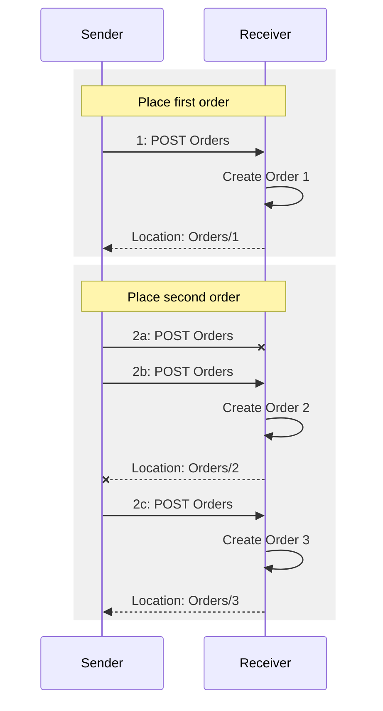
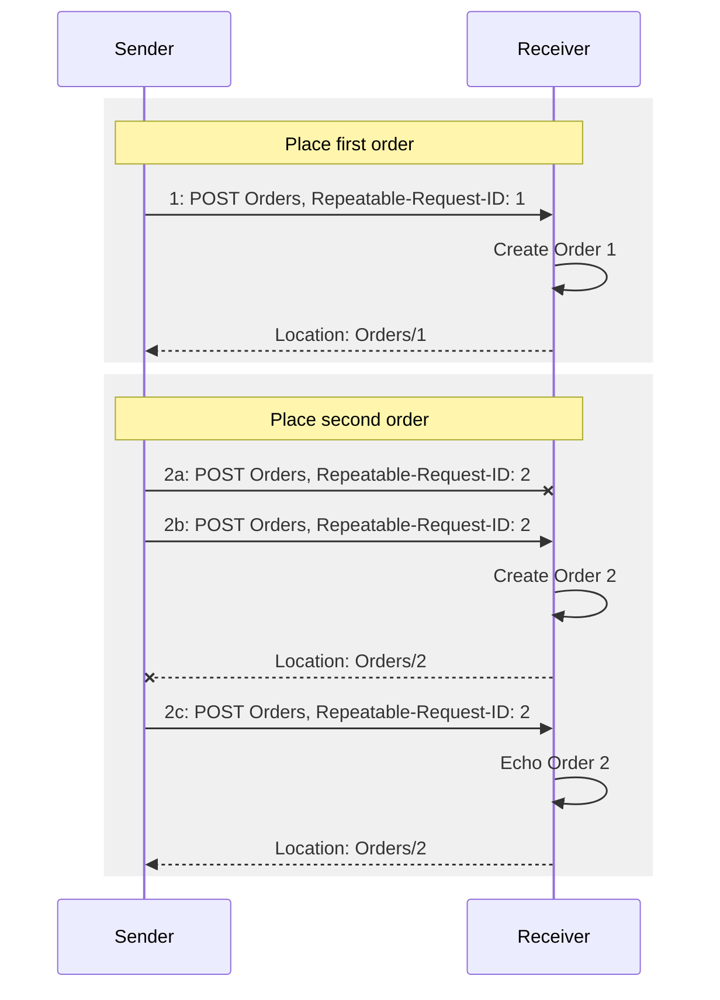

-------

# Repeatable Requests Version 1.0

## Committee Specification Draft 02

## 19 August 2026

#### This stage:
https://docs.oasis-open.org/odata/repeatable-requests/v1.0/csd02/repeatable-requests-v1.0.md (Authoritative) \
https://docs.oasis-open.org/odata/repeatable-requests/v1.0/csd02/repeatable-requests-v1.0.html \
https://docs.oasis-open.org/odata/repeatable-requests/v1.0/csd02/repeatable-requests-v1.0.pdf

#### Previous stage:
https://docs.oasis-open.org/odata/repeatable-requests/v1.0/csprd01/repeatable-requests-v1.0-csprd01.docx (Authoritative) \
https://docs.oasis-open.org/odata/repeatable-requests/v1.0/csprd01/repeatable-requests-v1.0-csprd01.html \
https://docs.oasis-open.org/odata/repeatable-requests/v1.0/csprd01/repeatable-requests-v1.0-csprd01.pdf

#### Latest stage:
https://docs.oasis-open.org/odata/repeatable-requests/v1.0/repeatable-requests-v1.0.md (Authoritative) \
https://docs.oasis-open.org/odata/repeatable-requests/v1.0/repeatable-requests-v1.0.html \
https://docs.oasis-open.org/odata/repeatable-requests/v1.0/repeatable-requests-v1.0.pdf

#### Technical Committee:
[OASIS Open Data Protocol (OData) TC](https://www.oasis-open.org/committees/odata/)

#### Chairs:
Ralf Handl (ralf.handl@sap.com), [SAP SE](http://www.sap.com/) \
Michael Pizzo (b-mpizzo@microsoft.com), [Microsoft](http://www.microsoft.com/)

#### Editors:

#### [Related work:]{id=RelatedWork}
This specification is related to:
* _OData Version 4.02. Part 1: Protocol_. Edited by Michael Pizzo, Ralf Handl, and Martin Zurmuehl. OASIS Standard. Latest stage: https://docs.oasis-open.org/odata/odata/v4.02/odata-v4.02-part1-protocol.html
* _OData JSON Format Version 4.02_. Edited by Michael Pizzo, Ralf Handl, and Heiko Theißen. Latest stage: https://docs.oasis-open.org/odata/odata-json-format/v4.02/odata-json-format-v4.02.html
* _OData Vocabularies Version 4.0_. https://oasis-tcs.github.io/odata-vocabularies/vocabularies/Org.OData.Repeatability.V1.xml

#### Abstract:
This document describes a method to provide the ability to retry unsafe (i.e. POST, PUT, PATCH, DELETE) requests without incurring unintended side-effects. This specification can be applied to any HTTP based protocol.

#### Status:
This document was last revised or approved by the OASIS Open Data Protocol (OData) TC on the above date. The level of approval is also listed above. Check the "Latest stage" location noted above for possible later revisions of this document. Any other numbered Versions and other technical work produced by the Technical Committee (TC) are listed at https://groups.oasis-open.org/communities/tc-community-home2?CommunityKey=e7cac2a9-2d18-4640-b94d-018dc7d3f0e2#technical.

TC members should send comments on this specification to the TC's email list. Any individual may submit comments to the TC by sending email to Technical-Committee-Comments@oasis-open.org. Please use a Subject line like "Comment on OData Protocol".

This specification is provided under the [RF on RAND Terms Mode](https://www.oasis-open.org/policies-guidelines/ipr/#RF-on-RAND-Mode) of the [OASIS IPR Policy](https://www.oasis-open.org/policies-guidelines/ipr/), the mode chosen when the Technical Committee was established. For information on whether any patents have been disclosed that may be essential to implementing this specification, and any offers of patent licensing terms, please refer to the Intellectual Property Rights section of the TC's web page (https://www.oasis-open.org/committees/odata/ipr.php).

Note that any machine-readable content ([Computer Language Definitions](https://www.oasis-open.org/policies-guidelines/tc-process-2017-05-26/#wpComponentsCompLang)) declared Normative for this Work Product is provided in separate plain text files. In the event of a discrepancy between any such plain text file and display content in the Work Product's prose narrative document(s), the content in the separate plain text file prevails.

#### Key words:
The key words "MUST", "MUST NOT", "REQUIRED", "SHALL", "SHALL NOT", "SHOULD", "SHOULD NOT", "RECOMMENDED", "NOT RECOMMENDED", "MAY", and "OPTIONAL" in this document are to be interpreted as described in BCP 14 [RFC2119](#rfc2119) and [RFC8174](#rfc8174) when, and only when, they appear in all capitals, as shown here.

#### Citation format:
When referencing this specification the following citation format should be used:

**[RepeatableRequests-v1.0]**

_Repeatable Requests Version 1.0_.
Edited by ? and ?. 19 August 2026. OASIS Committee Specification Draft 02.
https://docs.oasis-open.org/odata/repeatable-requests/v1.0/csd02/repeatable-requests-v1.0.html.
Latest stage: https://docs.oasis-open.org/odata/repeatable-requests/v1.0/repeatable-requests-v1.0.html

#### Notices
Copyright © OASIS Open 2026. All Rights Reserved.

Distributed under the terms of the OASIS [IPR Policy](https://www.oasis-open.org/policies-guidelines/ipr/).

The name "OASIS" is a trademark of [OASIS](https://www.oasis-open.org/), the owner and developer of this specification, and should be used only to refer to the organization and its official outputs.

For complete copyright information please see the full Notices section in an Appendix below.

-------

# Table of Contents

::: toc
- [1 Introduction](#Introduction)
  - [1.1 Changes from Earlier Versions](#ChangesfromEarlierVersions)
  - [1.2 Glossary](#Glossary)
    - [1.2.1 Definitions of Terms](#DefinitionsofTerms)
    - [1.2.2 Acronyms and Abbreviations](#AcronymsandAbbreviations)
    - [1.2.3 Document Conventions](#DocumentConventions)
  - [1.3 Overview](#Overview)
- [2 Repeatable Request](#RepeatableRequest)
- [3 Header Fields](#HeaderFields)
  - [3.1 Request Headers](#RequestHeaders)
    - [3.1.1 `Repeatability-Request-ID`](#RepeatabilityRequestID)
    - [3.1.2 `Repeatability-First-Sent`](#RepeatabilityFirstSent)
    - [3.1.3 `Repeatability-Client-ID`](#RepeatabilityClientID)
  - [3.2 Response Headers](#ResponseHeaders)
    - [3.2.1 `Repeatability-Result`](#RepeatabilityResult)
      - [3.2.1.1 Accepted](#Accepted)
      - [3.2.1.2 Rejected](#Rejected)
- [4 Client Behavior](#ClientBehavior)
- [5 Server Behavior](#ServerBehavior)
- [6 Example Scenarios](#ExampleScenarios)
- [7 Repeatable Request Cleanup](#RepeatableRequestCleanup)
- [8 Incorporation into OData](#IncorporationintoOData)
  - [8.1 Support](#Support)
  - [8.2 Discovery](#Discovery)
  - [8.3 Response Payload](#ResponsePayload)
  - [8.4 Batch Requests](#BatchRequests)
- [9 Security Considerations](#SecurityConsiderations)
- [10 Conformance](#Conformance)
  - [10.1 Service Conformance](#ServiceConformance)
  - [10.2 Client Conformance](#ClientConformance)
- [A References](#References)
  - [A.1 Informative References](#InformativeReferences)
- [B Safety, Security and Privacy Considerations](#SafetySecurityandPrivacyConsiderations)
- [C Acknowledgments](#Acknowledgments)
  - [C.1 Special Thanks](#SpecialThanks)
  - [C.2 Participants](#Participants)
- [D Revision History](#RevisionHistory)
- [E Notices](#Notices)
:::


-------

# <a id="Introduction" href="#Introduction">1 Introduction</a>

## <a id="ChangesfromEarlierVersions" href="#ChangesfromEarlierVersions">1.1 Changes from Earlier Versions</a>

Section | Feature / Change | Issue | Revision
--------|------------------|-------|---------

## <a id="Glossary" href="#Glossary">1.2 Glossary</a>

### <a id="DefinitionsofTerms" href="#DefinitionsofTerms">1.2.1 Definitions of Terms</a>

### <a id="AcronymsandAbbreviations" href="#AcronymsandAbbreviations">1.2.2 Acronyms and Abbreviations</a>

<!-- TODO -->

### <a id="DocumentConventions" href="#DocumentConventions">1.2.3 Document Conventions</a>

Keywords defined by this specification use `this monospaced font`.

Some sections of this specification are illustrated with non-normative examples.

::: example
Example 1: text describing an example uses this paragraph style
```
Non-normative examples use this paragraph style.
```
:::

All examples in this document are non-normative and informative only.

All other text is normative unless otherwise labeled.

## <a id="Overview" href="#Overview">1.3 Overview</a>

HTTP is an inherently unreliable protocol. If connection or other issues
prevent the client from receiving a response, the client is left in
doubt as to whether the request was processed by the server. For safe
HTTP requests as defined in [RFC7231](#rfc7231) section 4.2 (for
example, GET) the client can simply re-try the request, but for
operations that change state (for example, inserting a new resource or
invoking a side-effecting service operation such as PlaceOrder or
TransferFunds) re-issuing the request may result in an undesired state
(for example, two orders placed, or double the amount of funds
transferred).

::: figure
Figure 1: Lost requests and responses without Repeatability

:::

As the sender does not receive responses to requests 2a and 2b, it
creates three orders instead of the intended two orders.

This document proposes a simple approach that lets the receiver
recognize repeated requests, so it can echo a stored response for an
already received and processed request without processing the request a
second time:

::: figure
Figure 2: Lost requests and responses with Repeatability

:::

# <a id="RepeatableRequest" href="#RepeatableRequest">2 Repeatable Request</a>

A *repeatable request* is one in which the client sends the request with
the [`Repeatability-Request-ID`](#RepeatabilityRequestID) and
[`Repeatability-First-Sent`](#RepeatabilityFirstSent) headers.

An *unsafe request* is a non-idempotent request; that is, a request
which has the potential to change the service each time it is executed.
For example, a request to create a resource is an unsafe request because
executing the request multiple times could result in the same resource
being created multiple times.

# <a id="HeaderFields" href="#HeaderFields">3 Header Fields</a>

Repeatable Requests defines semantics around the following request and
response headers.

## <a id="RequestHeaders" href="#RequestHeaders">3.1 Request Headers</a>

Two request headers are required to facilitate the ability to retry
requests without incurring unintended side effects. Clients MUST send
the `Repeatability-Request-ID` and `Repeatability-First-Sent` header to
specify that a request is repeatable; that is, that the client can make
the request multiple times with the same `Repeatability-Request-ID` and
`Repeatability-First-Sent` header values and get back an appropriate
response without the server executing the request multiple times.

Another optional header, `Repeatability-Client-ID`, can be provided to
facilitate the ability for a server to eagerly cleanup tracking
information that it may use for the implementation of repeatable
requests (rather than keeping such information for a possibly extended
retention period).

### <a id="RepeatabilityRequestID" href="#RepeatabilityRequestID">3.1.1 `Repeatability-Request-ID`</a>

`Repeatability-Request-ID` MUST be sent by clients to specify that a
request is repeatable. The value of the `Repeatability-Request-ID` is an
opaque string representing a client-generated, globally unique for all
time, identifier for the request. Servers MUST accommodate the
36-character hexadecimal case-insensitive encoding of a UUID (GUID), as
defined in [RFC4122](#rfc4122). It is recommended for security
purposes to use version 4 (random) UUIDs as defined in
[RFC4122](#rfc4122) section 4.1.3. Support for other forms of
unique identifiers is optional.

If specified, the client directs that the request MUST be repeatable.
Servers aware of repeatability but unable to fulfill this direction for
this request type MUST not execute the request and instead return 501
Not Implemented.

### <a id="RepeatabilityFirstSent" href="#RepeatabilityFirstSent">3.1.2 `Repeatability-First-Sent`</a>

`Repeatability-First-Sent` MUST be sent by clients to specify that a
request is repeatable. `Repeatability-First-Sent` is used to specify the
date and time at which the request was first created.
`Repeatability-First-Sent` value MUST be expressed using the IMF-fixdate
form of HTTP-date as defined in [RFC7231](#rfc7231).

`Repeatability-First-Sent` allows the server to determine if the request
is within its currently tracked window of time for repeatability. If
`Repeatability-First-Sent` is within the server's window and the request
has not been seen previously, the server can safely execute it. If it is
not in the window of currently tracked requests, the server cannot
guarantee the request was not already executed and so MUST return an
error. Without using `Repeatability-First-Sent`, if/when the server cleans
up tracking information, the server could receive a
`Repeatability-Request-ID` that it has already executed but no longer has
any tracking data for and so the server would incorrectly execute the
request again.

### <a id="RepeatabilityClientID" href="#RepeatabilityClientID">3.1.3 `Repeatability-Client-ID`</a>

`Repeatability-Client-ID` is an optional header that MAY be provided by
the client. `Repeatability-Client-ID` is an opaque string representing a
client-generated, globally unique for all time, identifier for the
instance of the client application that issued the request. Servers, if
they do not ignore this header, MUST accommodate the 36-character
hexadecimal case-insensitive encoding of a UUID (GUID), as defined in
[RFC4122](#rfc4122). It is recommended for security purposes to
use version 4 (random) UUIDs as defined in [RFC4122](#rfc4122)
section 4.1.3. Support for other forms of unique identifiers is
optional.

`Repeatability-Client-ID`, if provided by the client, MAY be used by the
server to support bulk Repeatability Deletion.

## <a id="ResponseHeaders" href="#ResponseHeaders">3.2 Response Headers</a>

### <a id="RepeatabilityResult" href="#RepeatabilityResult">3.2.1 `Repeatability-Result`</a>

Servers aware of repeatability MUST return the `Repeatability-Result`
response header in the result of a repeatable request with one of the
case-insensitive values accepted or rejected.

#### <a id="Accepted" href="#Accepted">3.2.1.1 Accepted</a>

The server MUST return the value accepted for the `Repeatability-Result`
response header if the request was accepted and the server guarantees
that the server state reflects a single execution of the operation.

The response returned by the server MUST be the success or failure state
of the operation as first executed by the server and reflects either the
current state of the system or the state as it existed when the request
was first received.

#### <a id="Rejected" href="#Rejected">3.2.1.2 Rejected</a>

The server MUST return the value rejected for the `Repeatability-Result`
response header if the request was rejected because the combination of
`Repeatability-First-Sent` and `Repeatability-Request-ID` were invalid or
because the `Repeatability-First-Sent` value was outside the range of
values held by the server.

The server MUST also return a 4xx or 5xx response code without
attempting to execute the request when rejected is returned.

The server state MUST be the same as if the request was never received.

# <a id="ClientBehavior" href="#ClientBehavior">4 Client Behavior</a>

In order to issue a repeatable request, the client first creates a UUID
(GUID) and encodes that as a string. It MUST set that as the string
value of the `Repeatability-Request-ID` header and MUST also set the
`Repeatability-First-Sent` header to the current date-time value.

The client MAY also include a `Repeatability-Client-ID` header allowing
the server to associate with the client any tracking information that it
may use in support of repeatable requests.

If the request fails to return, for example, due to connection issues,
what the client can do will depend on what it already knows about the
server.

If the client has out-of-band knowledge that the server supports
repeatability, then the client can safely re-execute the request.

If the client had previously executed a repeatable request for which it
got a response, it can also determine whether the server supports
repeatability based on whether or not the server responded with a
`Repeatability-Result` header. If the server responded with a
`Repeatability-Result` header the client knows that the server supports
repeatability; re-executing the request in this case is safe. However,
if the response did not return a `Repeatability-Result` header, then the
client MUST assume that the request did not reach a server that knows
about repeatable requests.

If the client does not have out-of-band knowledge that that the server
supports repeatability and the client has not previously sent a
repeatable request for which it received a `Repeatability-Result` header,
it MUST NOT assume the server supports repeatability and therefore
cannot safely re-execute the request. In this case, re-issuing the
request MAY result in multiple executions.

If the client has determined that the server supports repeatability, it
can re-execute a request for which it did not receive a response by
sending the request again with the same `Repeatability-Request-ID` and
`Repeatability-First-Sent` headers (and `Repeatability-Client-ID`, if it was
specified previously).

If the request returns with a `Repeatability-Result` header with a value
of accepted then the client knows that the request has been executed in
a repeatable manner and consumes the results.

If the request returns with a `Repeatability-Result` header with a value
of rejected then the client knows that the creation time is beyond the
window of requests that the server has stored and it cannot safely retry
the operation, or some other error has occurred (for example, the
`Repeatability-Request-ID` and `Repeatability-First-Sent` values were
inconsistent with each other or with a previous request).

If the request returns with HTTP response code 501 Not Implemented with
a `Repeatability-Result` value of accepted, it implies the service knows
about repeatability but there is something wrong with the request.

If the request returns with HTTP response code 501 Not Implemented with
a `Repeatability-Result` value of rejected, it implies that the service
does know about repeatability but the server does not support
repeatability of the request.

# <a id="ServerBehavior" href="#ServerBehavior">5 Server Behavior</a>

This section applies to servers that are aware of this specification.

If the server receives the `Repeatability-Request-ID` header but the
`Repeatability-First-Sent` value is missing, it MUST return 400 Bad
Request with a `Repeatability-Result` of rejected.

If the server receives the `Repeatability-First-Sent` header but the
`Repeatability-Request-ID` value is missing, it MUST return 400 Bad
Request with a `Repeatability-Result` of rejected.

If the server receives the `Repeatability-First-Sent` header but the value
is not a valid IMF-fixdate form of HTTP-date as defined in
[RFC7231](#rfc7231), it MUST return 400 Bad Request with a
`Repeatability-Result` of rejected.

If the server receives a request with valid, non-null,
`Repeatability-Request-ID` and `Repeatability-First-Sent` values and

- does not support repeatable execution of the request it MUST return
  501 Not Implemented with a `Repeatability-Result` of rejected, or

- the `Repeatability-First-Sent` value is before the earliest remembered
  `Repeatability-Request-ID`, or this request cannot be reliably executed
  for some other implementation-specific reason, the server MUST return
  412 Precondition Failed with a `Repeatability-Result` value of rejected,
  or

- has not seen the `Repeatability-Request-ID` since its earliest
  remembered `Repeatability-Request-ID` (if any), and the
  `Repeatability-First-Sent` value is within its window of remembered
  `Repeatability-Request-ID` values, then it MUST execute the request and
  return the result with `Repeatability-Result` header value of accepted
  and record the `Repeatability-Request-ID` and any additional information
  to ensure the request is not executed more than once, and any
  additional information to respond should the client send the request
  again.

The server SHOULD return an error 400 Bad Request along with a
`Repeatability-Result` value of rejected if `Repeatability-Request-ID` is
non-null and the request verb, URI, or header fields other than Date are
different from that of the original request.

If the server has seen the `Repeatability-Request-ID`, it MAY return an
error 400 Bad Request along with a `Repeatability-Result` header value of
rejected if the request body was different from that of the original
`Repeatability-Request-ID`.

If the server has seen the `Repeatability-Request-ID` and the request
matches the previous request to the extent validated by the server, the
server MUST return a response with a `Repeatability-Result` value of
accepted that is either:

- the same response code and body as was generated (if any) when the
  original request with that `Repeatability-Request-ID` was processed, or

- the response code and response body resulting from re-executing the
  request if the original response code was 4xx or 5xx, i.e. a client
  error or an internal server error.

In order to permit the server to optimize the storage of response
bodies, the client and server may wish to negotiate the amount of
content that will be returned in an initial response and any subsequent
repeated response. The mechanism for such response content negotiation
may depend on the protocol used.

Whether a server is considered to have *seen* a previous request should
be transactionally consistent with the mutating effects of the request.
For example, a server is not required to remember a previous request
whose effects were rolled back due to a failure, since the client could
reissue such a request without any possibility for duplication of the
effects.

Servers MAY support repeatability on POST, PUT, PATCH and DELETE:

- Repeatability on POST ensures that the operation is executed, or the
  insert is performed no more than once.

- Repeatability on PUT or PATCH is different from the use of an ETag in
  that repeated PUT or PATCH operations to the same resource will return
  success (or fail), possibly including a payload, versus a concurrency
  violation. It is important for a repeated request to return with
  success if the original request actually succeeded, rather than a
  failure due to a conflict detected on the repeated execution.

- Repeatability on DELETE is different from use of an ETag in that
  repeated DELETE operations to the same resource will return success
  (or fail) rather than 404 Not Found.

Servers MUST ignore `Repeatability-Request-ID` and
`Repeatability-First-Sent` for GET and HEAD requests.

If the server knows about repeatability and it does not support it for a
particular repeatable request, it MUST NOT execute the request and MUST
return a 4xx or 5xx response with a `Repeatability-Result` header with a
value of rejected.

# <a id="ExampleScenarios" href="#ExampleScenarios">6 Example Scenarios</a>

::: example
Example 2: Create a new Order. Adding a new item to a collection is a
POST request to the collection. To safeguard against a lost response the
client adds repeatability headers:
```json
POST /service/Orders
Content-Type: application/json
Repeatability-Request-ID: 112a3a3e-f94c-4f56-b49b-5aab3d97e5b7
Repeatability-First-Sent: Tue, 26 Mar 2019 16:06:51 GMT

{
  "CustomerID": "ALFKI",
  "OrderLines": [
    {
      "ProductID": "tomatoes-red-cherry",
      "Quantity": 5,
      "Unit": "kg",
    },
    {
      "ProductID": "grapejuice-merlot",
      "Quantity": 2,
      "Unit": "l",
    }
  ]
}
```

The client does not receive a response, so it simply sends the request
again:
```json
POST /service/Orders
Content-Type: application/json
Repeatability-Request-ID: 112a3a3e-f94c-4f56-b49b-5aab3d97e5b7
Repeatability-First-Sent: Tue, 26 Mar 2019 16:06:51 GMT

{
  "CustomerID": "ALFKI",
  "OrderLines": [
    {
      "ProductID": "tomatoes-red-cherry",
      "Quantity": 5,
      "Unit": "kg",
    },
    {
      "ProductID": "grapejuice-merlot",
      "Quantity": 2,
      "Unit": "l",
    }
  ]
}
```

This time the client receives a response:
```json
HTTP/1.1 201 Created
Content-Type: application/json
Location: http://host/service/Orders/4711
Repeatability-Result: accepted

{
  "OrderID": 4711,
  "CustomerID": "ALFKI",
  "OrderLines": [
    {
      "ProductID": "tomatoes-red-cherry",
      "Quantity": 5,
      "Unit": "kg",
    },
    {
      "ProductID": "grapejuice-merlot",
      "Quantity": 2,
      "Unit": "l",
    }
  ]
}
```

The `Repeatability-Result` response header tells the client that it need
not worry: the new order was created exactly once.
:::

::: example
Example 3: Invoke an Action. The client wants to place an exact clone of
a recent order using the Clone action:
```json
POST /service/Orders/4711/Clone
Content-Type: application/json
Repeatability-Request-ID: a47a83d9-be50-46aa-ab2a-55f18f4fbc64
Repeatability-First-Sent: Mon, 01 Apr 2019 06:22:03 GMT

{}
```

The client does not receive a response, so it simply sends the request
again. This time the client receives a response:
```
HTTP/1.1 204 No Content
Location: http://host/service/Orders/4712
Repeatability-Result: accepted
```

The `Repeatability-Result` response header tells the client that it need
not worry: the new order was cloned exactly once.
:::

# <a id="RepeatableRequestCleanup" href="#RepeatableRequestCleanup">7 Repeatable Request Cleanup</a>

In some situations, such as when using occasionally-connected mobile
devices, clients may expect the server to offer a significant retention
period (e.g. 50 days) for remembered repeatable requests. In such
situations, the server's storage system may be burdened by the retention
requirements, so it is valuable to offer clients a way to signal that
certain remembered repeatable requests may be forgotten (deleted) by the
server even before the retention period has expired. Some clients may be
able to acknowledge that they have received all responses to all
outstanding requests. Bulk deletion of all the tracking information for
repeatable requests from a particular `Repeatability-Client-ID` may enable
a significant performance boost for the server.

A server MAY support the deletion of remembered requests by
`Repeatability-Request-ID`. If supported, the server SHOULD use the DELETE
method with the URL pattern
`$RepeatableRequestWithRequestID/`«Repeatability-Request-ID» for
this purpose. The HTTP response status SHOULD be 204 No Content, even if
no such request was found.

A server MAY support the deletion of remembered requests by
`Repeatability-Client-ID`. If supported, the server SHOULD use the DELETE
method with the URL pattern
`$RepeatableRequestWithClientID/`«Repeatability-Client-ID» for
this purpose. The HTTP response status SHOULD be 204 No Content, even
if no such requests were found.

Note that supporting cleanup by `Repeatability-Client-ID` does not mean
that the server needs to record information about client instances
separately from its set of remembered repeatable requests. For example,
it might be achieved simply with an extra (indexed) storage column in
the storage table used to track repeatable requests.

# <a id="IncorporationintoOData" href="#IncorporationintoOData">8 Incorporation into OData</a>

This specification is valid outside the context of OData but this
section details the specifics of using it with OData, see
[OData-Protocol](#ODataProtocol).

## <a id="Support" href="#Support">8.1 Support</a>

OData services are not required to support Repeatability. Clients MUST
rely on external means (e.g. capabilities) in order to know whether the
server supports repeatability.

## <a id="Discovery" href="#Discovery">8.2 Discovery</a>

Services supporting repeatability SHOULD annotate the entity container,
entity sets, singletons, action imports, or actions in the service
metadata with the term [Repeatability.Supported]{.term} defined in the
Repeatability vocabulary, see [OData-VocRep](#ODataVocRep).

Services supporting repeatable requests cleanup by
`Repeatability-Request-ID` and/or `Repeatability-Client-ID` SHOULD annotate
the entity container with the terms
[Repeatability.DeleteWithRequestIDSupported]{.term} and/or
[Repeatability.DeleteWithClientIDSupported]{.term}.

If lower-level elements such as individual entity sets do not support
repeatability, then they can opt out of repeatability using a
lower-level override of the `Repeatability.Supported` term.

Services MAY support repeatability without the use of annotations in the
service metadata.

## <a id="ResponsePayload" href="#ResponsePayload">8.3 Response Payload</a>

The client can optionally use system query options \$select and/or
\$expand in the request URL to force the service to return a payload
containing the minimal information required by the client, as compared
to what it would ordinarily return without the use of system query
options. Note that \@Core.ContentID is always returned in the response
payload if it was specified in the request body.

If the client sends a repeatable request containing a data modification
operation for an entity, and the client does not include \$select or
\$expand in the request URL, the server MAY choose to return 204 No
Content even if it would ordinarily return status code 200 or 201 for a
non-repeatable request.

The above paragraphs allow the service to minimize the tracking
information that it stores in support of repeatable requests.

## <a id="BatchRequests" href="#BatchRequests">8.4 Batch Requests</a>

Services MAY support repeatability for individual requests within a
batch request, as well as for individual requests within a change set or
atomicity group within a batch request.

Individual requests within a batch MAY have a mix of
`Repeatability-Request-ID` and `Repeatability-First-Sent` values. In this
case, each individual response within the batch response has the
appropriate `Repeatability-Result` (or not) according to the corresponding
request.

Repeatable request headers MUST NOT be applied to change sets or
atomicity groups directly because there is no way to specify headers for
an atomicity group in JSON batch requests, see
[OData-JSON](#ODataJSON). To make a change set or atomicity
group repeatable, a client MUST specify the same
`Repeatability-Request-ID` and `Repeatability-First-Sent` values for all
requests in the change set or atomicity group. The client MUST retry the
entire change set or atomicity group as a unit if it is repeatable;
individual operations within the change set or atomicity group MUST NOT
be retried.

There is no correlation between the repeatability of a request and the
repeatability of any of its dependent requests. That is, a repeatable
request may be retried without retrying any of its dependent requests.

Repeatability cannot be applied to batch requests themselves because a
single `Repeatability-Request-ID` on the batch request is not sufficient
for uniquely identifying the individual requests within the batch
request, and because repeatability implies transactional atomicity which
cannot be guaranteed for a batch request containing multiple change
sets, some of which may succeed (commit) and some of which may fail
(rollback). Therefore, if a server receives a batch request with either
a `Repeatability-Request-ID` or a `Repeatability-First-Sent` value, it MUST
NOT execute any requests within the batch and MUST respond with 4xx or
5xx response and with a `Repeatability-Result` value of rejected.

# <a id="SecurityConsiderations" href="#SecurityConsiderations">9 Security Considerations</a>

For HTTP relevant security implications please cf. the relevant sections
of [RFC7231](#rfc7231) (9. Security Considerations) and for the
HTTP PATCH method [RFC5789](#rfc5789) (5. Security
Considerations) as starting points.

Servers SHOULD authenticate the client before further evaluating the
repeatability of any requests.

As mentioned in [section 3.1.1](#RepeatabilityRequestID), it is
recommended for security purposes that clients use randomly generated
`Repeatability-Request-ID` values such as version 4 UUIDs as defined in
[RFC4122](#rfc4122) section 4.1.3.

# <a id="Conformance" href="#Conformance">10 Conformance</a>

## <a id="ServiceConformance" href="#ServiceConformance">10.1 Service Conformance</a>

In order to conform to this specification, a service:
1.  MUST conform to the semantics of the following headers, or fail the
    request:
    1.  [`Repeatability-Request-ID`](#RepeatabilityRequestID) ([section 3.1.1](#RepeatabilityRequestID))
    2.  [`Repeatability-First-Sent`](#RepeatabilityFirstSent) ([section 3.1.2](#RepeatabilityFirstSent))
2.  MUST return the [`Repeatability-Result`](#RepeatabilityResult)
    response header in response to repeatable requests ([section 2](#RepeatableRequest)) with one of the values
    [accepted](#Accepted) ([section 3.2.1.1](#Accepted)) or
    [rejected](#Rejected) ([section 3.2.1.2](#Rejected))
3.  MUST follow the guidelines in [Server Behavior](#ServerBehavior)
    ([section 5](#ServerBehavior))

## <a id="ClientConformance" href="#ClientConformance">10.2 Client Conformance</a>

If a client wants to safely repeat a request, a client:
1.  MUST specify the
    [`Repeatability-Request-ID`](#RepeatabilityRequestID) header in an
    unsafe request (section [3.1.1](#RepeatabilityRequestID))
2.  MUST specify the
    [`Repeatability-First-Sent`](#RepeatabilityFirstSent) header in a
    unsafe request (section [3.1.2](#RepeatabilityFirstSent))
3.  MUST only repeat a request if it has previously determined (through
    whatever means) that the server supports repeatability and MUST
    specify the repeatability headers ([section 4](#ClientBehavior)).


-------

# <a id="References" href="#References">Appendix A. References</a>

This appendix contains the informative references that are used in this document.

While any hyperlinks included in this appendix were valid at the time of publication, OASIS cannot guarantee their long-term validity.

## <a id="InformativeReferences" href="#InformativeReferences">A.1 Informative References</a>

###### [OData-Protocol]{id=ODataProtocol}
_OData Version 4.02 Part 1: Protocol._  
See link in "[Related work](#RelatedWork)" section on cover page.

###### [OData-JSON]{id=ODataJSON}
_OData JSON Format Version 4.02._  
See link in "[Related work](#RelatedWork)" section on cover page.

###### [OData-VocRep]{id=ODataVocRep}
_OData Vocabularies Version 4.0: Repeatability Vocabulary._  
See link in "[Related work](#RelatedWork)" section on cover page.

###### [RFC2119]{id=rfc2119}
_Bradner, S., "Key words for use in RFCs to Indicate Requirement Levels", BCP 14, RFC 2119, DOI 10.17487/RFC2119, March 1997_.
https://www.rfc-editor.org/info/rfc2119.

###### [RFC4122]{id=rfc4122}
_Leach, P., Mealling, M., and R. Salz, "A Universally Unique Identifier (UUID) URN Namespace", RFC 4122, DOI 10.17487/RFC4122, July 2005._  
https://www.rfc-editor.org/info/rfc4122.

###### [RFC5789]{id=rfc5789}
_Dusseault, L., and J. Snell, "Patch Method for HTTP", RFC 5789, March 2010._  
http://tools.ietf.org/html/rfc5789.

###### [RFC7231]{id=rfc7231}
_Fielding, R., Ed., and J. Reschke, Ed., "Hypertext Transfer Protocol (HTTP/1.1): Semantics and Content", RFC 7231, DOI 10.17487/RFC7231, June 2014._  
https://www.rfc-editor.org/info/rfc7231.

###### [RFC8174]{id=rfc8174}
_Leiba, B., "Ambiguity of Uppercase vs Lowercase in RFC 2119 Key Words", BCP 14, RFC 8174, DOI 10.17487/RFC8174, May 2017_.
https://www.rfc-editor.org/info/rfc8174.

-------

# <a id="SafetySecurityandPrivacyConsiderations" href="#SafetySecurityandPrivacyConsiderations">Appendix B. Safety, Security and Privacy Considerations</a>

-------

# <a id="Acknowledgments" href="#Acknowledgments">Appendix C. Acknowledgments</a>

## <a id="SpecialThanks" href="#SpecialThanks">C.1 Special Thanks</a>

The following individuals were members of the OASIS OData Technical Committee during the creation of this specification and its predecessors, and their contributions are gratefully acknowledged:
- Johannes Alberti (SAP SE)
- Jay Balunas (Red Hat)
- Mark Biamonte (Progress Software)
- Michael Bolz (SAP SE)
- Matthew Borges (SAP SE)
- Pablo Castro (Microsoft)
- Renze de Vries (SDL)
- Yi Ding (Microsoft)
- Rob Dolin (Microsoft)
- Chet Ensign (OASIS)
- George Ericson (Dell)
- Juliet Espinosa (GS1 Colombia/LOGYCA)
- Colleen Evans (Microsoft)
- Ashwani Goyal (SAP SE)
- chong gu (Huawei Technologies Co., Ltd.)
- Stefan Hagen (Individual)
- Ralf Handl (SAP SE)
- Hongxia Hao (Huawei Technologies Co., Ltd.)
- Hubert Heijkers (IBM)
- Oliver Heinrich (SAP SE)
- Serge Huber (Jahia Solutions Group SA)
- Jens Huesken (SAP SE)
- Evan Ireland (SAP SE)
- Gershon Janssen (Individual)
- Ling Jin (IBM)
- Gareth Jones (Microsoft)
- Ted Jones (Red Hat)
- Stephan Klevenz (SAP SE)
- Konstantin Kosinsky (Microsoft)
- Gerald Krause (SAP SE)
- Steven Legg (ViewDS Identity Solutions)
- shitao li (Huawei Technologies Co., Ltd.)
- Nuno Linhares (SDL)
- Saurabh Madan (Microsoft)
- Susan Malaika (IBM)
- Web Master (OASIS)
- Peggy Moloney (Microsoft)
- Joel Myhre (Pacific Disaster Center)
- Bob Natale (Mitre Corporation)
- Kenneth Peeples (Red Hat)
- Michael Pizzo (Microsoft)
- Jovan Popovic (Microsoft)
- Zheng Qian (Huawei Technologies Co., Ltd.)
- Ramesh Reddy (Red Hat)
- Uday Singh (SAP SE)
- Dan Solero (AT&T)
- Christof Sprenger (Microsoft)
- Divyansh Srivastava (Microsoft)
- Congyong Su (Microsoft)
- Wojciech Trocki (Red Hat)
- Mathias Uhlmann (SAP SE)
- Steve Veum (Progress Software)
- Aaron Wang (Microsoft)
- qingwei zhao (Huawei Technologies Co., Ltd.)
- Martin Zurmuehl (SAP SE)

## <a id="Participants" href="#Participants">C.2 Participants</a>

**OData TC Members:**

| First Name | Last Name | Company |
| :--- | :--- | :--- |
| George | Ericson | Dell |
| Hubert | Heijkers | IBM |
| Ling | Jin | IBM |
| Stefan | Hagen | Individual |
| John | Gathogo | Microsoft |
| Michael | Pizzo | Microsoft |
| Olga | Podolyako | Microsoft |
| Christof | Sprenger | Microsoft |
| Ralf | Handl | SAP SE |
| Gerald | Krause | SAP SE |
| Heiko | Theißen | SAP SE |

-------

# <a id="RevisionHistory" href="#RevisionHistory">Appendix D. Revision History</a>

| Revision | Date | Editor | Changes Made |
| :--- | :--- | :--- | :--- |
| Initial Draft 01 | 2013-06-25 | Mike Pizzo<br>Ralf Handl  | Initial version |
| Committee Note Draft 01 | 2019-10-17 | Matt Borges<br>Evan Ireland | Aligned header names<br> Added Repeatability Deletion<br> Clarified client and server behavior with regard to errors<br> Clarified what servers are required to store and return for repeated requests and how the client and server can negotiate this for OData |
| Committee Specification Draft 01 | 2020-04-07 | Matt Borges<br>Evan Ireland | Changed the committee note draft into a committee specification draft |
|Committee Specification Draft 02|2026-08-19|Michael Pizzo<br>Ralf Handl<br>Heiko Theißen| Changes listed in [section 1.1](#ChangesfromEarlierVersions)|

-------

# <a id="Notices" href="#Notices">Appendix E. Notices</a>

<!-- Required section. Do not modify. -->

Copyright © OASIS Open 2026. All Rights Reserved.

All capitalized terms in the following text have the meanings assigned to them in the OASIS Intellectual Property Rights Policy (the "OASIS IPR Policy"). The full [Policy](https://www.oasis-open.org/policies-guidelines/ipr/) may be found at the OASIS website.

This document and translations of it may be copied and furnished to others, and derivative works that comment on or otherwise explain it or assist in its implementation may be prepared, copied, published, and distributed, in whole or in part, without restriction of any kind, provided that the above copyright notice and this section are included on all such copies and derivative works. However, this document itself may not be modified in any way, including by removing the copyright notice or references to OASIS, except as needed for the purpose of developing any document or deliverable produced by an OASIS Technical Committee (in which case the rules applicable to copyrights, as set forth in the OASIS IPR Policy, must be followed) or as required to translate it into languages other than English.

The limited permissions granted above are perpetual and will not be revoked by OASIS or its successors or assigns.

This document and the information contained herein is provided on an "AS IS" basis and OASIS DISCLAIMS ALL WARRANTIES, EXPRESS OR IMPLIED, INCLUDING BUT NOT LIMITED TO ANY WARRANTY THAT THE USE OF THE INFORMATION HEREIN WILL NOT INFRINGE ANY OWNERSHIP RIGHTS OR ANY IMPLIED WARRANTIES OF MERCHANTABILITY OR FITNESS FOR A PARTICULAR PURPOSE.

As stated in the OASIS IPR Policy, the following three paragraphs in brackets apply to OASIS Standards Final Deliverable documents (Committee Specification, Candidate OASIS Standard, OASIS Standard, or Approved Errata).

\[OASIS requests that any OASIS Party or any other party that believes it has patent claims that would necessarily be infringed by implementations of this OASIS Standards Final Deliverable, to notify OASIS TC Administrator and provide an indication of its willingness to grant patent licenses to such patent claims in a manner consistent with the IPR Mode of the OASIS Technical Committee that produced this deliverable.\]

\[OASIS invites any party to contact the OASIS TC Administrator if it is aware of a claim of ownership of any patent claims that would necessarily be infringed by implementations of this OASIS Standards Final Deliverable by a patent holder that is not willing to provide a license to such patent claims in a manner consistent with the IPR Mode of the OASIS Technical Committee that produced this OASIS Standards Final Deliverable. OASIS may include such claims on its website, but disclaims any obligation to do so.\]

\[OASIS takes no position regarding the validity or scope of any intellectual property or other rights that might be claimed to pertain to the implementation or use of the technology described in this OASIS Standards Final Deliverable or the extent to which any license under such rights might or might not be available; neither does it represent that it has made any effort to identify any such rights. Information on OASIS' procedures with respect to rights in any document or deliverable produced by an OASIS Technical Committee can be found on the OASIS website. Copies of claims of rights made available for publication and any assurances of licenses to be made available, or the result of an attempt made to obtain a general license or permission for the use of such proprietary rights by implementers or users of this OASIS Standards Final Deliverable, can be obtained from the OASIS TC Administrator. OASIS makes no representation that any information or list of intellectual property rights will at any time be complete, or that any claims in such list are, in fact, Essential Claims.\]

The name "OASIS" is a trademark of [OASIS](https://www.oasis-open.org/), the owner and developer of this specification, and should be used only to refer to the organization and its official outputs. OASIS welcomes reference to, and implementation and use of, specifications, while reserving the right to enforce its marks against misleading uses. Please see https://www.oasis-open.org/policies-guidelines/trademark/ for above guidance.

