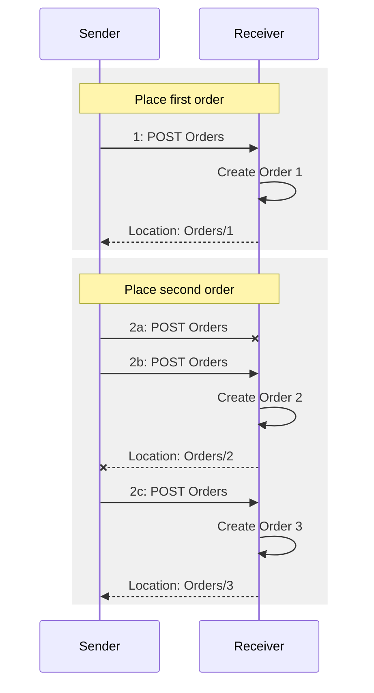
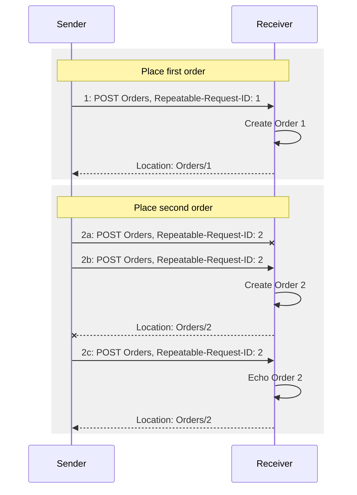

-------

# ##sec Introduction

## ##subsec Changes from Earlier Versions

Section | Feature / Change | Issue | Revision
--------|------------------|-------|---------

## ##subsec Glossary

### ##subsubsec Definitions of Terms

### ##subsubsec Acronyms and Abbreviations

<!-- TODO -->

### ##subsubsec Document Conventions

Keywords defined by this specification use `this monospaced font`.

Some sections of this specification are illustrated with non-normative examples.

::: example
Example ##ex: text describing an example uses this paragraph style
```
Non-normative examples use this paragraph style.
```
:::

All examples in this document are non-normative and informative only.

All other text is normative unless otherwise labeled.

## ##subsec Overview

HTTP is an inherently unreliable protocol. If connection or other issues
prevent the client from receiving a response, the client is left in
doubt as to whether the request was processed by the server. For safe
HTTP requests as defined in [RFC7231](#rfc7231) section 4.2 (for
example, GET) the client can simply re-try the request, but for
operations that change state (for example, inserting a new resource or
invoking a side-effecting service operation such as PlaceOrder or
TransferFunds) re-issuing the request may result in an undesired state
(for example, two orders placed, or double the amount of funds
transferred).

::: figure
Figure ##fig: Lost requests and responses without Repeatability

:::

As the sender does not receive responses to requests 2a and 2b, it
creates three orders instead of the intended two orders.

This document proposes a simple approach that lets the receiver
recognize repeated requests, so it can echo a stored response for an
already received and processed request without processing the request a
second time:

::: figure
Figure ##fig: Lost requests and responses with Repeatability

:::
